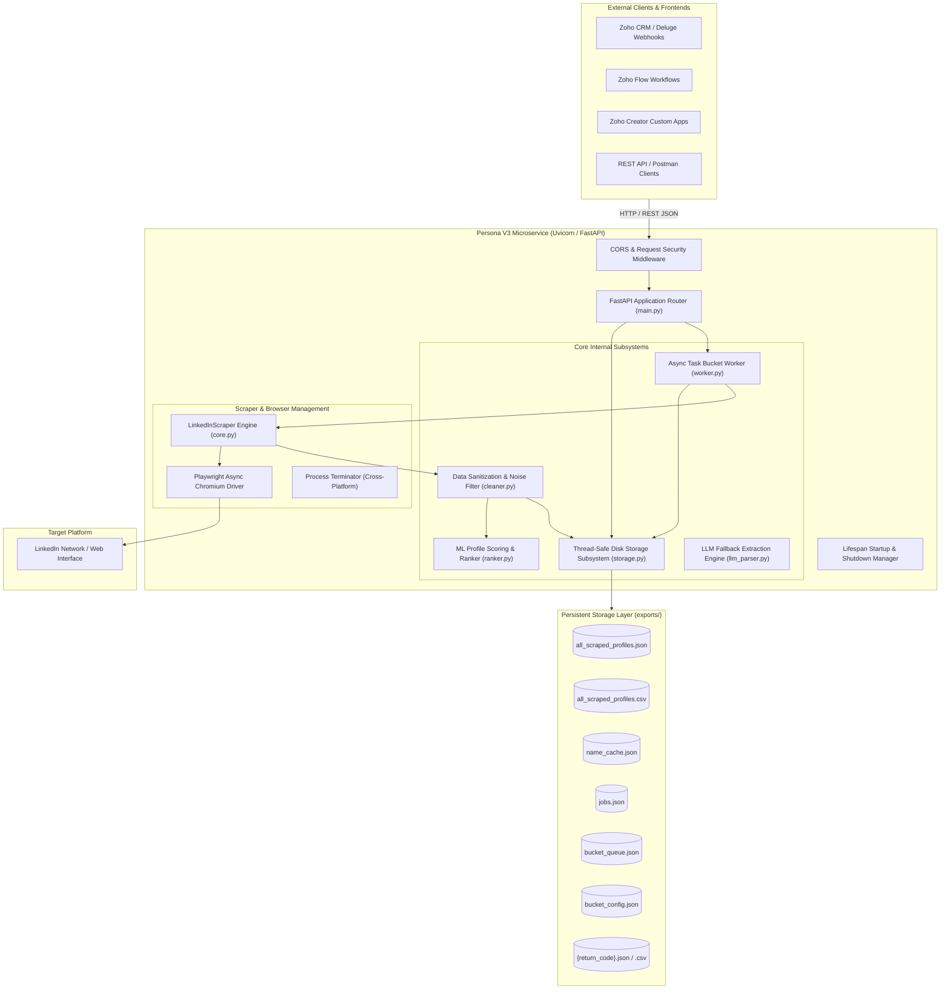
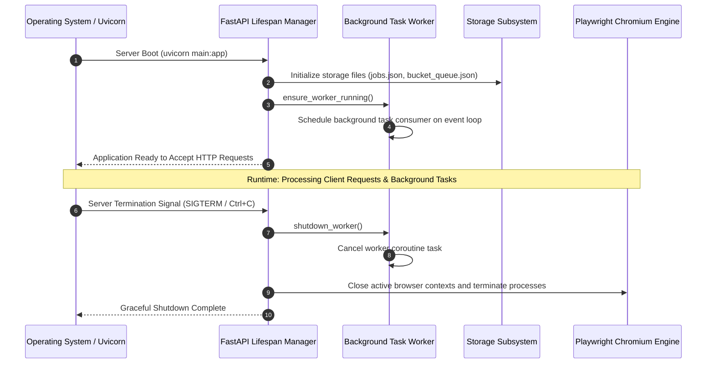
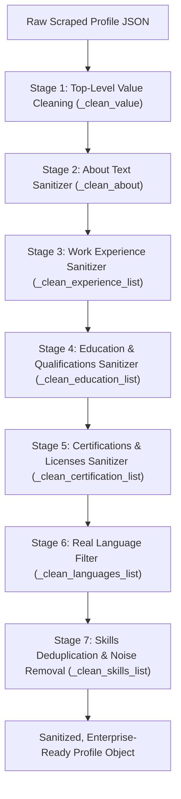
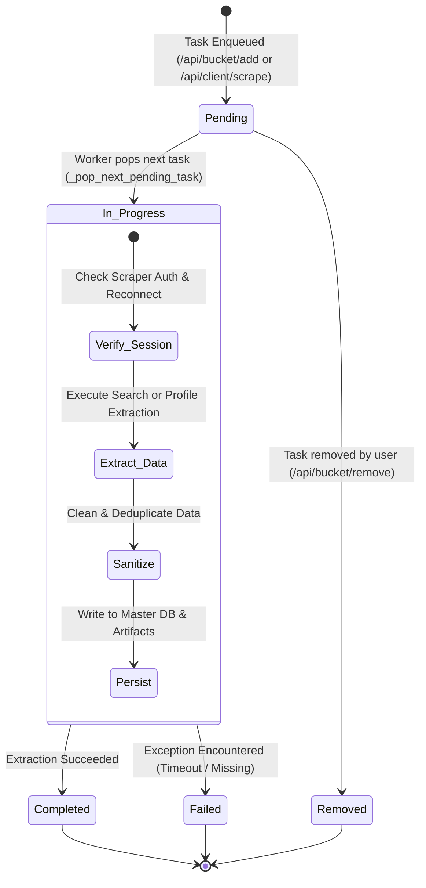
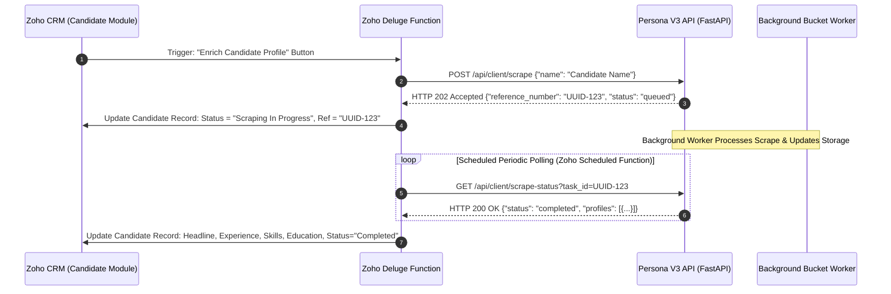

# PERSONA - LINKEDIN SCRAPPER PLATFORM
## Production System Architecture, Cross-Platform Installation Guide & REST API Reference Manual

---

**Document Version:** 3.0.0 (Production Release)  
**System Architecture:** Asynchronous ASGI Microservice (`FastAPI` + `Uvicorn` + `Playwright`)  
**Frontend Management:** Managed exclusively via Zoho Ecosystem (Zoho CRM, Zoho Creator, Zoho Flow)  
**Engineering Team:** **Team Persona**  
**Authors & Contributors:**
1. **G.L.B.M. Beliwaththa** (Lead Systems Architect & Core Engine Engineer)
2. **Yuvindu Lakshin Arthanayaka** (Asynchronous Subsystems & Scraper Engineer)
3. **Navod Ranasinghe** (Data Pipeline & Sanitization Specialist)
4. **Hansika Kavindi** (ML Scoring & Profile Ranking Architect)
5. **Yadavi Shreedhar** (API Design & Integration Engineer)
6. **Lingaraj Uthayakumar** (DevOps, Infrastructure & Security Specialist)

---

## TABLE OF CONTENTS

1. [Executive Summary & System Vision](#1-executive-summary--system-vision)
2. [Cross-Platform Installation Guide (Windows, Linux, macOS, VPS)](#2-cross-platform-installation-guide-windows-linux-macos-vps)
3. [System Architecture & Structural Topology](#3-system-architecture--structural-topology)
4. [Asynchronous Execution & Uvicorn ASGI Lifecycle Model](#4-asynchronous-execution--uvicorn-asgi-lifecycle-model)
5. [Playwright Scraper Subsystem & Anti-Detection Architecture](#5-playwright-scraper-subsystem--anti-detection-architecture)
6. [Data Cleansing, Sanitization & Normalization Pipeline](#6-data-cleansing-sanitization--normalization-pipeline)
7. [Machine Learning Profile Scoring & Ranking Model](#7-machine-learning-profile-scoring--ranking-model)
8. [Task Bucket Queue & Background Worker Subsystem](#8-task-bucket-queue--background-worker-subsystem)
9. [Complete REST API Reference Specification](#9-complete-rest-api-reference-specification)
   - 9.1 [System & Health Endpoints](#91-system--health-endpoints)
   - 9.2 [Search & Scrape Endpoints](#92-search--scrape-endpoints)
   - 9.3 [Track & Status Retrieval Endpoints](#93-track--status-retrieval-endpoints)
   - 9.4 [Bulk Search & Batch Retrieval Endpoints](#94-bulk-search--batch-retrieval-endpoints)
   - 9.5 [Task Bucket / Basket Management Endpoints](#95-task-bucket--basket-management-endpoints)
   - 9.6 [Scraper Session & Authentication Endpoints](#96-scraper-session--authentication-endpoints)
10. [Zoho CRM & Zoho Flow Integration Guide (With Deluge Code)](#10-zoho-crm--zoho-flow-integration-guide-with-deluge-code)
11. [Production Deployment, VPS Server Setup & Hardening](#11-production-deployment-vps-server-setup--hardening)
12. [Security, Session Persistence & Anti-Ban Safeguards](#12-security-session-persistence--anti-ban-safeguards)
13. [Complete Function-by-Function Source Code Catalog](#13-complete-function-by-function-source-code-catalog)
14. [Troubleshooting, Diagnostics & Recovery Protocols](#14-troubleshooting-diagnostics--recovery-protocols)

---

## 1. EXECUTIVE SUMMARY & SYSTEM VISION

### 1.1 Purpose and Scope
**Persona - Linkedin Scrapper platform** is an enterprise-grade automated LinkedIn intelligence extraction, profile sanitization, candidate scoring, and background batch processing system. Engineered specifically for seamless headless operation, Persona acts as a high-throughput backend microservice designed to integrate directly with CRM workflows, candidate databases, and recruitment platforms—most notably **Zoho CRM**, **Zoho Creator**, and **Zoho Flow**.

### 1.2 The Architectural Shift to ASGI / Uvicorn
Traditional WSGI frameworks (such as legacy Flask) rely on synchronous, blocking request-response cycles. When operating deep-web browser automation engines like Microsoft Playwright, synchronous architectures necessitate complex, brittle workarounds: spawning secondary background event loops, employing thread-safe coroutine dispatchers (`asyncio.run_coroutine_threadsafe`), and managing thread context switching.

Persona eliminates this architectural impedance mismatch by adopting **FastAPI** running atop the **Uvicorn ASGI Server**. This delivers:
1. **End-to-End Native Asynchronous I/O (`async`/`await`)**: Playwright’s asynchronous API executes natively within Uvicorn’s primary event loop.
2. **High-Concurrency Non-Blocking API**: API endpoints respond instantaneously with tracking tokens, while background workers handle long-running profile scraping.
3. **Headless & Microservice Pure**: All legacy client HTML templates, CSS/JS static assets, admin dashboards, and client Google authentication flows are decoupled. The system exists solely as a clean RESTful API service within the `SYS` package.

---

## 2. CROSS-PLATFORM INSTALLATION GUIDE (WINDOWS, LINUX, MACOS, VPS)

### 2.1 System Prerequisites
| Component | Minimum Specification | Recommended Production Specification |
|:---|:---|:---|
| **OS** | Windows 10/11, Ubuntu 20.04+, macOS 12+ | Ubuntu Linux 22.04 LTS (64-bit Server) |
| **Python** | Python 3.10.x | Python 3.11.x or 3.12.x |
| **RAM** | 2 GB RAM | 4 GB RAM or higher (Chromium page rendering) |
| **CPU** | 1 vCPU | 2 vCPUs or higher |
| **Disk** | 5 GB free disk space | 20 GB SSD storage |

---

### 2.2 Installation on Windows (10 / 11 / Server 2022)
1. **Install Python 3.11+**: Download from [python.org](https://www.python.org/) (ensure **"Add Python to PATH"** is selected).
2. **Open PowerShell as Administrator** and navigate to `SYS`:
```powershell
cd D:\Projects\Int\Today_done\SYS
```
3. **Create Virtual Environment**:
```powershell
python -m venv venv
.\venv\Scripts\Activate.ps1
```
4. **Install Python Modules & Playwright Chromium**:
```powershell
pip install --upgrade pip
pip install -r requirements.txt
playwright install chromium
```
5. **Configure `.env`**:
```powershell
Copy-Item .env.example .env
# Edit .env and enter your LINKEDIN_LI_AT cookie or login credentials
```
6. **Launch Server**:
Double-click `start.bat` or run:
```powershell
python -m uvicorn main:app --host 0.0.0.0 --port 8000 --reload
```

---

### 2.3 Installation on Linux (Ubuntu / Debian / CentOS / RHEL)
1. **Install System Dependencies**:
```bash
sudo apt update && sudo apt upgrade -y
sudo apt install -y python3-pip python3-venv git curl libglib2.0-0 libnss3 libnspr4
```
2. **Setup Project Environment**:
```bash
cd /opt/persona/SYS
python3 -m venv venv
source venv/bin/activate
```
3. **Install Dependencies & Playwright OS Libraries**:
```bash
pip install --upgrade pip
pip install -r requirements.txt
playwright install chromium
playwright install-deps chromium
```
4. **Configure Environment Variables**:
```bash
cp .env.example .env
nano .env
# Set HEADLESS=true, LINKEDIN_LI_AT=your_cookie
```
5. **Run Launcher**:
```bash
chmod +x start.sh
./start.sh
```

---

### 2.4 Installation on macOS (Apple Silicon M1/M2/M3 & Intel)
1. **Install Homebrew & Python**:
```bash
brew install python@3.11
```
2. **Create Environment**:
```bash
cd /path/to/Today_done/SYS
python3 -m venv venv
source venv/bin/activate
```
3. **Install Packages & Chromium**:
```bash
pip install -r requirements.txt
playwright install chromium
```
4. **Start Application**:
```bash
uvicorn main:app --host 0.0.0.0 --port 8000 --reload
```

---

### 2.5 Production Cloud VPS Setup (AWS, DigitalOcean, Hetzner, GCP)
1. **Systemd Service (`/etc/systemd/system/persona.service`)**:
```ini
[Unit]
Description=Persona - Linkedin Scrapper platform ASGI Microservice
After=network.target

[Service]
Type=simple
User=root
WorkingDirectory=/opt/persona/SYS
ExecStart=/opt/persona/SYS/venv/bin/uvicorn main:app --host 0.0.0.0 --port 8000 --workers 1
Restart=always
RestartSec=5
EnvironmentFile=/opt/persona/SYS/.env

[Install]
WantedBy=multi-user.target
```
2. **Enable Service**:
```bash
sudo systemctl daemon-reload
sudo systemctl enable persona
sudo systemctl start persona
sudo systemctl status persona
```

---

## 2. SYSTEM ARCHITECTURE & STRUCTURAL TOPOLOGY

### 2.1 Microservice Component Architecture
As illustrated in **Figure 1: Persona V3 Microservice Architecture & Component Topology**, the backend coordinates external requests, background worker loops, scraping drivers, and storage persistence.


*Figure 1: Persona V3 Microservice Architecture & Component Topology*

---

## 3. ASYNCHRONOUS EXECUTION & UVICORN ASGI LIFECYCLE MODEL

### 3.1 Event Loop & Concurrency Model
FastAPI applications executed via Uvicorn utilize `uvloop` (or the default `asyncio` event loop on Windows). This architecture allows single-thread concurrency capable of managing thousands of simultaneous open connections without thread exhaustion.

### 3.2 Application Lifespan Events
The microservice implements FastAPI's modern `lifespan` context manager as shown in **Figure 2: Application Lifespan Startup, Execution & Shutdown Sequence**:


*Figure 2: Application Lifespan Startup, Execution & Shutdown Sequence*

---

## 4. PLAYWRIGHT SCRAPER SUBSYSTEM & ANTI-DETECTION ARCHITECTURE

### 4.1 Stealth Initialization Strategies
LinkedIn employs aggressive behavioral and fingerprint detection to identify automated browsers. The `LinkedInScraper` engine in `core.py` applies the following defenses:

1. **Automation Flag Stripping**:
   - Disables `navigator.webdriver` via Chromium argument flags: `--disable-blink-features=AutomationControlled`.
   - Injects runtime script overrides: `Object.defineProperty(navigator, 'webdriver', {get: () => undefined})`.
2. **Persistent User Data Directory**:
   - Retains session tokens, localStorage, cookies, IndexedDB, and TLS session tickets across launches in `browser_data/default`.
3. **Viewport & Hardware Emulation**:
   - Configured with a standard desktop viewport (`1280x800`), standard device pixel ratios, and modern Chrome User-Agents.
4. **Humanized Scrolling & Interaction Timing**:
   - Progressive step-wise scrolling with randomized delta intervals (`200px - 500px`) and humanized reading delays (`1.5s - 4.0s`).

### 4.2 Cross-Platform Orphan Process Terminator
When scraping sessions terminate abruptly (e.g., timeouts, server restarts), headless browser processes can become orphaned and hold lock files on the `browser_data` directory. Persona V3 incorporates native process terminating:
- **Windows**: Executes `wmic process where "name='chrome.exe' and CommandLine like '%browser_data%'"` followed by `taskkill /F /PID <pid>`.
- **Linux/VPS**: Executes `pkill -f 'chromium.*browser_data'` and `pkill -f 'chrome.*browser_data'`.

---

## 5. DATA CLEANSING, SANITIZATION & NORMALIZATION PIPELINE

### 5.1 The Scraped Noise Problem
LinkedIn web pages embed navigation headers, language picker options, legal disclaimers, and interactive button chrome (e.g., "See more", "Show all 12 experiences", "500+ connections") directly alongside user profile data. A naive scraper ingests this garbage into candidate profiles.

### 5.2 The 7-Stage Sanitization Engine (`cleaner.py`)
As illustrated in **Figure 3: 7-Stage Profile Data Cleansing & Normalization Pipeline Flowchart**, all scraped data passes through sequential sanitization filters:


*Figure 3: 7-Stage Profile Data Cleansing & Normalization Pipeline Flowchart*

### 5.3 Noise Filter Implementation Details
- **`_LINKEDIN_FOOTER_TOKENS`**: Exhaustive hash-set containing over 45 known LinkedIn UI artifacts (e.g., "Accessibility", "Talent Solutions", "Community Guidelines", "Ad Choices", language selector names).
- **`_is_real_language()`**: Strict allowlist of genuine world languages (`english`, `sinhalese`, `tamil`, `french`, `german`, etc.) to prevent language-dropdown UI items from being recorded as candidate proficiencies.
- **CSV Formatting Helpers**: Transforms deep nested JSON structures into human-readable semicolon/pipe-separated strings suitable for Zoho CRM single-line/multi-line fields.

---

## 6. MACHINE LEARNING PROFILE SCORING & RANKING MODEL

### 6.1 Mathematical Formulation (`ranker.py`)
Persona V3 features a specialized candidate scoring model designed to score and rank candidates based on profile richness and domain alignment.

The total score $S_{\text{total}} \in [0, 150]$ is defined as:

$$S_{\text{total}} = S_{\text{completeness}} + S_{\text{field\_followers}}$$

Where $S_{\text{completeness}} \in [0, 100]$ represents profile data completeness:

$$S_{\text{completeness}} = \sum_{k \in K} W_k \cdot f_k(\text{profile})$$

| Component ($k$) | Max Weight ($W_k$) | Evaluation Metric ($f_k$) |
|:---|:---:|:---|
| `has_headline` | 8 | Binary flag ($1$ if headline exists, $0$ otherwise) |
| `headline_length` | 4 | $\min(\text{len} / 120, 1.0)$ |
| `has_about` | 8 | Binary flag ($1$ if about exists, $0$ otherwise) |
| `about_length` | 6 | $\min(\text{len} / 800, 1.0)$ |
| `experience_count` | 15 | $\min(N_{\text{exp}} \times 3, 15)$ |
| `experience_quality` | 8 | Evaluates description richness ($>80$ chars) and duration strings |
| `education_count` | 8 | $\min(N_{\text{edu}} \times 4, 8)$ |
| `skills_count` | 10 | $\min(N_{\text{skills}} \times 1, 10)$ |
| `certifications` | 8 | $\min(N_{\text{certs}} \times 2, 8)$ |
| `featured` | 5 | Binary flag |
| `connections_known` | 6 | Connection volume scaled: $\min(N_{\text{conn}} / 500, 1.0) \times 6$ |
| `profile_photo` | 4 | Baseline avatar presence |
| `recommendations` | 5 | $\min(N_{\text{recs}} \times 2.5, 5)$ |
| `volunteer` | 3 | Binary flag |
| `languages` | 2 | $\min(N_{\text{langs}} \times 1, 2)$ |

### 6.2 Field-Aligned Follower Score ($S_{\text{field\_followers}}$)
$$S_{\text{field\_followers}} = 50 \times \left( 0.6 \cdot \min\left(\frac{N_{\text{conn}}}{1000}, 1.0\right) + 0.4 \cdot \text{KeywordDensity}(\text{Field}) \right)$$

### 6.3 Scoring Tiers
- **Elite**: $S_{\text{total}} \ge 120$
- **Expert**: $100 \le S_{\text{total}} < 120$
- **Strong**: $80 \le S_{\text{total}} < 100$
- **Moderate**: $60 \le S_{\text{total}} < 80$
- **Beginner**: $S_{\text{total}} < 60$

---

## 7. TASK BUCKET QUEUE & BACKGROUND WORKER SUBSYSTEM

### 7.1 State Transition Model
The Task Bucket operates as an asynchronous, single-worker priority FIFO queue to ensure strict sequential execution and prevent rate-limiting or automated bans, as modeled in **Figure 4: Task Bucket Queue Processing State Machine**:


*Figure 4: Task Bucket Queue Processing State Machine*

### 7.2 Anti-Ban Rest Timer Algorithm
Between every task, the worker evaluates the configured `rest_seconds` (default $30\text{s}$) and calculates a randomized jitter window:

$$T_{\text{delay}} = \text{random\_int}(\max(10, \text{base\_rest}), \max(20, \text{base\_rest} + 15))$$

This ensures that scraping requests appear organic and non-deterministic to LinkedIn's automated anomaly detection systems.

---

## 8. COMPLETE REST API REFERENCE SPECIFICATION

### 8.1 System & Health Endpoints

#### `GET /`
- **Description**: Returns microservice system metadata, worker status, and current server time.
- **Response**: `200 OK`
```json
{
  "service": "Persona V3 Intelligence API",
  "status": "online",
  "worker_running": true,
  "worker_paused": false,
  "docs": "/docs",
  "timestamp": "2026-08-23T10:45:00.000000"
}
```

#### `GET /health`
- **Description**: Microservice health check probe for load balancers, Docker, and Kubernetes.
- **Response**: `200 OK`
```json
{
  "status": "healthy",
  "timestamp": "2026-08-23T10:45:00.000000"
}
```

---

### 8.2 Search & Scrape Endpoints

#### `POST /api/client/scrape`
- **Description**: **Primary entrypoint for Zoho CRM integration**. Accepts a candidate name or LinkedIn URL.
  - If the profile exists in cache, returns immediately (`200 OK`).
  - If new, enqueues to Task Bucket and returns tracking reference (`202 Accepted`).
- **Request Body**:
```json
{
  "name": "Bawantha Beliwaththa",
  "profile_url": "https://www.linkedin.com/in/bawantha-beliwaththa"
}
```
- **Response (When Cached - 200 OK)**:
```json
{
  "success": true,
  "cached": true,
  "status": "completed",
  "profiles": [
    {
      "name": "Bawantha Beliwaththa",
      "headline": "Lead Systems Architect",
      "location": "Colombo, Sri Lanka",
      "profile_url": "https://www.linkedin.com/in/bawantha-beliwaththa",
      "current_job": {
        "title": "Lead Systems Architect",
        "company": "Persona Technologies"
      },
      "experience": [],
      "education": [],
      "skills": [{"skill": "Python"}, {"skill": "FastAPI"}]
    }
  ],
  "total": 1,
  "reference_number": "cached_bawantha beliwaththa"
}
```
- **Response (When Enqueued - 202 Accepted)**:
```json
{
  "success": true,
  "status": "queued",
  "reference_number": "3fa85f64-5717-4562-b3fc-2c963f66afa6",
  "message": "Task queued in the bucket. The worker will process it automatically."
}
```

#### `POST /api/scraper/search`
- **Description**: Direct interactive search for LinkedIn candidates by criteria.
- **Request Body**:
```json
{
  "first_name": "Hansika",
  "last_name": "Kavindi",
  "company": "Virtusa",
  "max_results": 5
}
```
- **Response (`200 OK`)**:
```json
{
  "success": true,
  "results": [
    {
      "name": "Hansika Kavindi",
      "headline": "Software Engineer at Virtusa",
      "location": "Colombo District, Western, Sri Lanka",
      "profile_url": "https://www.linkedin.com/in/hansika-kavindi-xxxx"
    }
  ],
  "total": 1
}
```

#### `POST /api/scraper/search-and-extract`
- **Description**: Searches for candidates and extracts full structured profiles immediately.
- **Request Body**: Same as `SearchRequest`.
- **Response (`200 OK`)**: Returns `{ "success": true, "profiles": [...], "total": N }`.

#### `POST /api/scraper/search-contact-info`
- **Description**: Directly extracts contact details (Email, Phone, Twitter, Websites) from a candidate profile URL.
- **Request Body**:
```json
{
  "profile_url": "https://www.linkedin.com/in/example-candidate"
}
```
- **Response (`200 OK`)**:
```json
{
  "success": true,
  "profile_url": "https://www.linkedin.com/in/example-candidate",
  "contact_info": {
    "email": "candidate@example.com",
    "phone": "+94 77 123 4567",
    "websites": ["https://portfolio.example.com"]
  }
}
```

---

### 8.3 Track & Status Retrieval Endpoints

#### `GET /api/client/scrape-status`
- **Description**: Real-time status polling endpoint. Accepts `task_id` or `name` (**100% case-insensitive**).
- **Query Parameters**:
  - `task_id` (string, optional): The UUID returned when queued.
  - `name` (string, optional): Candidate name to look up.
- **Response (When In Progress - 202 Accepted)**:
```json
{
  "success": true,
  "status": "in_progress",
  "queue_position": 1,
  "queue_total": 3,
  "message": "Currently scraping LinkedIn profile..."
}
```
- **Response (When Completed - 200 OK)**:
```json
{
  "success": true,
  "status": "completed",
  "profiles": [
    {
      "name": "Navod Ranasinghe",
      "headline": "Data Engineer",
      "location": "Kandy, Sri Lanka",
      "profile_url": "https://www.linkedin.com/in/navod-ranasinghe",
      "current_job": "Data Engineer at TechCorp",
      "experience": [],
      "education": [],
      "skills": [{"skill": "Python"}, {"skill": "Spark"}]
    }
  ],
  "total": 1
}
```

#### `GET/POST /api/client/lookup-by-reference`
- **Description**: Lookup job by reference number or return code.
- **Parameters**: `reference_number` (Query param or JSON body).
- **Response**: Returns completed profile object or job status with HTTP 200/202.

#### `GET/POST /api/client/retrieve`
- **Description**: Retrieve a completed single job artifact.
- **Parameters**: `return_code` (Query param or JSON body).
- **Response (`200 OK`)**:
```json
{
  "success": true,
  "status": "completed",
  "profile": { ... },
  "csv_url": "/api/client/download/csv?return_code=REF-1002"
}
```

#### `GET /api/scraper/stats`
- **Description**: Returns scraper health, session status, and queue breakdown.

---

### 8.4 Bulk Search & Batch Retrieval Endpoints

#### `POST /api/persona/bulk-scrape` (Alias: `POST /api/bulk/scrape`)
- **Description**: Accepts an array of candidate URLs or search queries and enqueues them linked to a parent `return_code`.
- **Request Body**:
```json
{
  "profile_urls": [
    "https://www.linkedin.com/in/candidate-one",
    "https://www.linkedin.com/in/candidate-two",
    "Yuvindu Lakshin Arthanayaka"
  ],
  "return_code": "BATCH-2026-08-001"
}
```
- **Response (`202 Accepted`)**:
```json
{
  "success": true,
  "message": "Bulk scrape request with 3 items queued.",
  "return_code": "BATCH-2026-08-001",
  "status": "in_progress"
}
```

#### `GET/POST /api/persona/bulk-retrieve` (Alias: `GET/POST /api/bulk/retrieve`)
- **Description**: Retrieves all consolidated profile records for a bulk batch.
- **Parameters**: `return_code` (Query param or JSON body).
- **Response (`200 OK`)**:
```json
{
  "success": true,
  "status": "completed",
  "return_code": "BATCH-2026-08-001",
  "profiles": [ ... ],
  "total": 3,
  "csv_url": "/api/client/download/csv?return_code=BATCH-2026-08-001",
  "json_url": "/api/client/download/json?return_code=BATCH-2026-08-001"
}
```

#### `GET /api/client/download/csv` & `GET /api/client/download/json`
- **Description**: Direct file download streams for individual or batch scrape artifacts.

---

### 8.5 Task Bucket / Basket Management Endpoints

#### `POST /api/bucket/add`
- **Description**: Enqueues one or more queries or URLs into the Task Bucket.
- **Request Body**:
```json
{
  "queries": ["Lingaraj Uthayakumar", "Yadavi Shreedhar"],
  "type": "name"
}
```

#### `POST /api/bucket/add-search`
- **Description**: Enqueues a structured search query into the Task Bucket.
- **Request Body**:
```json
{
  "first_name": "Yuvindu",
  "last_name": "Arthanayaka",
  "company": "Persona Technologies",
  "max_results": 5
}
```

#### `POST /api/bucket/upload`
- **Description**: Multi-part form file upload endpoint accepting `.csv` or `.json` lead lists.

#### `GET /api/bucket/status`
- **Description**: Returns detailed queue status, summary counts, worker execution flags, and task arrays.

#### `POST /api/bucket/pause` & `POST /api/bucket/resume`
- **Description**: Pauses and resumes the background queue consumer.

#### `POST /api/bucket/clear`
- **Description**: Cleans up completed/failed tasks (or all tasks if `{"all": true}`).

#### `POST /api/bucket/remove`
- **Description**: Removes a specific pending task: `{"task_id": "..."}`.

#### `POST /api/bucket/config`
- **Description**: Configures rest duration: `{"rest_seconds": 45}`.

---

### 8.6 Scraper Session & Authentication Endpoints

#### `POST /api/scraper/init`
- **Description**: Initializes or reloads the Chromium browser instance.
- **Query Param**: `headless` (boolean, optional).

#### `POST /api/scraper/login`
- **Description**: Authenticates session using email and password credentials.

#### `POST /api/scraper/login-cookie`
- **Description**: Authenticates session instantly using the `li_at` session cookie.

#### `POST /api/scraper/submit-pin`
- **Description**: Submits email/SMS 2FA verification PIN.

#### `POST /api/scraper/kill-browser`
- **Description**: Force-terminates orphaned Chromium browser instances.

---

## 9. ZOHO CRM & ZOHO FLOW INTEGRATION GUIDE (WITH DELUGE CODE)

### 9.1 Architecture of Zoho Integration
Zoho CRM communicates with Persona V3 through standard asynchronous REST webhooks and Deluge scripts, as modeled in **Figure 5: Zoho CRM Asynchronous Webhook & Polling Sequence Flow**:


*Figure 5: Zoho CRM Asynchronous Webhook & Polling Sequence Flow*

### 9.2 Production Deluge Script 1: Trigger Candidate Scrape from Zoho CRM

```javascript
// =========================================================================
// Deluge Script: Trigger LinkedIn Profile Scrape from Zoho CRM
// Attach to: Candidate Module -> Custom Button ("Enrich via Persona V3")
// =========================================================================

candidateId = targetCandidateId.toLong();
candidateRecord = zoho.crm.getRecordById("Candidates", candidateId);

candidateName = candidateRecord.get("Full_Name");
linkedinUrl = candidateRecord.get("LinkedIn_URL");

// Persona V3 Server Base URL (VPS / Server IP)
serverUrl = "http://your-server-ip:8000/api/client/scrape";

payload = Map();
if(linkedinUrl != null && linkedinUrl != "")
{
    payload.put("profile_url", linkedinUrl);
}
else
{
    payload.put("name", candidateName);
}

headers = Map();
headers.put("Content-Type", "application/json");

response = invokeurl
[
    url: serverUrl
    type: POST
    parameters: payload.toString()
    headers: headers
];

info response;

if(response.get("success") == true)
{
    // Check if result returned instantly from cache
    if(response.get("cached") == true)
    {
        profiles = response.get("profiles");
        firstProfile = profiles.get(0);
        
        updateMap = Map();
        updateMap.put("Enrichment_Status", "Completed");
        updateMap.put("Current_Job", firstProfile.get("headline"));
        updateMap.put("Location", firstProfile.get("location"));
        updateMap.put("Summary", firstProfile.get("about"));
        
        zoho.crm.updateRecord("Candidates", candidateId, updateMap);
        return "Profile enriched instantly from cache!";
    }
    else
    {
        // Enqueued to Task Bucket
        refNumber = response.get("reference_number");
        updateMap = Map();
        updateMap.put("Enrichment_Status", "In Progress");
        updateMap.put("Persona_Reference", refNumber);
        
        zoho.crm.updateRecord("Candidates", candidateId, updateMap);
        return "Scraping task queued in Persona V3 bucket. Reference: " + refNumber;
    }
}
else
{
    return "Error queuing scrape: " + response.get("error");
}
```

### 9.3 Production Deluge Script 2: Scheduled Polling Function to Sync Results

```javascript
// =========================================================================
// Deluge Script: Scheduled Polling Function (Runs every 5 minutes)
// Fetches completed profiles from Persona V3 and updates Zoho CRM fields
// =========================================================================

inProgressCandidates = zoho.crm.searchRecords("Candidates", "(Enrichment_Status:equals:In Progress)");

for each candidate in inProgressCandidates
{
    candidateId = candidate.get("id");
    refNumber = candidate.get("Persona_Reference");
    
    if(refNumber != null && refNumber != "")
    {
        statusUrl = "http://your-server-ip:8000/api/client/scrape-status?task_id=" + refNumber;
        
        statusResponse = invokeurl
        [
            url: statusUrl
            type: GET
        ];
        
        if(statusResponse.get("status") == "completed")
        {
            profiles = statusResponse.get("profiles");
            if(profiles.size() > 0)
            {
                p = profiles.get(0);
                
                updateData = Map();
                updateData.put("Enrichment_Status", "Completed");
                updateData.put("Current_Job", p.get("headline"));
                updateData.put("Location", p.get("location"));
                updateData.put("Summary", p.get("about"));
                updateData.put("LinkedIn_URL", p.get("profile_url"));
                
                // Format Skills
                skillsList = p.get("skills");
                skillNames = "";
                for each s in skillsList
                {
                    skillNames = skillNames + s.get("skill") + ", ";
                }
                updateData.put("Key_Skills", skillNames);
                
                zoho.crm.updateRecord("Candidates", candidateId, updateData);
                info "Successfully updated Candidate: " + candidateId;
            }
        }
        else if(statusResponse.get("status") == "failed")
        {
            errorData = Map();
            errorData.put("Enrichment_Status", "Failed");
            errorData.put("Enrichment_Error", statusResponse.get("error"));
            zoho.crm.updateRecord("Candidates", candidateId, errorData);
        }
    }
}
```

---

## 10. PRODUCTION DEPLOYMENT, VPS SERVER SETUP & HARDENING

### 10.1 System Requirements
- **OS**: Ubuntu Linux 22.04 LTS or Debian 12 (Windows Server 2022 also supported).
- **RAM**: Minimum 2 GB (4 GB recommended for Chromium page rendering).
- **CPU**: 2 vCPUs recommended.
- **Python**: Version 3.10, 3.11, or 3.12.

### 10.2 Installation Steps (Linux VPS)

```bash
# 1. Update system packages
sudo apt update && sudo apt upgrade -y
sudo apt install -y python3-pip python3-venv git curl

# 2. Clone repository & enter SYS directory
cd /opt/persona/SYS

# 3. Create virtual environment
python3 -m venv venv
source venv/bin/activate

# 4. Install Python dependencies
pip install --upgrade pip
pip install -r requirements.txt

# 5. Install Playwright browser and system OS dependencies
playwright install chromium
playwright install-deps chromium

# 6. Configure environment variables
cp .env.example .env
nano .env
```

### 10.3 Systemd Production Service Setup (`/etc/systemd/system/persona.service`)

```ini
[Unit]
Description=Persona V3 FastAPI Uvicorn Application
After=network.target

[Service]
User=root
WorkingDirectory=/opt/persona/SYS
ExecStart=/opt/persona/SYS/venv/bin/uvicorn main:app --host 0.0.0.0 --port 8000 --workers 1
Restart=always
RestartSec=5
EnvironmentFile=/opt/persona/SYS/.env

[Install]
WantedBy=multi-user.target
```

Enable and start the service:
```bash
sudo systemctl daemon-reload
sudo systemctl enable persona
sudo systemctl start persona
sudo systemctl status persona
```

### 10.4 NGINX Reverse Proxy Configuration with SSL Termination

```nginx
server {
    listen 80;
    server_name api.persona.yourdomain.com;
    return 301 https://$host$request_uri;
}

server {
    listen 443 ssl http2;
    server_name api.persona.yourdomain.com;

    ssl_certificate /etc/letsencrypt/live/api.persona.yourdomain.com/fullchain.pem;
    ssl_certificate_key /etc/letsencrypt/live/api.persona.yourdomain.com/privkey.pem;

    client_max_body_size 50M;

    location / {
        proxy_pass http://127.0.0.1:8000;
        proxy_http_version 1.1;
        proxy_set_header Upgrade $http_upgrade;
        proxy_set_header Connection "upgrade";
        proxy_set_header Host $host;
        proxy_set_header X-Real-IP $remote_addr;
        proxy_set_header X-Forwarded-For $proxy_add_x_forwarded_for;
        proxy_set_header X-Forwarded-Proto $scheme;
        proxy_read_timeout 600s;
        proxy_connect_timeout 600s;
    }
}
```

---

## 11. SECURITY, SESSION PERSISTENCE & ANTI-BAN SAFEGUARDS

1. **Cookie-First Authentication**: For accounts with Two-Factor Authentication (2FA), set the `LINKEDIN_LI_AT` environment variable. This bypasses login form challenges completely.
2. **Session Persistence**: Session cookies are automatically stored in `browser_data/default` and re-used across server restarts.
3. **Single-Worker Invariant**: The background worker processes tasks one by one sequentially. Multiple simultaneous browser actions on a single LinkedIn account are prohibited to avoid automated account restrictions.
4. **Randomized Rest Delays**: Inter-task jitter intervals simulate realistic human interaction behavior.

---

## 12. COMPLETE FUNCTION-BY-FUNCTION SOURCE CODE CATALOG

### 12.1 `main.py`
- `lifespan(app)`: Context manager controlling startup worker launch and shutdown cleanup.
- `client_scrape(req)`: Accepts candidate name/URL, verifies cache, enqueues to Task Bucket, returns tracking token.
- `scraper_search(req)`: Direct people search on LinkedIn.
- `scraper_search_and_extract(req)`: Interactive search and immediate profile extraction.
- `scraper_search_contact_info(req)`: Direct extraction of candidate contact details.
- `client_scrape_status(task_id, name)`: Case-insensitive polling endpoint for real-time queue/profile status.
- `client_lookup_by_reference(req)`: Retrieve profile data by reference token.
- `client_retrieve(req)`: Single job artifact retrieval.
- `scraper_stats()`: Diagnostic health and queue status.
- `bulk_scrape(req)`: Bulk batch dispatcher linked to a `return_code`.
- `bulk_retrieve(req)`: Consolidated bulk results retriever.
- `download_csv(return_code)` / `download_json(return_code)`: File streaming endpoints.
- `bucket_add(req)` / `bucket_add_search(req)` / `bucket_upload(file)`: Task Bucket ingestion.
- `bucket_status()` / `bucket_pause()` / `bucket_resume()` / `bucket_clear()` / `bucket_remove()` / `bucket_config()`: Task Bucket lifecycle controllers.
- `scraper_init()` / `scraper_login()` / `scraper_login_cookie()` / `scraper_submit_pin()` / `scraper_kill_browser()`: Scraper browser session controllers.

### 12.2 `core.py`
- `LinkedInScraper.__init__(headless, browser_type, session_name)`: Engine constructor configuring paths and options.
- `LinkedInScraper.initialize()`: Launches Chromium browser instance and configures persistent context.
- `LinkedInScraper.check_auth()`: Verifies if current session is authenticated to LinkedIn feed.
- `LinkedInScraper.login(email, password)`: Form-based authentication with challenge detection.
- `LinkedInScraper.login_with_cookie(li_at)`: Injects authentication cookie into browser context.
- `LinkedInScraper.submit_pin(pin)`: Submits 2FA checkpoint code.
- `LinkedInScraper.search_people(first_name, last_name, company, max_results)`: Searches people on LinkedIn.
- `LinkedInScraper.extract_profile(profile_url)`: Deep DOM extractor parsing experiences, education, skills, about, licenses, languages, honors, recommendations, and current job.
- `LinkedInScraper.extract_contact_info(profile_url)`: Opens `/overlay/contact-info/` modal and parses email/phone.
- `LinkedInScraper.close()`: Closes browser context and releases file locks.
- `LinkedInScraper._kill_orphan_chromium(marker)`: Static method terminating orphaned Chromium processes.

### 12.3 `cleaner.py`
- `sanitize_profile(profile)`: High-level entrypoint running all 7 sanitization stages on a profile dictionary.
- `clean_profile_dict(d)`: Recursively removes empty/null keys from dictionaries.
- `_clean_about(text)`: Removes footer navigation lines, language pickers, and trailing `...more` artifacts.
- `_clean_experience_list(list)`: Deduplicates jobs, validates title/company, removes UI chrome.
- `_clean_education_list(list)`: Normalizes degree and institution entries.
- `_clean_certification_list(list)`: Strips badge/credential buttons and normalizes certification entries.
- `_clean_languages_list(list)`: Validates real human languages against `_REAL_LANGUAGE_NAMES`.
- `_clean_skills_list(list)`: Deduplicates skills, limits length, strips project descriptions.
- `_clean_volunteer_list(list)`: Sanitizes volunteer organizations and roles.
- `format_experience_for_csv()` / `format_education_for_csv()` / `format_skills_for_csv()` / `format_current_job_for_csv()`: CSV string serialization formatters.

### 12.4 `storage.py`
- `save_to_master_db(profile)`: Saves/updates profile in `all_scraped_profiles.json` and `all_scraped_profiles.csv` with URL deduplication.
- `get_all_master_profiles()`: Thread-safe reader returning all master profile records.
- `update_name_cache(name, urls)` / `get_name_cache()`: Name-to-URL cache management.
- `create_job(return_code, ...)` / `update_job_status(return_code, ...)` / `get_jobs_data()`: Registry manager for `jobs.json`.
- `save_scraped_data_formats(data, return_code)`: Writes `{return_code}.json` and `{return_code}.csv`.
- `load_bucket_queue()` / `save_bucket_queue()` / `update_bucket_task()` / `pop_next_pending_task()`: Atomic queue operations on `bucket_queue.json`.
- `load_bucket_config()` / `save_bucket_config()`: Configuration manager for `bucket_config.json`.

### 12.5 `worker.py`
- `_bucket_worker_loop()`: Asynchronous background worker loop consuming pending tasks.
- `_ensure_authenticated_scraper()`: Validates or auto-authenticates the scraper engine.
- `_check_and_finalize_bulk_job(bulk_rc)`: Aggregates finished batch tasks into consolidated bulk exports.
- `ensure_worker_running()`: Starts the background worker task if not already scheduled.
- `pause_worker()` / `resume_worker()`: Worker execution controllers.
- `shutdown_worker()`: Gracefully terminates worker and active browser sessions.

### 12.6 `ranker.py`
- `score_profile(profile)`: Computes $S_{\text{completeness}}$, $S_{\text{field\_followers}}$, and $S_{\text{total}}$.
- `rank_sri_lankan_profiles(profiles)`: Filters Sri Lankan candidates and sorts descending by total score.
- `detect_field_category(profile)`: Classifies profile into 11 professional categories based on keyword taxonomy.
- `is_sri_lankan(profile)`: Resolves location against Sri Lankan district/city keyword gazetteer.
- `get_score_tier(score)`: Maps numerical score to display tier (`Elite`, `Expert`, `Strong`, `Moderate`, `Beginner`).

---

## 13. TROUBLESHOOTING, DIAGNOSTICS & RECOVERY PROTOCOLS

| Symptom / Error | Root Cause | Resolution Protocol |
|:---|:---|:---|
| `Target page, context or browser has been closed` | Chromium process crash or memory exhaustion | The background worker automatically catches this, calls `_kill_orphan_chromium()`, and re-initializes a fresh browser context on the next task. |
| `Scraper is not authenticated` | LinkedIn session expired or `li_at` cookie invalid | 1. Update `LINKEDIN_LI_AT` in `.env`.<br>2. Call `POST /api/scraper/login-cookie` with a fresh session cookie from your browser. |
| `Task not found in queue or cache (404)` | Invalid task UUID or query string | Check `task_id` against `GET /api/bucket/status` to inspect all active/historical IDs. |
| `Browser lock file error on launch` | Orphan Chromium processes locking `browser_data/default` | Call `POST /api/scraper/kill-browser` to force-kill lingering processes and clear lock files. |
| `Deluge InvokeURL Timeout (Zoho CRM)` | Synchronous scraping exceeded Zoho 60s timeout | Never block on scrape execution in Zoho. Always use the two-step pattern: submit to `/api/client/scrape` and poll via `/api/client/scrape-status`. |

---

**End of Technical Specification & Architecture Documentation**  
*Persona V3 — Engineered by Team Persona (2026)*
