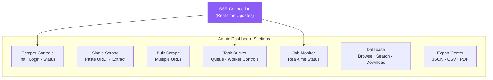
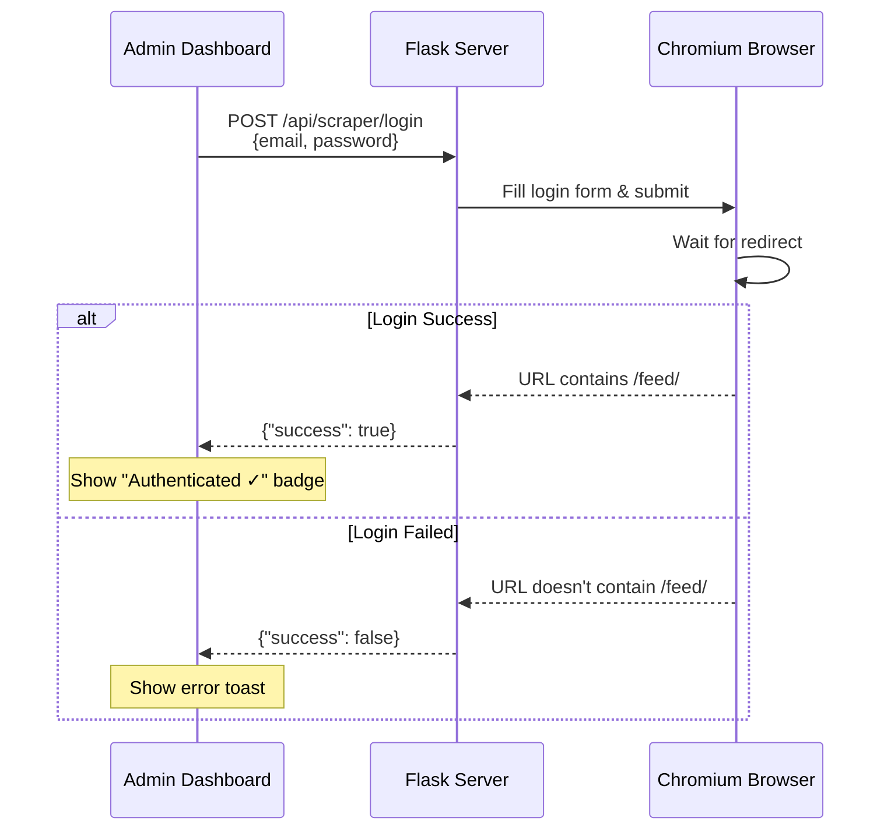

# 🖥 Admin Dashboard Guide

> Complete guide to the admin dashboard — the control center for the Persona platform.

---

## Table of Contents

- [Overview](#overview)
- [Accessing the Dashboard](#accessing-the-dashboard)
- [Dashboard Sections](#dashboard-sections)
  - [Scraper Controls](#scraper-controls)
  - [Single Profile Extraction](#single-profile-extraction)
  - [Bulk Scraping](#bulk-scraping)
  - [Task Bucket Panel](#task-bucket-panel)
  - [Job Monitor](#job-monitor)
  - [Database Management](#database-management)
  - [Export Center](#export-center)
- [SSE Live Updates](#sse-live-updates)
- [Toast Notifications](#toast-notifications)
- [Keyboard Shortcuts & Tips](#keyboard-shortcuts--tips)

---

## Overview

The admin dashboard (`templates/index.html`, 1672 lines) is a full-featured single-page application (SPA) built with vanilla HTML, CSS, and JavaScript. It provides complete control over the Persona scraper platform.



---

## Accessing the Dashboard

**URL:** `http://localhost:5000/admin`

The admin page is served by the Flask route:

```python
@app.route('/admin')
def admin_page():
    return render_template('index.html')
```

---

## Dashboard Sections

### Scraper Controls

The first section on the dashboard — controls the browser lifecycle.

| Button | Action | API Call |
|--------|--------|---------|
| **Initialize** | Launches Chromium browser | `POST /api/scraper/init` |
| **Login** | Opens login form → sends credentials | `POST /api/scraper/login` |
| **Stats** | Shows runtime statistics | `GET /api/scraper/stats` |
| **Close** | Closes the browser | `POST /api/scraper/close` |

**Initialize Options:**

| Option | Description |
|--------|-------------|
| Headless mode | Run browser without visible window (faster, less resource usage) |
| Session name | Name for the persistent browser data directory |

**Login Flow:**



---

### Single Profile Extraction

Paste a LinkedIn profile URL and extract structured data instantly.

**Input:** LinkedIn URL (e.g., `https://www.linkedin.com/in/username`)

**Process:**
1. User pastes URL in the input field
2. Clicks "Extract" button
3. Dashboard shows loading spinner
4. Scraper navigates to profile and extracts all sections
5. Result displayed as a formatted profile card

**Output:** Full profile card with:
- Name, headline, location
- Profile picture
- About section
- Current job
- All experience entries
- Education
- Skills with endorsements
- Certifications
- Languages
- Volunteer experience
- Honors & awards
- Recommendations

---

### Bulk Scraping

Extract multiple profiles in sequence with automatic rate limiting.

**Input:** Multiple LinkedIn URLs (one per line in a textarea)

**Process:**
1. User pastes multiple URLs
2. Clicks "Start Bulk Scrape"
3. Each profile is extracted sequentially with a 4-second delay
4. Progress is shown in real-time via SSE
5. Results are saved to the database automatically

---

### Task Bucket Panel

The Task Bucket panel provides queue management directly from the dashboard.

| Control | Description |
|---------|-------------|
| **Add Tasks** | Enter names or URLs to queue |
| **Queue Table** | Shows all tasks with status badges |
| **Pause Worker** | Stops the worker after current task |
| **Resume Worker** | Continues processing |
| **Clear Queue** | Removes completed/failed tasks |
| **Rest Period** | Configure seconds between tasks |

**Status Badges:**

| Status | Badge Color | Description |
|--------|-------------|-------------|
| Pending | Gray | Waiting in queue |
| In Progress | Blue (animated) | Currently being processed |
| Completed | Green | Successfully scraped |
| Failed | Red | Error occurred |

---

### Job Monitor

Real-time monitoring of all scrape jobs, powered by SSE.

| Column | Description |
|--------|-------------|
| Reference # | Unique job identifier |
| Person Name | Name being searched |
| Status | Current status badge |
| Requested At | When the job was submitted |
| Scraped At | When scraping completed |
| Actions | View results · Retry · Download |

**SSE Updates:** The job table auto-refreshes when these events arrive:
- `bucket_update` — task status changed
- `new_scrape` — profile scraped
- `request_started` — new search started

---

### Database Management

Browse, search, and manage all scraped profiles.

| Feature | Description |
|---------|-------------|
| **Profile List** | Scrollable list of all profiles in the master database |
| **Search** | Filter profiles by name, headline, or location |
| **Profile Cards** | Click any profile to see full details in a modal |
| **Download DB** | Download the entire database as JSON or CSV |
| **Destroy DB** | ⚠️ Delete all data (with confirmation dialog) |

---

### Export Center

Export data in multiple formats.

| Format | Description |
|--------|-------------|
| **JSON** | Full structured data |
| **CSV** | Spreadsheet-compatible format |
| **PDF (Single)** | Professionally formatted single-profile report |
| **PDF (Bulk)** | Multi-page report with one profile per page |

---

## SSE Live Updates

The admin dashboard connects to the SSE endpoint on page load:

```javascript
const eventSource = new EventSource('/api/admin/events');

eventSource.onmessage = function(event) {
    const data = JSON.parse(event.data);
    // Handle event based on data.type
};
```

### What Updates in Real-Time

| Event | Dashboard Update |
|-------|-----------------|
| `new_scrape` | Profile card appears in results |
| `bucket_update` | Task status badge changes color |
| `bucket_tasks_added` | Queue counter increments |
| `bucket_rest` | Rest period countdown shown |
| `bucket_paused` | Worker status shows "Paused" |
| `bucket_resumed` | Worker status shows "Running" |
| `request_started` | Job appears in monitor |

---

## Toast Notifications

The dashboard uses a custom toast notification system:

| Type | Color | Use Case |
|------|-------|----------|
| Success | Green | Scrape completed, task added |
| Error | Red | API errors, connection failures |
| Info | Blue | Status updates, cache hits |
| Warning | Amber | Rate limiting, delays |

---

## Keyboard Shortcuts & Tips

- **Paste URL → Enter**: Quick extract a single profile
- **Tab navigation**: Move between input fields
- **Scroll to load**: Profile cards lazy-load as you scroll
- **Click profile card**: Opens detailed modal view
- **Right-click → Copy**: Copy profile URLs from results
