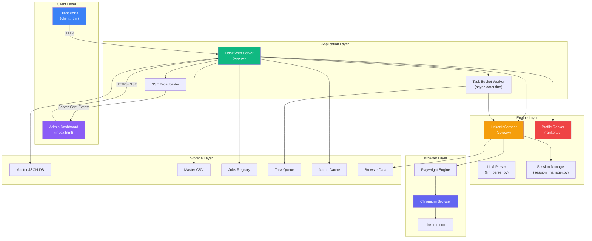
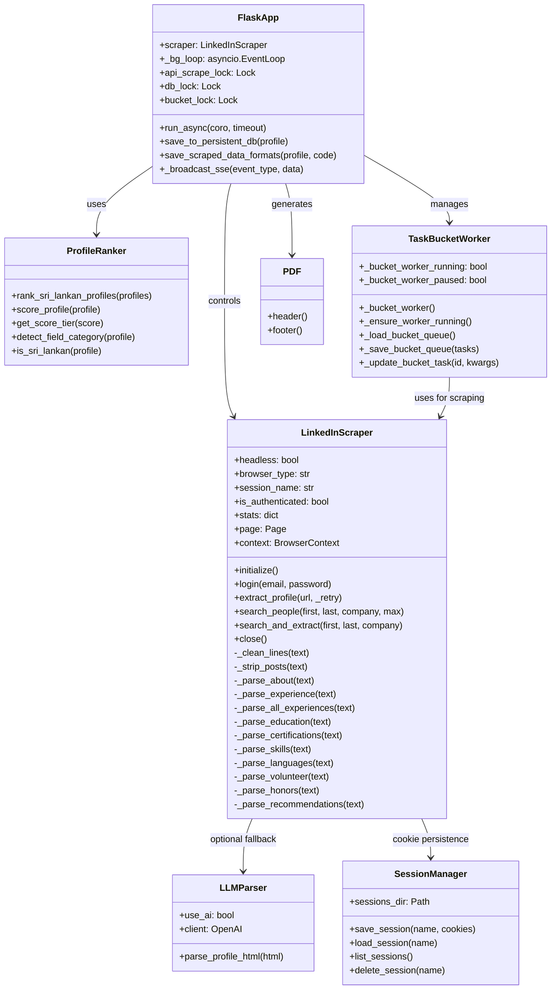
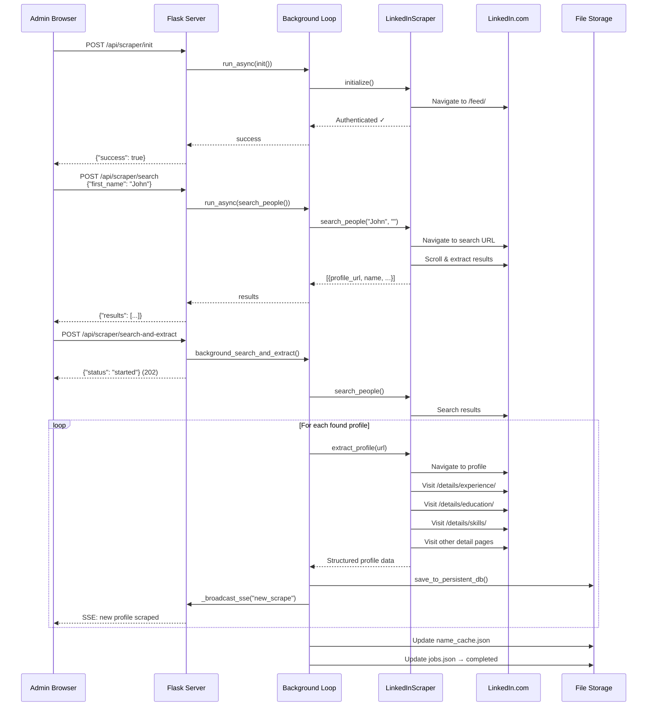
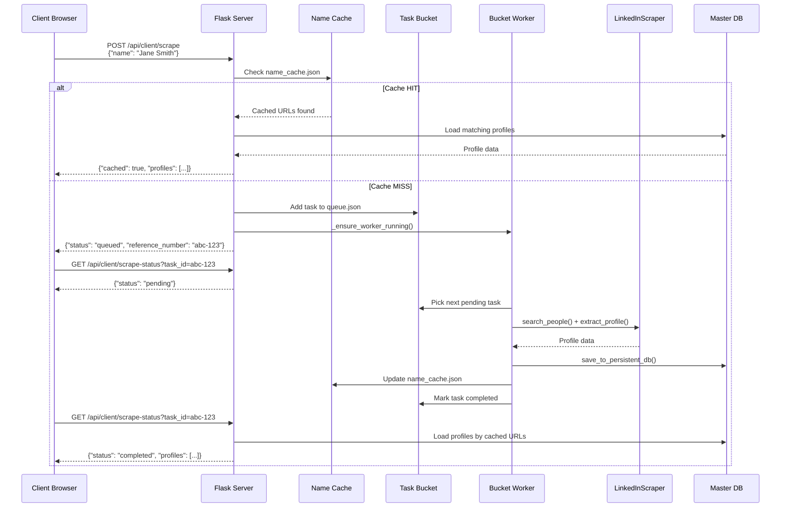
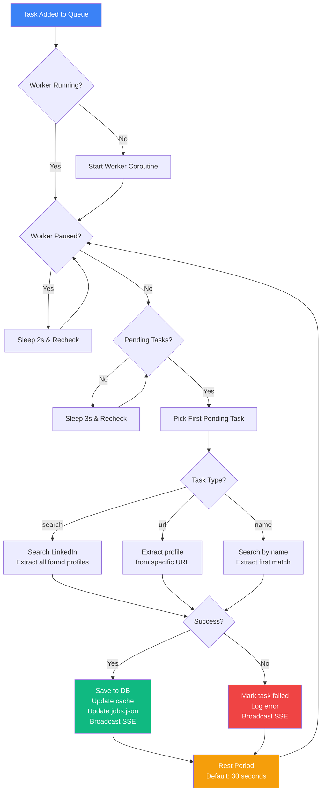
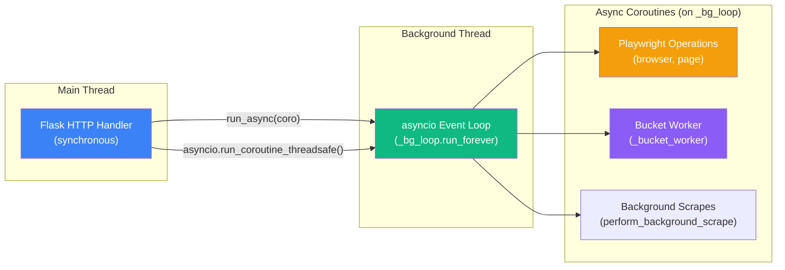
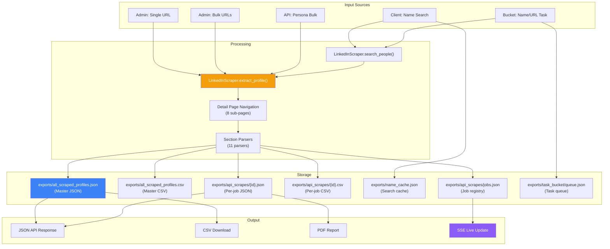
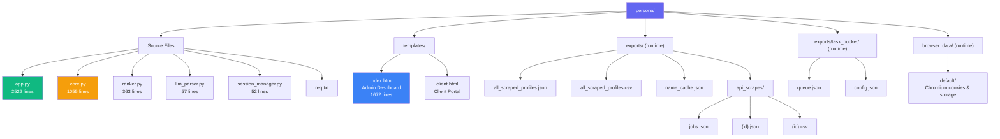
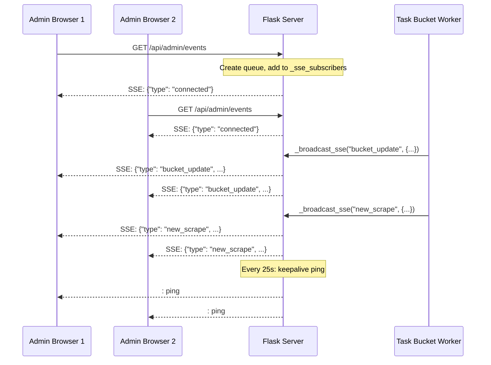
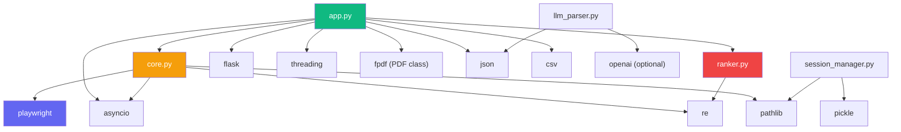

# 🏗 System Architecture

> Comprehensive architecture documentation for the Persona platform covering component design, data flow, threading model, and system interactions.

---

## Table of Contents

- [High-Level Architecture](#high-level-architecture)
- [Component Diagram](#component-diagram)
- [Request Flow Diagrams](#request-flow-diagrams)
  - [Single Profile Scrape Flow](#single-profile-scrape-flow)
  - [Client Search Flow](#client-search-flow)
  - [Task Bucket Processing Flow](#task-bucket-processing-flow)
- [Threading & Concurrency Model](#threading--concurrency-model)
- [Data Flow Diagram](#data-flow-diagram)
- [File System Layout](#file-system-layout)
- [SSE Event System](#sse-event-system)
- [Module Dependency Graph](#module-dependency-graph)

---

## High-Level Architecture

---

## Component Diagram

---

## Request Flow Diagrams

### Single Profile Scrape Flow

### Client Search Flow

### Task Bucket Processing Flow

---

## Threading & Concurrency Model

### How It Works

1. **Flask runs on the main thread** — handles all HTTP requests synchronously
2. **A dedicated asyncio event loop** (`_bg_loop`) runs in a daemon thread started at module load
3. **`run_async(coro, timeout)`** submits a coroutine to `_bg_loop` and blocks until the result is ready (for synchronous API responses)
4. **`asyncio.run_coroutine_threadsafe(coro, _bg_loop)`** fires and forgets a coroutine (for background operations that return 202 immediately)
5. **Three locks** protect shared state:

| Lock | Protects | Used By |
|------|----------|---------|
| `api_scrape_lock` | Per-job JSON/CSV files, jobs.json | save_scraped_data_formats, create_job, update_job_status |
| `db_lock` | Master database (all_scraped_profiles.json/csv), name_cache.json | save_to_persistent_db, client search endpoints |
| `bucket_lock` | Task queue (queue.json) | _load_bucket_queue, _save_bucket_queue |

---

## Data Flow Diagram

---

## File System Layout

---

## SSE Event System

The admin dashboard receives real-time updates via Server-Sent Events. The server maintains a list of subscriber queues and broadcasts events to all connected clients.

### SSE Event Types

| Event Type | Payload | Trigger |
|-----------|---------|---------|
| `connected` | `{}` | Browser connects to SSE endpoint |
| `request_started` | `{name}` | New search-and-extract request begins |
| `new_scrape` | `{name, count}` | A profile was successfully scraped |
| `bucket_tasks_added` | `{count, query}` | New tasks added to the bucket |
| `bucket_update` | `{task_id, status, query, ...}` | Task status changed |
| `bucket_rest` | `{seconds}` | Worker entering rest period |
| `bucket_paused` | `{}` | Worker paused |
| `bucket_resumed` | `{}` | Worker resumed |
| `bucket_cleared` | `{removed}` | Completed/failed tasks cleared |

---

## Module Dependency Graph

> **Note:** `llm_parser.py` and `session_manager.py` are not currently imported by `app.py` in V4 but remain available as utilities. The scraper engine (`core.py`) handles browser persistence directly via Playwright's persistent context.
