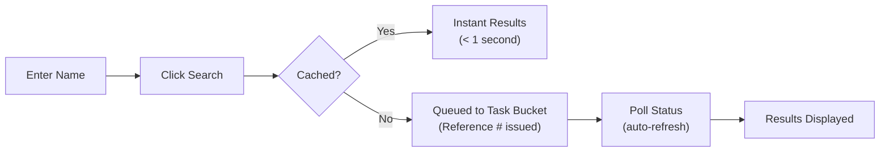
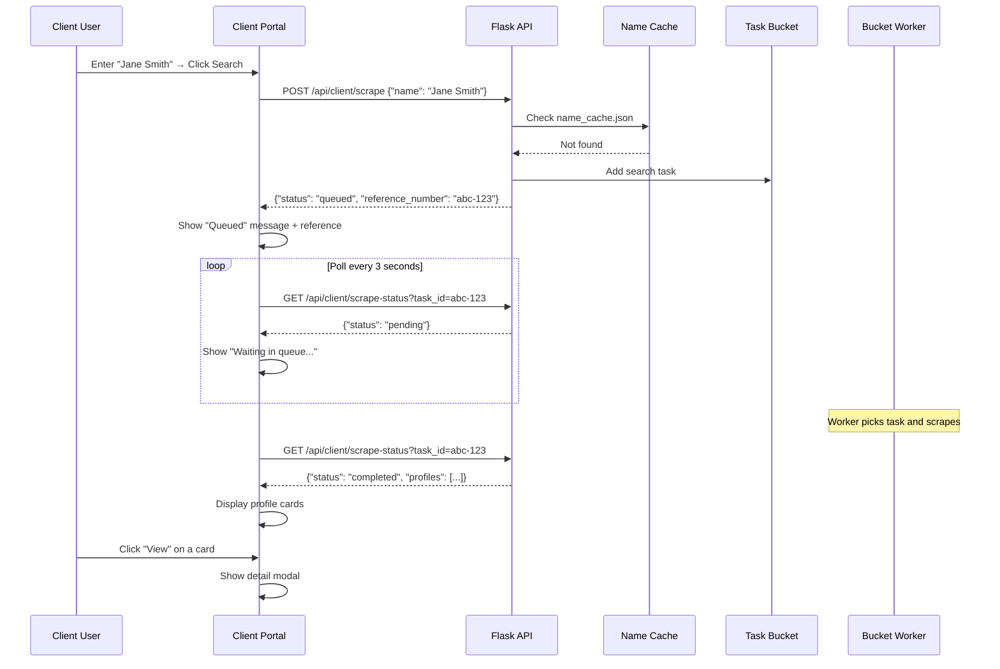
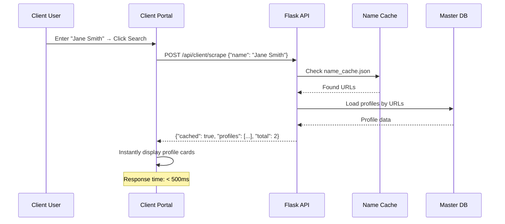
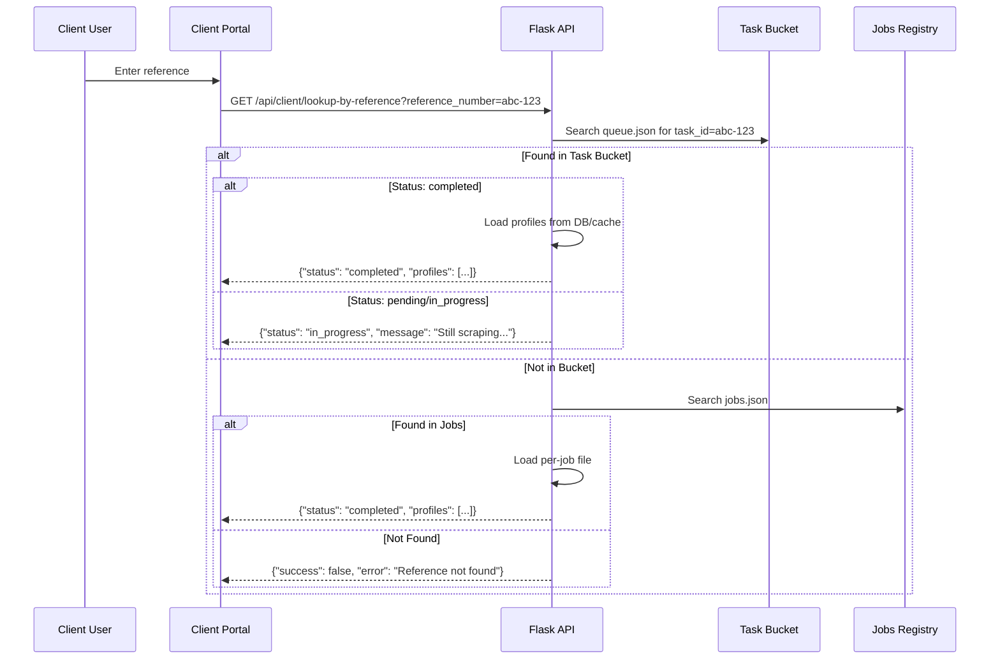
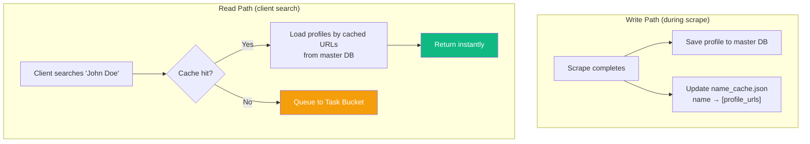

# 🌐 Client Portal Guide

> Documentation for the client-facing profile portal (`client.html`).

---

## Table of Contents

- [Overview](#overview)
- [Accessing the Portal](#accessing-the-portal)
- [Features](#features)
  - [Name Search](#name-search)
  - [Profile Cards](#profile-cards)
  - [Detail Modal](#detail-modal)
  - [Reference Number Lookup](#reference-number-lookup)
  - [Export & Download](#export--download)
- [User Flow Diagrams](#user-flow-diagrams)
  - [First-Time Search Flow](#first-time-search-flow)
  - [Cached Search Flow](#cached-search-flow)
  - [Reference Lookup Flow](#reference-lookup-flow)
- [How Caching Works](#how-caching-works)
- [Status Messages](#status-messages)

---

## Overview

The Client Portal is a clean, read-only interface designed for end-users who need to search and view LinkedIn profiles without needing access to the admin dashboard.

**Key differences from the Admin Dashboard:**
- No scraper controls (can't init/close browser)
- No database management
- No task queue controls
- Simplified search-only interface
- Reference number based tracking

---

## Accessing the Portal

**URL:** `http://localhost:5000` (root URL)

The client page is served by the Flask route:

```python
@app.route('/')
def client_page():
    return render_template('client.html')
```

---

## Features

### Name Search

The primary feature — search for a person by name.



**Input:** Person's name (e.g., "John Doe")

**Behavior:**
1. If the name was previously searched and cached → **instant results**
2. If not cached → task is queued to the Task Bucket, reference number is returned
3. Client polls `/api/client/scrape-status` until results are ready
4. Results are displayed as profile cards

---

### Profile Cards

Search results are displayed as visual profile cards:

| Element | Content |
|---------|---------|
| **Avatar** | Profile picture (or placeholder) |
| **Name** | Full name in bold |
| **Headline** | Professional headline |
| **Location** | Geographic location with icon |
| **View Button** | Opens detailed modal |

---

### Detail Modal

Clicking "View" on any profile card opens a full-screen modal with:

| Section | Content |
|---------|---------|
| **Header** | Large photo, name, headline, location |
| **About** | Full "About" text |
| **Current Position** | Current job title, company, duration |
| **Experience** | All work experience entries |
| **Education** | All education entries |
| **Skills** | Skills list with endorsement counts |
| **Certifications** | Certification names, issuers, dates |
| **Languages** | Languages with proficiency levels |
| **Volunteer** | Volunteer roles and organizations |
| **Honors & Awards** | Award titles, issuers, dates |
| **Recommendations** | Recommender names, titles, and text |

---

### Reference Number Lookup

Every scrape request is assigned a reference number. Users can retrieve results later using this reference.

**Input:** Reference number (e.g., `a1b2c3d4-e5f6-7890-abcd-ef1234567890`)

**Behavior:**
1. Client sends reference number to `/api/client/lookup-by-reference`
2. If completed → displays results
3. If in progress → shows "still scraping" message
4. If not found → shows error

---

### Export & Download

From the detail modal, users can:
- **Download JSON** — full structured profile data
- **Download PDF** — professionally formatted profile report

---

## User Flow Diagrams

### First-Time Search Flow



### Cached Search Flow



### Reference Lookup Flow



---

## How Caching Works



### Cache File Format

**File:** `exports/name_cache.json`

```json
{
  "Jane Smith": [
    "https://www.linkedin.com/in/janesmith",
    "https://www.linkedin.com/in/jsmith-google"
  ],
  "John Doe": [
    "https://www.linkedin.com/in/johndoe"
  ]
}
```

---

## Status Messages

| Status | Message Shown | User Action |
|--------|--------------|-------------|
| `cached` | Results displayed instantly | Browse profiles |
| `queued` | "Task queued. Reference: ABC-123" | Wait or note reference # |
| `pending` | "Waiting in queue…" | Wait (auto-polls) |
| `in_progress` | "Currently scraping…" | Wait (auto-polls) |
| `completed` | Profile cards displayed | Browse/export |
| `failed` | "No profile found for: ..." | Try different name |
| `error` | "Connection error" | Check server status |
