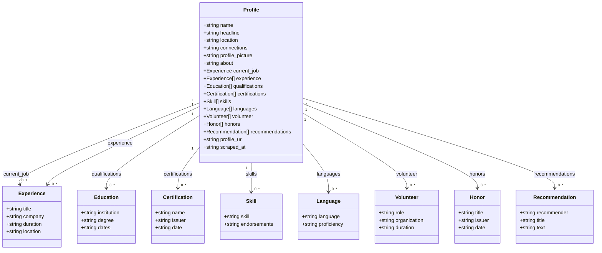
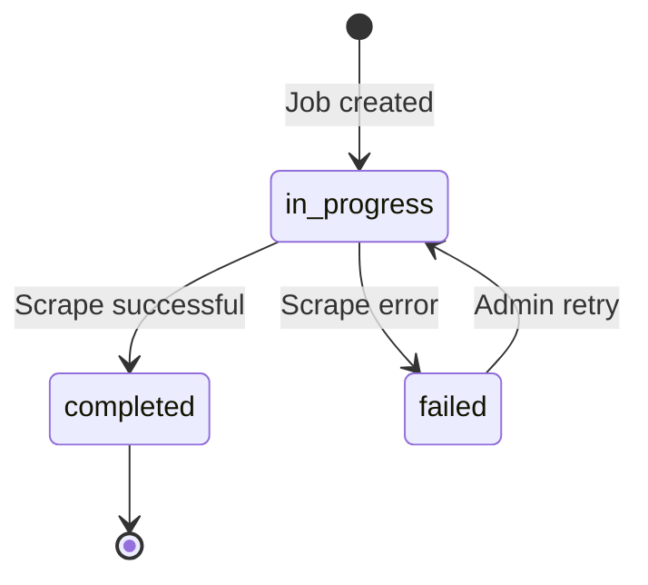
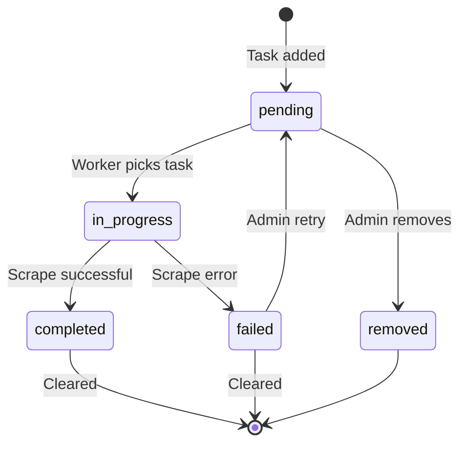
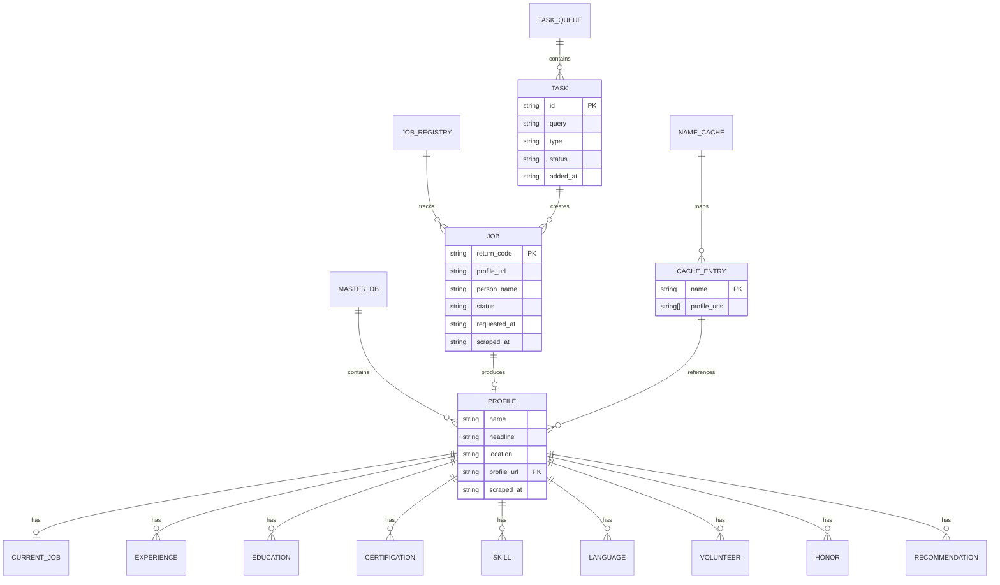

# 📊 Data Schema Documentation

> Complete documentation of all data models, file formats, and database schemas used in the Persona platform.

---

## Table of Contents

- [Profile Data Model](#profile-data-model)
- [Job Registry Schema](#job-registry-schema)
- [Task Bucket Schema](#task-bucket-schema)
- [Name Cache Schema](#name-cache-schema)
- [CSV File Formats](#csv-file-formats)
- [PDF Report Format](#pdf-report-format)
- [Entity Relationship Diagram](#entity-relationship-diagram)

---

## Profile Data Model

Every scraped profile is stored as a JSON object with the following fields:



### Complete JSON Example

```json
{
  "name": "Bawantha Beliwaththa",
  "headline": "BSc (Hons) Data Science Undergrad | Developer",
  "location": "Kegalle, Sabaragamuwa, Sri Lanka",
  "connections": "500+ connections",
  "profile_picture": "https://media.licdn.com/dms/image/...",
  "about": "BSc (Hons) Data Science undergraduate student at the University of Hertfordshire. A technology enthusiast interested in Data Science, Machine Learning, Web Development, and Cybersecurity.",
  "current_job": {
    "title": "Project Head (St. Mary's College Website)",
    "company": "St. Mary's College, Kegalle",
    "duration": "2023 - Present",
    "location": "Kegalle, Sri Lanka"
  },
  "experience": [
    {
      "title": "Project Head (St. Mary's College Website)",
      "company": "St. Mary's College, Kegalle",
      "duration": "2023 - Present",
      "location": "Kegalle, Sri Lanka"
    },
    {
      "title": "IT Club President & Prefect",
      "company": "St. Mary's College, Kegalle",
      "duration": "2021 - 2022",
      "location": "Kegalle, Sri Lanka"
    }
  ],
  "qualifications": [
    {
      "institution": "University of Hertfordshire",
      "degree": "BSc (Hons) in Data Science",
      "dates": "2024 – 2028"
    },
    {
      "institution": "St. Mary's College, Kegalle",
      "degree": "GCE Advanced Level",
      "dates": "2019 – 2022"
    }
  ],
  "certifications": [
    {
      "name": "Python for Data Science",
      "issuer": "Coursera",
      "date": "Issued Dec 2023"
    }
  ],
  "skills": [
    { "skill": "Python", "endorsements": "47 endorsements" },
    { "skill": "Data Science", "endorsements": "35 endorsements" },
    { "skill": "Web Development", "endorsements": "" },
    { "skill": "Cybersecurity", "endorsements": "" }
  ],
  "languages": [
    { "language": "English", "proficiency": "Professional working proficiency" },
    { "language": "Sinhala", "proficiency": "Native or bilingual proficiency" }
  ],
  "volunteer": [
    {
      "role": "Volunteer Developer",
      "organization": "SMC Kegalle Devs Team",
      "duration": "2022 – Present"
    }
  ],
  "honors": [
    {
      "title": "IT Club President Selection",
      "issuer": "St. Mary's College, Kegalle",
      "date": "2021"
    }
  ],
  "recommendations": [
    {
      "recommender": "Jane Doe",
      "title": "Senior Engineer at Google",
      "text": "I had the pleasure of working with..."
    }
  ],
  "profile_url": "https://www.linkedin.com/in/beliwaththa",
  "scraped_at": "2026-06-30T10:15:00.000000"
}
```

### Field Reference

| Field | Type | Description | Source |
|-------|------|-------------|--------|
| `name` | `string` | Full name | `<h1>` on main page, fallback: page title |
| `headline` | `string` | Professional headline | `.text-body-medium` |
| `location` | `string` | Geographic location | `.text-body-small.inline.t-black--light` |
| `connections` | `string` | Connection/follower count | `span.t-bold` near connection text |
| `profile_picture` | `string` | Avatar image URL | `img.pv-top-card-profile-picture__image` |
| `about` | `string` | About section text | `#about ~ div`, fallback: text parser |
| `current_job` | `Experience` | Most recent job | First entry from experience parser |
| `experience` | `Experience[]` | All work experience entries | `/details/experience/` sub-page |
| `qualifications` | `Education[]` | Education entries | `/details/education/` sub-page |
| `certifications` | `Certification[]` | License/certification entries | `/details/certifications/` sub-page |
| `skills` | `Skill[]` | Skills with endorsements | `/details/skills/` sub-page |
| `languages` | `Language[]` | Languages with proficiency | `/details/languages/` sub-page |
| `volunteer` | `Volunteer[]` | Volunteer experience | `/details/volunteering-experiences/` sub-page |
| `honors` | `Honor[]` | Awards and honors | `/details/honors/` sub-page |
| `recommendations` | `Recommendation[]` | Received recommendations | `/details/recommendations/` sub-page |
| `profile_url` | `string` | LinkedIn profile URL | Input parameter |
| `scraped_at` | `string` (ISO 8601) | Timestamp of extraction | `datetime.now().isoformat()` |

---

## Job Registry Schema

**File:** `exports/api_scrapes/jobs.json`

Tracks the status of every scrape job (single or bulk) across the system.

```json
{
  "return_code_abc123": {
    "profile_url": "https://www.linkedin.com/in/johndoe",
    "person_name": "John Doe",
    "status": "completed",
    "requested_at": "2026-06-30T10:00:00",
    "scraped_at": "2026-06-30T10:02:30",
    "error": null
  },
  "BULK_1719720000_a1b2c3d4": {
    "profile_url": "https://www.linkedin.com/in/user1",
    "profile_urls": [
      "https://www.linkedin.com/in/user1",
      "https://www.linkedin.com/in/user2"
    ],
    "is_bulk": true,
    "person_name": "",
    "status": "in_progress",
    "requested_at": "2026-06-30T10:05:00",
    "scraped_at": null,
    "error": null
  }
}
```

### Job Status Lifecycle



| Status | Description |
|--------|-------------|
| `in_progress` | Scrape is currently running |
| `completed` | Scrape finished successfully |
| `failed` | Scrape encountered an error |

---

## Task Bucket Schema

### Queue File

**File:** `exports/task_bucket/queue.json`

```json
[
  {
    "id": "a1b2c3d4-e5f6-7890-abcd-ef1234567890",
    "query": "Jane Smith @ Google",
    "type": "search",
    "search_params": {
      "first_name": "Jane",
      "last_name": "Smith",
      "company": "Google",
      "max_results": 5
    },
    "status": "pending",
    "added_at": "2026-06-30T10:00:00",
    "started_at": null,
    "completed_at": null,
    "result_name": "",
    "result_url": "",
    "profiles_found": 0,
    "error": null,
    "_client_name": "Jane Smith"
  }
]
```

### Task Types

| Type | Description | Query Format |
|------|-------------|--------------|
| `search` | Structured search with first/last name and company | `"Jane Smith @ Google"` |
| `name` | Simple name search (first match) | `"John Doe"` |
| `url` | Direct URL scrape | `"https://linkedin.com/in/user"` |

### Task Status Lifecycle



### Config File

**File:** `exports/task_bucket/config.json`

```json
{
  "rest_seconds": 30
}
```

---

## Name Cache Schema

**File:** `exports/name_cache.json`

Maps search names to lists of profile URLs for instant lookups on repeated searches.

```json
{
  "John Doe": [
    "https://www.linkedin.com/in/johndoe"
  ],
  "Jane Smith": [
    "https://www.linkedin.com/in/janesmith",
    "https://www.linkedin.com/in/jsmith"
  ]
}
```

---

## CSV File Formats

### Master CSV (`all_scraped_profiles.csv`)

| Column | Content |
|--------|---------|
| `name` | Profile name |
| `headline` | Professional headline |
| `location` | Geographic location |
| `profile_picture` | Avatar URL |
| `about` | About text |
| `current_job` | JSON string of Experience object |
| `experience` | JSON string of Experience array |
| `qualifications` | JSON string of Education array |
| `certifications` | JSON string of Certification array |
| `profile_url` | LinkedIn URL |
| `scraped_at` | ISO 8601 timestamp |

### Per-Job CSV (`{return_code}.csv`)

Same columns as master CSV plus:

| Column | Content |
|--------|---------|
| `return_code` | Job identifier |

### Export CSV (via `/api/scraper/export`)

| Column | Content |
|--------|---------|
| `Name` | Profile name |
| `Profile Picture` | Avatar URL |
| `About` | About text (max 2000 chars) |
| `Job Title` | Current job title |
| `Company` | Current company |
| `Qualifications` | Semicolon-separated "institution - degree" |
| `Certifications` | Semicolon-separated "name - issuer" |
| `Profile URL` | LinkedIn URL |
| `Scraped At` | Timestamp |

---

## PDF Report Format

Generated via the custom `PDF` class (extends FPDF):

```mermaid
graph TD
    subgraph "PDF Page Layout"
        H["Header: LinkedIn Blue Banner<br/>'LINKEDIN PROFILE REPORT'<br/>(0, 0) → (210, 35)"]
        
        PI["Profile Info Block (y=40)<br/>Name (Arial Bold 16)<br/>Headline (Arial 10)<br/>Location | URL | Connections"]
        
        PP["Profile Photo<br/>40x40px embedded image<br/>(if downloadable)"]
        
        S1["ABOUT Section<br/>Blue header bar + body text"]
        S2["EXPERIENCE Section<br/>Title at Company (Bold)<br/>Duration | Location (Italic)"]
        S3["EDUCATION Section<br/>Institution - Degree (Bold)<br/>Dates (Italic)"]
        S4["SKILLS Section<br/>Comma-separated list with endorsements"]
        S5["CERTIFICATIONS Section"]
        S6["LANGUAGES Section"]
        S7["VOLUNTEER EXPERIENCE Section"]
        S8["HONORS & AWARDS Section"]
        S9["RECOMMENDATIONS Section"]
        
        F["Footer: Page number<br/>(centered, gray italic)"]
    end

    H --> PI --> PP --> S1 --> S2 --> S3 --> S4 --> S5 --> S6 --> S7 --> S8 --> S9 --> F
```



---

## Entity Relationship Diagram



### Deduplication Logic

The master database uses `profile_url` as the unique key. When saving a profile:

1. Load `all_scraped_profiles.json`
2. Search for an existing entry with matching `profile_url`
3. If found → **update** the existing entry
4. If not found → **append** to the list
5. Rewrite the entire JSON file
6. Rewrite the entire CSV file (to stay in sync)
