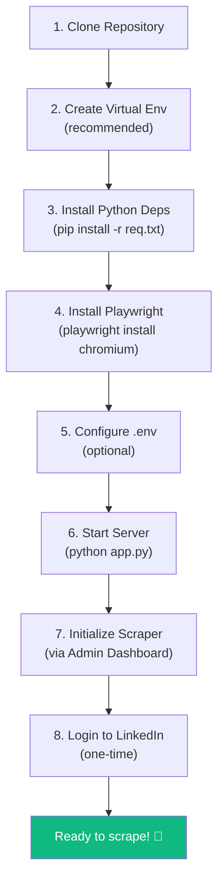
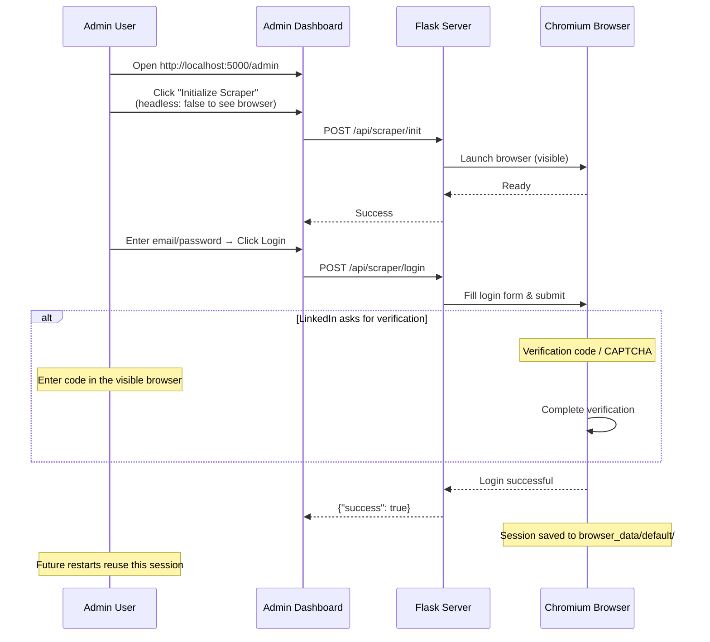

# 🚀 Deployment Guide

> Installation, configuration, and production deployment instructions for the Persona platform.

---

## Table of Contents

- [Prerequisites](#prerequisites)
- [Installation](#installation)
  - [Step-by-Step Setup](#step-by-step-setup)
  - [Playwright Browser Installation](#playwright-browser-installation)
- [Configuration](#configuration)
  - [Environment Variables](#environment-variables)
  - [Server Configuration](#server-configuration)
  - [Task Bucket Configuration](#task-bucket-configuration)
- [Running the Server](#running-the-server)
  - [Development Mode](#development-mode)
  - [Production Considerations](#production-considerations)
- [First-Time Login](#first-time-login)
- [Directory Permissions](#directory-permissions)
- [Dependency Reference](#dependency-reference)
- [Upgrading](#upgrading)
- [Uninstalling](#uninstalling)

---

## Prerequisites

| Requirement | Minimum | Recommended |
|-------------|---------|-------------|
| **Python** | 3.9+ | 3.11+ |
| **RAM** | 2 GB | 4+ GB (Chromium uses ~500MB+) |
| **Disk Space** | 500 MB | 2+ GB (browser data + scraped profiles) |
| **OS** | Windows 10, macOS 12, Ubuntu 20.04 | Windows 11, macOS 14, Ubuntu 22.04 |
| **Network** | Internet access | Stable broadband |
| **LinkedIn** | Active account | Premium account (optional) |

---

## Installation

### Step-by-Step Setup



#### 1. Clone the Repository

```bash
git clone https://github.com/your-username/persona.git
cd persona
```

#### 2. Create Virtual Environment (Recommended)

**Windows:**
```bash
python -m venv .venv
.venv\Scripts\activate
```

**macOS/Linux:**
```bash
python3 -m venv .venv
source .venv/bin/activate
```

#### 3. Install Python Dependencies

```bash
pip install -r req.txt
```

#### 4. Install Playwright Browsers

```bash
playwright install chromium
```

This downloads a Chromium browser binary (~150MB). It's stored in Playwright's cache directory, not in the project folder.

#### 5. (Optional) Configure Environment

```bash
# Create .env file for optional features
echo "OPENAI_API_KEY=sk-..." > .env
```

#### 6. Start the Server

```bash
python app.py
```

Output:
```
Persona - LinkedIn Profile Scraper and Ranker
http://localhost:5000
```

---

### Playwright Browser Installation

Playwright downloads browser binaries to its cache. If you need to install on a system without internet:

```bash
# Download browsers on a connected machine
playwright install --with-deps chromium

# Or install all browsers
playwright install
```

**Supported browsers:**
- `chromium` (default, recommended)
- `firefox`
- `webkit`

> **Note:** Persona only officially supports Chromium. The `browser_type` parameter exists for future compatibility.

---

## Configuration

### Environment Variables

| Variable | Required | Default | Description |
|----------|----------|---------|-------------|
| `OPENAI_API_KEY` | No | None | OpenAI API key for optional AI parser |

Create a `.env` file in the project root:

```env
OPENAI_API_KEY=sk-proj-abc123...
```

---

### Server Configuration

The Flask server is configured at the bottom of `app.py`:

```python
app.run(debug=True, host='0.0.0.0', port=5000, threaded=True)
```

| Parameter | Default | Description |
|-----------|---------|-------------|
| `debug` | `True` | Enable Flask debug mode (auto-reload, detailed errors) |
| `host` | `0.0.0.0` | Listen on all interfaces (accessible from network) |
| `port` | `5000` | HTTP port number |
| `threaded` | `True` | Handle requests in threads (required for SSE) |

**To change the port:**

Edit the last line in `app.py`:
```python
app.run(debug=True, host='0.0.0.0', port=8080, threaded=True)
```

---

### Task Bucket Configuration

Configure via API:

```bash
# Set rest period to 60 seconds
curl -X POST http://localhost:5000/api/bucket/config \
  -H "Content-Type: application/json" \
  -d '{"rest_seconds": 60}'
```

Or edit the config file directly:

**File:** `exports/task_bucket/config.json`

```json
{
  "rest_seconds": 30
}
```

---

## Running the Server

### Development Mode

```bash
python app.py
```

- Debug mode enabled (auto-reload on code changes)
- Accessible at `http://localhost:5000`
- Admin dashboard at `http://localhost:5000/admin`

### Production Considerations

> ⚠️ **Important:** This application is designed for personal/internal use. It is NOT designed for public deployment.

**If deploying for internal team use:**

1. **Disable debug mode:**
   ```python
   app.run(debug=False, host='0.0.0.0', port=5000, threaded=True)
   ```

2. **Use a WSGI server** (e.g., Gunicorn with eventlet for SSE support):
   ```bash
   pip install gunicorn eventlet
   gunicorn -w 1 --threads 4 -b 0.0.0.0:5000 app:app
   ```
   > **Note:** Only 1 worker is supported because the scraper uses a single shared browser instance.

3. **Use HTTPS** via a reverse proxy (Nginx, Caddy):
   ```nginx
   server {
       listen 443 ssl;
       server_name persona.local;
       
       ssl_certificate /path/to/cert.pem;
       ssl_certificate_key /path/to/key.pem;
       
       location / {
           proxy_pass http://127.0.0.1:5000;
           proxy_set_header Host $host;
           proxy_set_header X-Real-IP $remote_addr;
       }
       
       # SSE requires special handling
       location /api/admin/events {
           proxy_pass http://127.0.0.1:5000;
           proxy_set_header Connection '';
           proxy_http_version 1.1;
           chunked_transfer_encoding off;
           proxy_buffering off;
           proxy_cache off;
       }
   }
   ```

4. **Firewall**: Restrict access to trusted IPs only.

---

## First-Time Login

The LinkedIn login needs to be done once. After that, the session is persisted.



> **Tip:** Set `headless: false` on first login so you can see the browser and handle any verification steps (CAPTCHA, 2FA, etc.)

---

## Directory Permissions

The server needs write access to:

| Directory | Purpose | Created Automatically |
|-----------|---------|----------------------|
| `exports/` | Profile database, job files | Yes |
| `exports/api_scrapes/` | Per-job result files | Yes |
| `exports/task_bucket/` | Task queue and config | Yes |
| `browser_data/` | Chromium persistent data | Yes |
| `sessions/` | Cookie session backups | Yes |

All directories are created automatically on first use. If running as a service, ensure the service user has write permissions to the project directory.

---

## Dependency Reference

**File:** `req.txt`

| Package | Version | Purpose |
|---------|---------|---------|
| `flask` | Latest | Web server and routing |
| `flask_cors` | Latest | Cross-origin resource sharing |
| `playwright` | Latest | Browser automation (Chromium) |
| `requests` | Latest | HTTP client (image downloads) |
| `beautifulsoup4` | Latest | HTML parsing (legacy, minimal use) |
| `pydantic` | Latest | Data validation (legacy, minimal use) |
| `openai` | Latest | AI parser (optional) |
| `python-dotenv` | Latest | .env file loading |
| `aiohttp` | Latest | Async HTTP client |
| `tenacity` | Latest | Retry decorators |
| `fpdf` | Latest | PDF generation |

### Install All Dependencies

```bash
pip install -r req.txt
```

### Install Only Required Dependencies (Minimal)

```bash
pip install flask flask_cors playwright fpdf requests python-dotenv
```

---

## Upgrading

When upgrading to a new version:

1. **Backup your data:**
   ```bash
   cp -r exports/ exports_backup/
   cp -r browser_data/ browser_data_backup/
   ```

2. **Pull the latest code:**
   ```bash
   git pull origin main
   ```

3. **Update dependencies:**
   ```bash
   pip install -r req.txt --upgrade
   ```

4. **Update Playwright:**
   ```bash
   playwright install chromium
   ```

5. **Restart the server:**
   ```bash
   python app.py
   ```

Your scraped data, browser sessions, and task queue will be preserved across upgrades.

---

## Uninstalling

1. **Stop the server** (Ctrl+C)

2. **Remove data directories** (if you want to delete all scraped data):
   ```bash
   rm -rf exports/
   rm -rf browser_data/
   rm -rf sessions/
   ```

3. **Deactivate virtual environment:**
   ```bash
   deactivate
   ```

4. **Remove the project:**
   ```bash
   cd ..
   rm -rf persona/
   ```

5. **Remove Playwright browsers:**
   ```bash
   playwright uninstall --all
   ```
