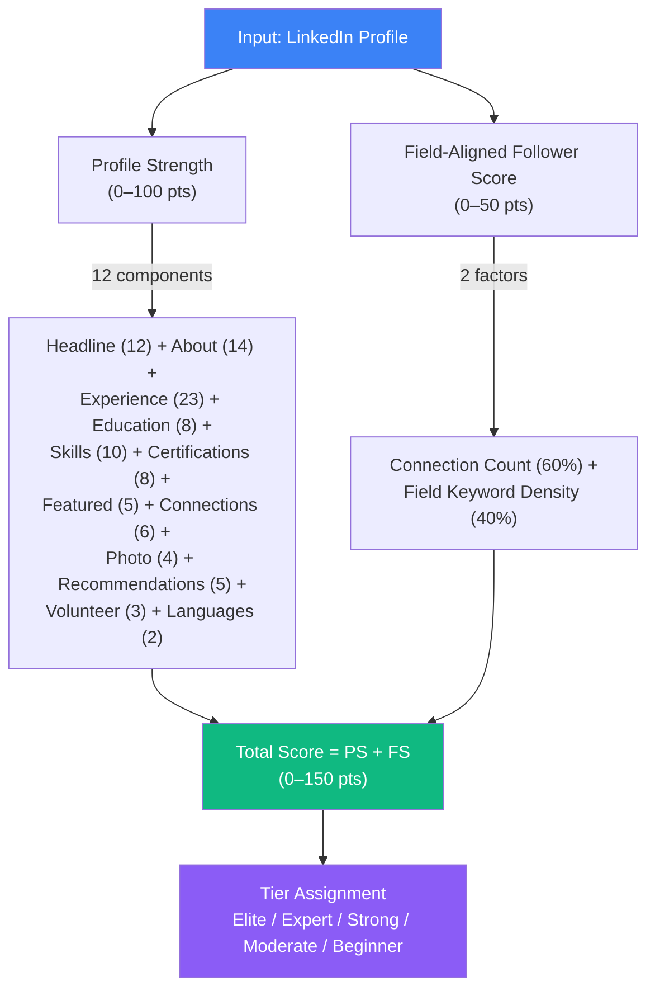
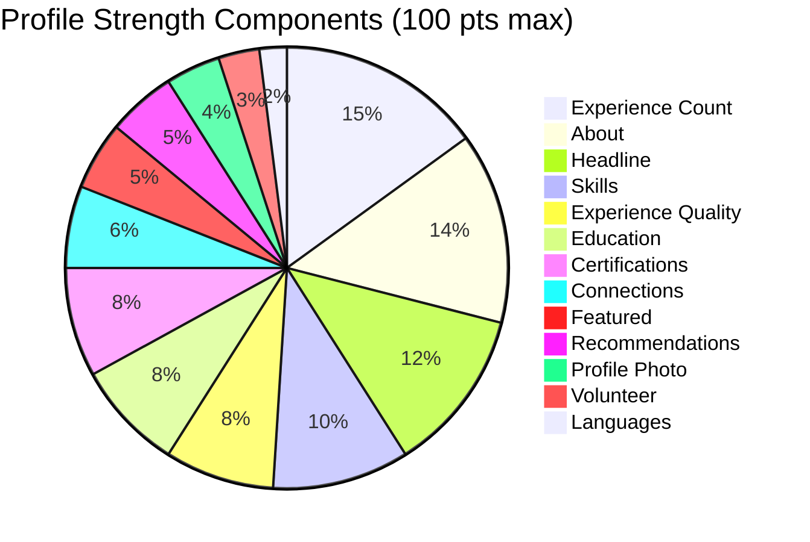
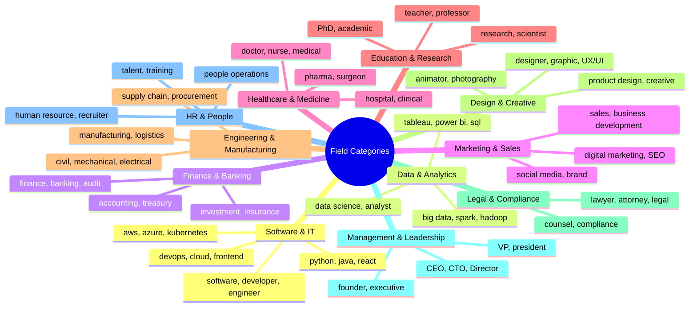
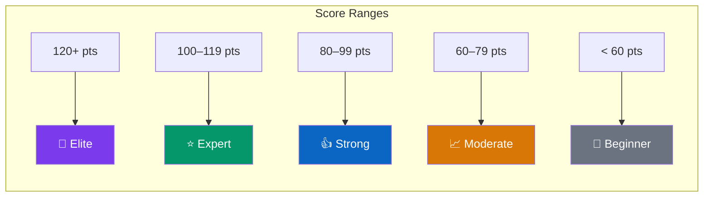
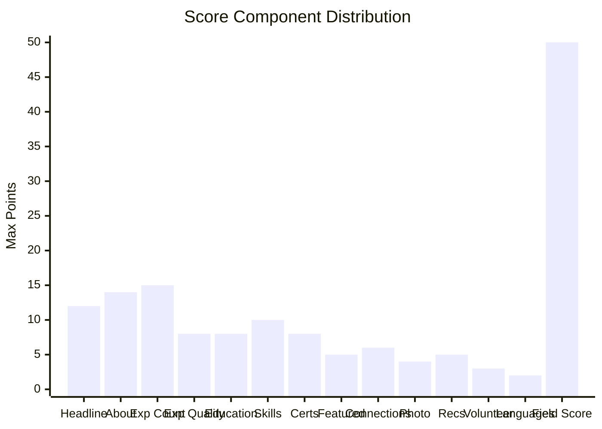

# 📈 Profile Ranking Model

> Detailed documentation of the weighted scoring model used to rank LinkedIn profiles.

---

## Table of Contents

- [Overview](#overview)
- [Scoring Architecture](#scoring-architecture)
- [Profile Strength Scoring (0–100)](#profile-strength-scoring-0100)
- [Field-Aligned Follower Score (0–50)](#field-aligned-follower-score-050)
- [Field Category Detection](#field-category-detection)
- [Tier System](#tier-system)
- [Sri Lankan Geo-Filter](#sri-lankan-geo-filter)
- [Scoring Formula](#scoring-formula)
- [API Usage](#api-usage)
- [Extension Points](#extension-points)

---

## Overview

The ranking model (`ranker.py`, 363 lines) scores LinkedIn profiles on a **0–150 point scale** using two dimensions:

1. **Profile Strength** (0–100 pts): How complete and rich is the profile?
2. **Field-Aligned Follower Score** (0–50 pts): How well-connected is the person in their field?

> **Note:** Currently, the ranker only scores profiles geo-located in Sri Lanka. Non-Sri Lankan profiles are filtered out.

---

## Scoring Architecture



---

## Profile Strength Scoring (0–100)

Each component awards points based on the presence and richness of profile data:

### Component Breakdown



### Detailed Scoring Rules

| Component | Max Points | Scoring Logic | Formula |
|-----------|-----------|---------------|---------|
| **Headline** | 12 | 8 pts for having any headline + up to 4 pts for length | `8 + min(len/120 × 4, 4)` |
| **About** | 14 | 8 pts for having any about + up to 6 pts for length | `8 + min(len/800 × 6, 6)` |
| **Experience Count** | 15 | 3 points per experience entry | `min(count × 3, 15)` |
| **Experience Quality** | 8 | 2 pts per entry with rich description (>80 chars), 1 pt for short desc, 0.5 for duration | `min(sum, 8)` |
| **Education** | 8 | 4 points per education entry | `min(count × 4, 8)` |
| **Skills** | 10 | 1 point per skill | `min(count, 10)` |
| **Certifications** | 8 | 2 points per certification | `min(count × 2, 8)` |
| **Featured** | 5 | Binary: 5 pts if featured content exists, 0 if not | `5 if featured else 0` |
| **Connections** | 6 | Proportional to 500 connections | `min(conn/500 × 6, 6)` |
| **Profile Photo** | 4 | Baseline bonus (always awarded) | `4` |
| **Recommendations** | 5 | 2.5 points per recommendation | `min(count × 2.5, 5)` |
| **Volunteer** | 3 | Binary: 3 pts if any volunteer experience | `3 if volunteer else 0` |
| **Languages** | 2 | 1 point per language | `min(count, 2)` |

### Example Scoring

| Profile Attribute | Value | Points |
|------------------|-------|--------|
| Headline | "Senior Software Engineer at Google" (35 chars) | 8 + 1.17 = **9.17** |
| About | 400-char description | 8 + 3.0 = **11.0** |
| 5 experience entries | 3 with descriptions | 15 + 7.5 = **15** (capped) + **7.5** |
| 2 education entries | — | **8** |
| 10 skills | — | **10** |
| 3 certifications | — | **6** |
| No featured content | — | **0** |
| 500+ connections | — | **6** |
| Profile photo | — | **4** |
| 2 recommendations | — | **5** |
| Volunteer experience | — | **3** |
| 2 languages | — | **2** |
| | **Profile Strength** | **87.67** |

---

## Field-Aligned Follower Score (0–50)

This dimension estimates how well-connected the person is within their professional field.

### Formula

```
field_score = 50 × (0.6 × connection_ratio + 0.4 × field_keyword_ratio)
```

Where:
- `connection_ratio = min(connections / 1000, 1.0)` — normalized connection count
- `field_keyword_ratio = matching_keywords / total_keywords` — density of field-specific keywords in headline, about, and skills

### Example

For a Software Engineer with 500 connections:

```
connection_ratio = 500 / 1000 = 0.5
field_keyword_ratio = 8 / 30 = 0.267 (8 out of 30 Software & IT keywords found)

field_score = 50 × (0.6 × 0.5 + 0.4 × 0.267)
           = 50 × (0.3 + 0.107)
           = 50 × 0.407
           = 20.33 pts
```

---

## Field Category Detection

The system classifies profiles into **11 industry categories** based on keyword matching across headline, about, skills, and experience:



### Detection Algorithm

```python
def detect_field_category(profile):
    text = concat(headline, about, skills, experience_titles)
    
    scores = {}
    for category, keywords in FIELD_CATEGORIES.items():
        hits = count(keyword in text for keyword in keywords)
        if hits > 0:
            scores[category] = hits
    
    return max(scores) or "General"
```

The category with the most keyword hits wins. If no keywords match, the profile is classified as "General".

---

## Tier System

Profiles are assigned a display tier based on their total score:



| Score Range | Label | Color | Icon |
|-------------|-------|-------|------|
| 120+ | **Elite** | `#7c3aed` (Purple) | `fa-crown` |
| 100–119 | **Expert** | `#059669` (Green) | `fa-star` |
| 80–99 | **Strong** | `#0a66c2` (Blue) | `fa-thumbs-up` |
| 60–79 | **Moderate** | `#d97706` (Amber) | `fa-chart-line` |
| < 60 | **Beginner** | `#6b7280` (Gray) | `fa-seedling` |

---

## Sri Lankan Geo-Filter

The ranker filters profiles by geographic location in Sri Lanka using a keyword-based approach:

### Keywords Checked

```python
SL_KEYWORDS = [
    "sri lanka", "srilanka", "colombo", "kandy", "galle", "negombo",
    "jaffna", "trincomalee", "batticaloa", "ratnapura", "kurunegala",
    "anuradhapura", "polonnaruwa", "badulla", "matara", "hambantota",
    "nuwara eliya", "kegalle", "kalutara", "gampaha", "puttalam",
    "mannar", "vavuniya", "mullaitivu", "kilinochchi", "ampara",
    "moneragala", "matale", "lk",
]
```

### Fields Searched

The filter checks three fields: `location`, `headline`, and `about`. If any Sri Lankan keyword is found in any of these fields, the profile passes the filter.

```python
def is_sri_lankan(profile):
    haystack = f"{location} {headline} {about}".lower()
    return any(kw in haystack for kw in SL_KEYWORDS)
```

---

## Scoring Formula

### Complete Formula

```
Total Score = min(Profile Strength, 100) + Field Follower Score

Profile Strength = Σ(all component scores)

Field Follower Score = 50 × (0.6 × min(connections/1000, 1.0) + 0.4 × field_hit_ratio)
```

### Score Distribution (Theoretical)



---

## API Usage

### Rank Profiles

```bash
curl -X POST http://localhost:5000/api/rank \
  -H "Content-Type: application/json" \
  -d '{
    "profiles": [
      {
        "name": "John Doe",
        "headline": "Software Engineer at Google",
        "location": "Colombo, Sri Lanka",
        "about": "Experienced developer...",
        "connections": "500+",
        "experiences": [{"title": "SWE", "company": "Google"}],
        "education": [{"institution": "UoM", "degree": "BSc CS"}],
        "skills": ["Python", "Java", "AWS"],
        "certifications": [{"name": "AWS Solutions Architect"}],
        "recommendations": [{"recommender": "Jane", "text": "Great dev"}],
        "volunteer": [{"role": "Mentor"}],
        "languages": [{"language": "English"}, {"language": "Sinhala"}]
      }
    ]
  }'
```

### Response Structure

```json
{
  "ranked": [
    {
      "rank": 1,
      "profile": { ... },
      "scoring": {
        "total_score": 127.5,
        "profile_strength": 89.0,
        "field_follower_score": 38.5,
        "field_category": "Software & IT",
        "is_sri_lankan": true,
        "connections_count": 500,
        "breakdown": { ... }
      },
      "tier": {
        "label": "Elite",
        "color": "#7c3aed",
        "icon": "fa-crown"
      }
    }
  ]
}
```

---

## Extension Points

The ranking model can be extended by modifying `ranker.py`:

### Adding New Field Categories

Add a new entry to `FIELD_CATEGORIES`:

```python
FIELD_CATEGORIES["Blockchain & Web3"] = [
    "blockchain", "crypto", "web3", "defi", "smart contract",
    "solidity", "ethereum", "nft", "dao",
]
```

### Adjusting Scoring Weights

Modify the `WEIGHTS` dictionary:

```python
WEIGHTS = {
    "has_headline": 8,      # Increase/decrease per component
    "skills_count": 15,     # Give more weight to skills
    ...
}
```

### Removing the Geo-Filter

To rank all profiles regardless of location, modify `rank_sri_lankan_profiles()`:

```python
def rank_all_profiles(profiles):
    results = []
    for profile in profiles:
        scoring = score_profile(profile)
        # Remove: if not scoring["is_sri_lankan"]: continue
        results.append({"profile": profile, "scoring": scoring})
    results.sort(key=lambda x: x["scoring"]["total_score"], reverse=True)
    for i, item in enumerate(results, 1):
        item["rank"] = i
    return results
```
