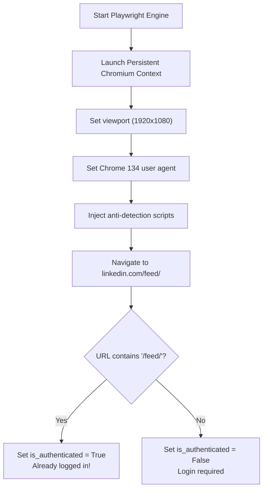
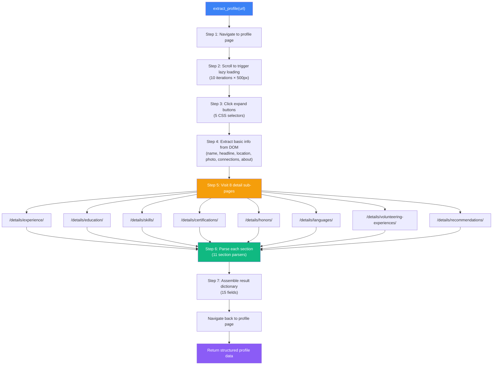
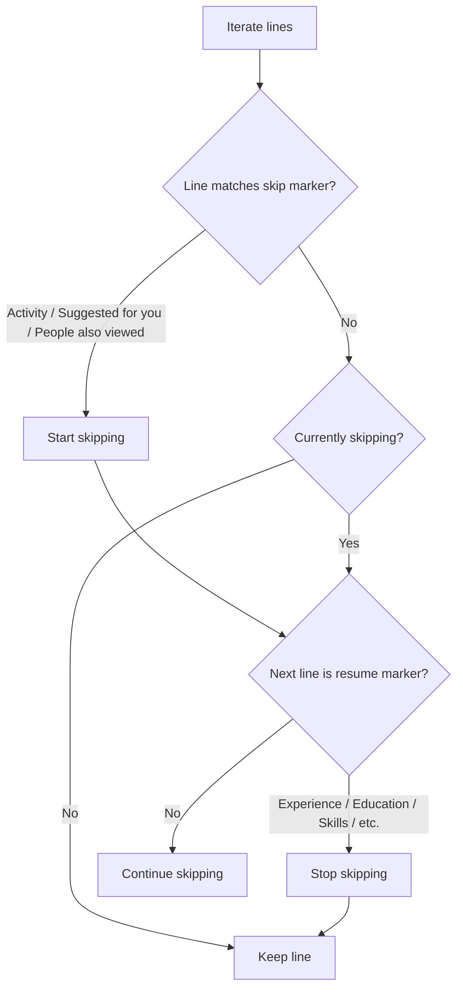
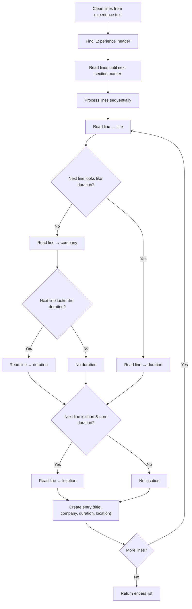
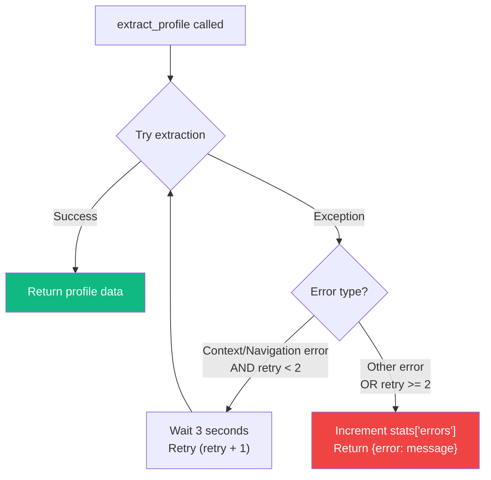

# 🔍 Scraper Engine Documentation

> Deep dive into `core.py` — the LinkedIn scraper engine that powers the Persona platform.

---

## Table of Contents

- [Overview](#overview)
- [LinkedInScraper Class](#linkedinscraper-class)
- [Initialization & Authentication](#initialization--authentication)
- [Profile Extraction Pipeline](#profile-extraction-pipeline)
  - [Step 1: Navigate to Profile](#step-1-navigate-to-profile)
  - [Step 2: Initial Scroll (Lazy Loading)](#step-2-initial-scroll-lazy-loading)
  - [Step 3: Expand Hidden Sections](#step-3-expand-hidden-sections)
  - [Step 4: DOM Data Extraction](#step-4-dom-data-extraction)
  - [Step 5: Detail Sub-Page Navigation](#step-5-detail-sub-page-navigation)
  - [Step 6: Section Parsing](#step-6-section-parsing)
  - [Step 7: Result Assembly](#step-7-result-assembly)
- [UI Noise Filtering](#ui-noise-filtering)
- [Section Parsers](#section-parsers)
- [People Search](#people-search)
- [Anti-Detection Measures](#anti-detection-measures)
- [Error Handling & Retries](#error-handling--retries)

---

## Overview

`core.py` (1055 lines) contains the `LinkedInScraper` class — the heart of the Persona platform. It uses **Playwright** (an async browser automation library) to control a real Chromium browser, navigate LinkedIn pages, and extract structured profile data.

### Key Design Principles

1. **Detail Sub-Page Navigation**: Instead of parsing the main profile page (which has limited data), V4 navigates to each dedicated detail page (`/details/experience/`, `/details/education/`, etc.) for richer, more accurate extraction.

2. **UI Noise Filtering**: A comprehensive noise filter removes 50+ known LinkedIn UI elements from raw text before parsing.

3. **Persistent Browser Context**: Uses Playwright's `launch_persistent_context` to store cookies and session data across restarts.

4. **Graceful Degradation**: Every parsing step is wrapped in try/except blocks. If a section fails, the scraper continues with other sections rather than failing entirely.

---

## LinkedInScraper Class

```python
class LinkedInScraper:
    def __init__(
        self,
        headless: bool = False,        # Run browser without visible window
        browser_type: str = "chromium", # Browser engine
        session_name: str = "default"   # Subfolder for persistent profile
    )
```

### Instance Variables

| Variable | Type | Description |
|----------|------|-------------|
| `headless` | `bool` | Whether the browser runs in headless mode |
| `browser_type` | `str` | Browser engine (always `chromium`) |
| `session_name` | `str` | Name of the persistent browser data directory |
| `playwright` | `Playwright` | Playwright engine instance |
| `context` | `BrowserContext` | Persistent browser context (stores cookies) |
| `page` | `Page` | Active browser page/tab |
| `is_authenticated` | `bool` | Whether LinkedIn login is active |
| `stats` | `dict` | Runtime statistics (requests, errors, etc.) |
| `user_data_dir` | `Path` | Path to `browser_data/{session_name}/` |

---

## Initialization & Authentication

### `initialize()` Method



**Browser Launch Parameters:**

```python
self.context = await self.playwright.chromium.launch_persistent_context(
    str(self.user_data_dir),
    headless=self.headless,
    viewport={'width': 1920, 'height': 1080},
    user_agent='Mozilla/5.0 (Windows NT 10.0; Win64; x64) AppleWebKit/537.36 '
               '(KHTML, like Gecko) Chrome/134.0.0.0 Safari/537.36',
    locale='en-US',
    timezone_id='America/New_York',
    args=['--disable-blink-features=AutomationControlled']
)
```

### `login(email, password)` Method

1. Navigate to `https://www.linkedin.com/login`
2. Fill `#username` and `#password` fields
3. Click submit button
4. Wait 5 seconds for navigation
5. Check if URL contains `/feed/` → set `is_authenticated`

---

## Profile Extraction Pipeline

The `extract_profile(profile_url, _retry=0)` method is the most important method in the system. Here's the complete pipeline:



### Step 1: Navigate to Profile

```python
await self.page.goto(profile_url, wait_until='domcontentloaded', timeout=60000)
await asyncio.sleep(4)
# Wait for name element to appear
await self.page.wait_for_selector('h1', timeout=15000)
```

### Step 2: Initial Scroll (Lazy Loading)

LinkedIn uses lazy loading — sections below the viewport are not rendered until they scroll into view.

```python
for _ in range(10):
    await self.page.evaluate('window.scrollBy(0, 500)')
    await asyncio.sleep(0.6)
```

- **10 iterations** × **500px** = 5000px total scroll
- **0.6s delay** between scrolls (mimics human behavior)

### Step 3: Expand Hidden Sections

LinkedIn collapses content behind "Show all" and "See more" buttons. The scraper clicks through five CSS selectors:

| Selector | Target |
|----------|--------|
| `button[aria-label*="Show all"]` | "Show all X experience" buttons |
| `button[aria-label*="See more"]` | "See more" expand buttons |
| `button.inline-show-more-text__button` | Inline text expanders |
| `span.see-more-button button` | Legacy see-more buttons |
| `a.optional-action-on-hide-show__button` | Optional show/hide buttons |

### Step 4: DOM Data Extraction

A single `page.evaluate()` JavaScript call extracts basic info from the main profile page:

| Field | CSS Selectors Tried |
|-------|-------------------|
| `name` | `h1`, `.text-heading-xlarge`, `.pv-top-card--list li:first-child` |
| `headline` | `.text-body-medium`, `.pv-text-details__left-panel .text-body-medium` |
| `location` | `.text-body-small.inline.t-black--light`, `.pv-text-details__left-panel span.text-body-small` |
| `profile_picture` | `img.pv-top-card-profile-picture__image`, `img.presence-entity__image`, `img[src*="media.licdn.com"]` |
| `connections` | `span.t-bold` elements near "connection/follower" text |
| `about` | `#about ~ div`, section heading fallback |

**Name Fallback**: If `h1` extraction fails, the scraper extracts the name from `document.title` (e.g., "John Doe - Software Engineer | LinkedIn").

### Step 5: Detail Sub-Page Navigation

This is the **key innovation in V4**. Instead of parsing the main profile page text (which is noisy and incomplete), the scraper navigates to each dedicated detail page:

```python
detail_pages = {
    'experience':      f"{base_url}/details/experience/",
    'education':       f"{base_url}/details/education/",
    'skills':          f"{base_url}/details/skills/",
    'certifications':  f"{base_url}/details/certifications/",
    'honors':          f"{base_url}/details/honors/",
    'languages':       f"{base_url}/details/languages/",
    'volunteer':       f"{base_url}/details/volunteering-experiences/",
    'recommendations': f"{base_url}/details/recommendations/",
}
```

For each detail page:

1. Navigate to the URL (`wait_until='domcontentloaded'`)
2. Wait 2 seconds for rendering
3. Scroll 5 times (500px each) to load lazy content
4. Click "Show more" buttons to expand descriptions
5. Extract text from the **structured list container only** (not the entire page)

**Smart Text Extraction**: The scraper uses a cascade of CSS selectors to target only the profile content, avoiding sidebars and navigation:

```javascript
const selectors = [
    'main .pvs-list__container',
    'main ul.pvs-list',
    '[data-view-name="profile-component-entity"]',
    '.scaffold-layout__main .pvs-list__container',
    '.scaffold-layout__main ul',
];
```

### Step 6: Section Parsing

Each section's raw text is processed by a dedicated parser. See [Section Parsers](#section-parsers) below.

### Step 7: Result Assembly

```python
result = {
    'name': name,
    'headline': raw.get('headline', ''),
    'location': raw.get('location', ''),
    'connections': connections,
    'profile_picture': raw.get('profile_picture', ''),
    'about': about,
    'current_job': current_job,         # First experience entry
    'experience': experience,           # All experience entries
    'qualifications': qualifications,   # Education entries
    'certifications': certifications,
    'skills': skills,
    'languages': languages,
    'volunteer': volunteer,
    'honors': honors,
    'recommendations': recommendations,
    'profile_url': profile_url,
    'scraped_at': datetime.now().isoformat()
}
```

---

## UI Noise Filtering

LinkedIn pages contain extensive UI chrome (navigation, buttons, badges, sidebar content) that must be filtered out before parsing. The scraper uses two filtering mechanisms:

### Static Noise Set (`_UI_NOISE`)

A set of 50+ known UI strings that are never profile data:

```python
_UI_NOISE = {
    # Navigation
    'LinkedIn', 'Home', 'My Network', 'Jobs', 'Messaging', 'Notifications',
    # Expand buttons
    'Show all', 'Show more', 'See more', 'See less',
    # Tab labels
    'Received', 'Given', 'All', 'Top skills',
    # Sidebar
    'People also viewed', 'People you may know', 'Suggested for you',
    # Actions
    'Connect', 'Follow', 'Message', 'More', 'Report',
    # Connection badges
    '1st', '2nd', '3rd', '· 1st', '· 2nd', '· 3rd',
    ...
}
```

### Regex Noise Patterns (`_UI_NOISE_PATTERNS`)

Compiled regex patterns for dynamic UI elements:

| Pattern | Matches |
|---------|---------|
| `^\d+\s+connection` | "500+ connections" |
| `^\d+\s+follower` | "1,234 followers" |
| `^See all \d+` | "See all 12 …" |
| `^Show all \d+` | "Show all 5 …" |
| `^·\s+\d+\s+(yr\|mo\|week\|day)` | "· 2 yrs 3 mos" |
| `^linkedin\.com` | LinkedIn URLs in text |
| `^\s*\d+\s*$` | Lone digits (page numbers) |

### `_clean_lines(text)` Method

Splits text into lines, removes empty lines and all lines matching noise filters:

```python
def _clean_lines(self, text: str) -> List[str]:
    result = []
    for line in text.split('\n'):
        s = line.strip()
        if s and not _is_noise(s):
            result.append(s)
    return result
```

### `_strip_posts(text)` Method

Removes the Activity/posts section and sidebar content that appears mid-page:



---

## Section Parsers

All section parsers follow a common pattern:

1. Clean lines (remove noise)
2. Find section header in the text
3. Read lines until the next section header
4. Group lines into structured entries

### Parser Summary

| Parser | Section | Output Structure | Grouping Logic |
|--------|---------|-----------------|---------------|
| `_parse_experience()` | Experience | `{title, company, duration, location}` | First entry only |
| `_parse_all_experiences()` | Experience | `[{title, company, duration, location}]` | Duration-based boundaries |
| `_parse_education()` | Education | `[{institution, degree, dates}]` | Duration-based boundaries |
| `_parse_certifications()` | Certifications | `[{name, issuer, date}]` | Duration-based boundaries |
| `_parse_skills()` | Skills | `[{skill, endorsements}]` | Endorsement pattern matching |
| `_parse_languages()` | Languages | `[{language, proficiency}]` | Proficiency keyword matching |
| `_parse_volunteer()` | Volunteer | `[{role, organization, duration}]` | Duration-based boundaries |
| `_parse_honors()` | Honors | `[{title, issuer, date}]` | Duration-based boundaries |
| `_parse_recommendations()` | Recommendations | `[{recommender, title, text}]` | Text length heuristics |
| `_parse_about()` | About | `str` | Section header boundaries |

### Duration Detection

The `_looks_like_duration(line)` helper function uses a regex to detect date/duration patterns:

```python
_DURATION_RE = re.compile(
    r'\b(\d{4}|Jan|Feb|Mar|...|Present|Current|Now|\d+\s*yr|\d+\s*mo|\d+\s*week)',
    re.I
)
```

This is the primary mechanism for detecting entry boundaries in multi-entry sections like Experience and Education.

### Proficiency Detection

The `_looks_like_proficiency(line)` helper checks for language proficiency keywords:

```python
_PROFICIENCY_KW = {
    'native', 'bilingual', 'full professional', 'professional working',
    'limited working', 'elementary', 'fluent', 'advanced', 'intermediate',
    'beginner', 'basic', 'conversational', 'working proficiency',
}
```

### Example: Experience Parser Flow



---

## People Search

### `search_people(first_name, last_name, company, max_results, force_search)`

1. **Build query**: Combine `first_name`, `last_name`, `company` into a search string
2. **Navigate**: Go to `https://www.linkedin.com/search/results/people/?keywords={encoded_query}`
3. **Scroll**: 4 iterations × 800px to load more results
4. **Extract**: Run JavaScript to parse search result cards

**JavaScript Extraction** targets two container types:

| Selector | Description |
|----------|-------------|
| `li.reusable-search__result-container` | Standard search result cards |
| `.entity-result__item` | Alternative result container |

For each card, it extracts:
- `profile_url` from `a[href*="/in/"]`
- `name` from `.entity-result__title-text`
- `profile_picture` from `img[src*="licdn.com"]` (excluding company logos and ghost images)
- `headline` from `.entity-result__primary-subtitle`

**Deduplication**: Uses a JavaScript `Set` to prevent duplicate URLs.

### `search_and_extract(first_name, last_name, company)`

Combines search + extraction:

1. Call `search_people()` to get profile URLs
2. For each result, call `extract_profile()`
3. Wait 5 seconds between each extraction
4. Return `{success, profiles_extracted, profiles}`

---

## Anti-Detection Measures

| Measure | Implementation |
|---------|---------------|
| **User Agent** | Chrome 134 on Windows 10 user agent string |
| **WebDriver Flag** | `navigator.webdriver` set to `undefined` via init script |
| **Chrome Object** | `window.chrome = { runtime: {} }` injected |
| **Automation Features** | `--disable-blink-features=AutomationControlled` flag |
| **Persistent Context** | Reuses cookies/localStorage like a real browser |
| **Human-like Scrolling** | Random delays between scroll operations |
| **Rate Limiting** | 5-second delays between profile extractions |

---

## Error Handling & Retries



- **MAX_RETRIES**: 2 (total 3 attempts)
- **Retry conditions**: Only for context-related or navigation errors
- **Retry delay**: 3 seconds between attempts
- **Failure**: Returns `{'profile_url': url, 'error': error_message}` instead of raising
