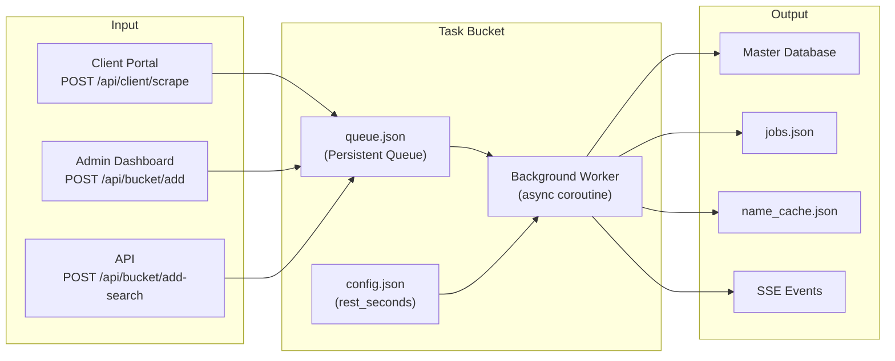
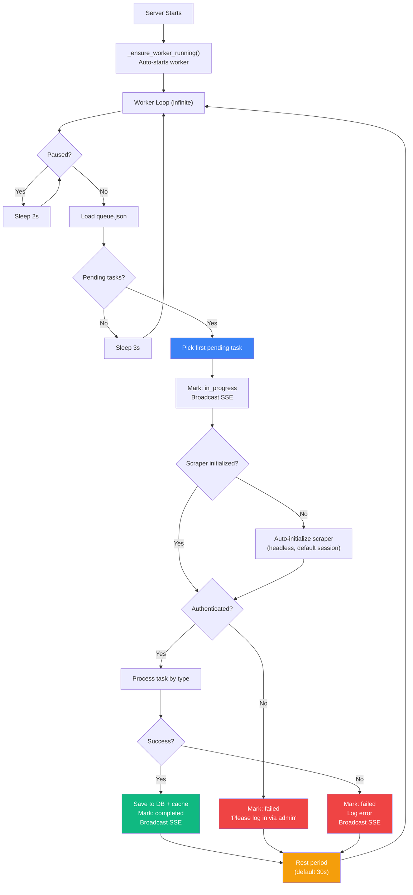
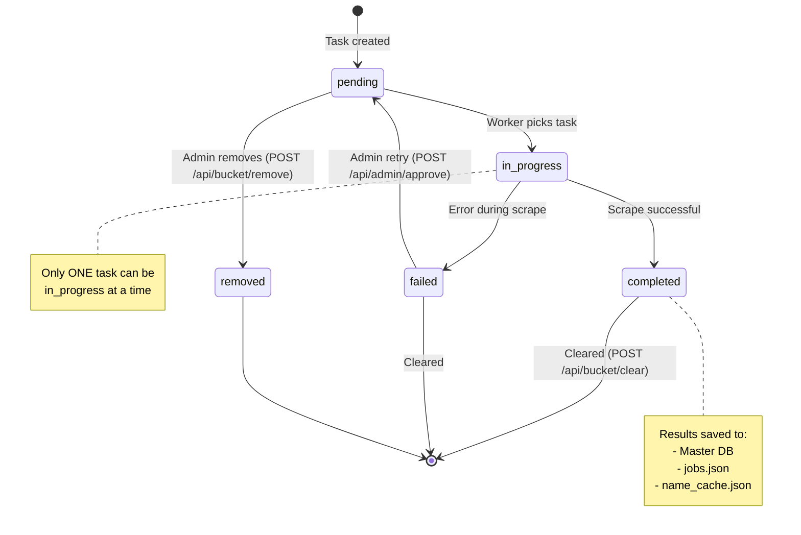
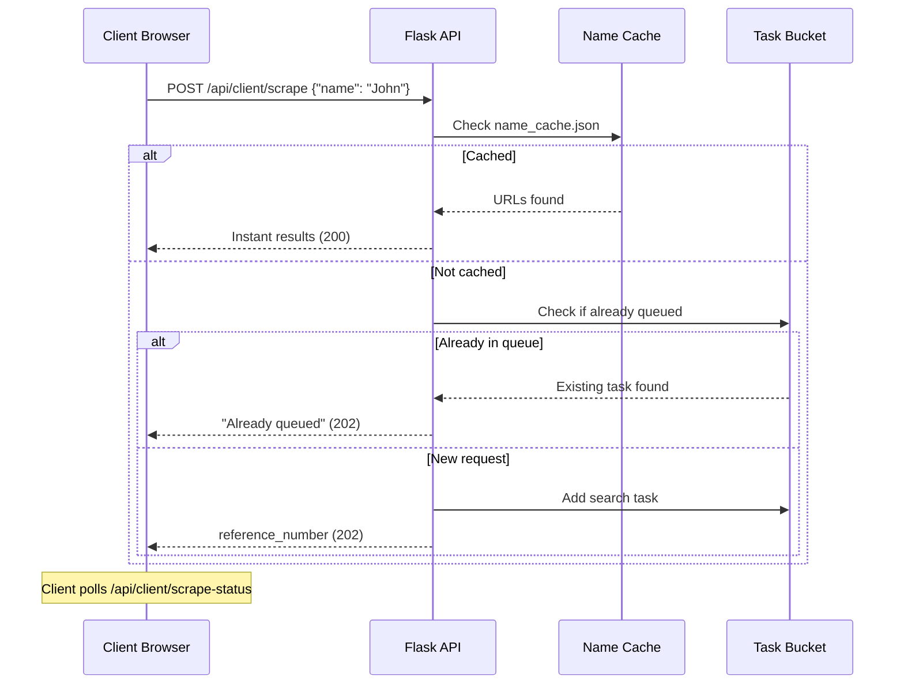

# ⚙️ Task Bucket System

> Documentation for the persistent task queue and background worker system.

---

## Table of Contents

- [Overview](#overview)
- [How It Works](#how-it-works)
- [Task Lifecycle](#task-lifecycle)
- [Worker Behavior](#worker-behavior)
- [Task Types](#task-types)
- [Configuration](#configuration)
- [SSE Event Integration](#sse-event-integration)
- [API Endpoints](#api-endpoints)
- [File Storage](#file-storage)
- [Integration with Client Portal](#integration-with-client-portal)

---

## Overview

The Task Bucket is a **persistent, file-backed task queue** that processes LinkedIn scrape requests one at a time in the background. It was designed for:

- **Unattended scraping**: Queue up many tasks, walk away, come back to results
- **Rate limiting**: Configurable rest periods between tasks prevent LinkedIn from flagging your account
- **Resilience**: Tasks survive server restarts — any pending tasks from previous runs auto-resume
- **Real-time monitoring**: SSE events broadcast every status change to connected admin browsers



---

## How It Works



---

## Task Lifecycle



---

## Worker Behavior

### Single Worker Model

Only **one worker coroutine** runs at a time. The global flag `_bucket_worker_running` prevents duplicate workers:

```python
def _ensure_worker_running():
    global _bucket_worker_running
    if not _bucket_worker_running:
        asyncio.run_coroutine_threadsafe(_bucket_worker(), _bg_loop)
```

### Auto-Start on Server Launch

At the bottom of `app.py`, `_ensure_worker_running()` is called at module load time. This means:
- Any pending tasks from a previous server session will resume automatically
- The worker starts immediately when the server boots

### Rest Period Behavior

The rest period runs in 2-second increments, checking the pause flag:

```python
while elapsed < rest:
    await asyncio.sleep(min(2, rest - elapsed))
    elapsed += 2
    if _bucket_worker_paused:
        break  # Exit rest early if paused
```

### Auto-Initialization

If the scraper is not initialized when the worker picks a task, it auto-initializes:

```python
if not scraper:
    s = LinkedInScraper(headless=True, browser_type='chromium', session_name='default')
    await s.initialize()
    scraper = s
```

This means the worker can run unattended as long as the LinkedIn session was previously saved.

---

## Task Types

### `search` — Structured People Search

Most commonly used. Searches LinkedIn by name/company, then extracts all found profiles.

```json
{
  "type": "search",
  "query": "Jane Smith @ Google",
  "search_params": {
    "first_name": "Jane",
    "last_name": "Smith",
    "company": "Google",
    "max_results": 5
  }
}
```

**Worker behavior:**
1. Call `scraper.search_people(fn, ln, co, max_results=mx)`
2. For each search result, call `scraper.extract_profile(url)`
3. Save each profile to master DB
4. Update name cache with `client_name → [scraped_urls]`
5. Save first profile under task_id for download compatibility
6. Log to jobs.json for backward compatibility

### `url` — Direct URL Scrape

Extracts a specific LinkedIn profile by URL.

```json
{
  "type": "url",
  "query": "https://www.linkedin.com/in/johndoe"
}
```

**Worker behavior:**
1. Call `scraper.extract_profile(url)`
2. Save profile to master DB
3. Save per-job files
4. Log to jobs.json

### `name` — Simple Name Search

Searches by name string, extracts only the first match.

```json
{
  "type": "name",
  "query": "John Doe"
}
```

**Worker behavior:**
1. Call `scraper.search_people(query, '', max_results=1, force_search=True)`
2. Extract the first result's profile
3. Save to master DB + per-job files

> **Auto-detection:** URLs starting with `http` are automatically treated as `url` type regardless of the specified type.

---

## Configuration

### Config File

**Location:** `exports/task_bucket/config.json`

```json
{
  "rest_seconds": 30
}
```

### Update via API

```bash
curl -X POST http://localhost:5000/api/bucket/config \
  -H "Content-Type: application/json" \
  -d '{"rest_seconds": 60}'
```

### Recommended Rest Period Values

| Scenario | Recommended Value | Rationale |
|----------|------------------|-----------|
| Light usage (< 20 profiles/day) | 15–30 seconds | Minimal rate limiting risk |
| Moderate usage (20–100 profiles/day) | 30–60 seconds | Safe for sustained scraping |
| Heavy usage (100+ profiles/day) | 60–120 seconds | Reduces rate limiting risk |
| Overnight batch | 30–45 seconds | Balance speed vs. safety |

---

## SSE Event Integration

The Task Bucket broadcasts SSE events at every status change, enabling real-time admin dashboard updates without polling.

### Events Broadcast by the Worker

| When | Event Type | Payload |
|------|-----------|---------|
| Task starts processing | `bucket_update` | `{task_id, status: "in_progress", query}` |
| Profile successfully scraped | `new_scrape` | `{name, count: 1}` |
| Task completed | `bucket_update` | `{task_id, status: "completed", query, result_name, profiles_found}` |
| Task failed | `bucket_update` | `{task_id, status: "failed", query, error}` |
| Entering rest period | `bucket_rest` | `{seconds}` |

### Events Broadcast by API Endpoints

| When | Event Type | Payload |
|------|-----------|---------|
| Tasks added to queue | `bucket_tasks_added` | `{count, query}` |
| Worker paused | `bucket_paused` | `{}` |
| Worker resumed | `bucket_resumed` | `{}` |
| Queue cleared | `bucket_cleared` | `{removed}` |
| Task retried | `bucket_update` | `{task_id, status: "pending", query}` |
| Task removed | `bucket_update` | `{task_id, status: "removed"}` |

---

## API Endpoints

| Method | Endpoint | Description |
|--------|----------|-------------|
| `POST` | `/api/bucket/add` | Add name/URL tasks |
| `POST` | `/api/bucket/add-search` | Add structured search task |
| `GET` | `/api/bucket/status` | Get full queue + summary |
| `POST` | `/api/bucket/pause` | Pause worker |
| `POST` | `/api/bucket/resume` | Resume worker |
| `POST` | `/api/bucket/config` | Update rest_seconds |
| `POST` | `/api/bucket/remove` | Remove pending task |
| `POST` | `/api/bucket/clear` | Clear completed/failed |

> See [API Reference](./api-reference.md#task-bucket-api-endpoints) for full request/response details.

---

## File Storage

```
exports/task_bucket/
├── queue.json    # Array of task objects
└── config.json   # Worker configuration
```

### Thread Safety

All file operations use `bucket_lock` (a `threading.Lock`):

```python
bucket_lock = threading.Lock()

def _load_bucket_queue():
    with bucket_lock:
        # Read queue.json

def _save_bucket_queue(tasks):
    with bucket_lock:
        # Write queue.json
```

---

## Integration with Client Portal

The Client Portal (`POST /api/client/scrape`) automatically routes all search requests through the Task Bucket:



This means the client never waits for a scrape — it always gets an immediate response with either cached results or a reference number to poll.
