#  Persona — Documentation

> **Persona** is a full-stack LinkedIn profile intelligence platform that automates profile discovery, extraction, and export through a web-based admin dashboard and REST API.

---

## Documentation Map

| Document | Description |
|----------|-------------|
| [Architecture](./architecture.md) | System architecture, component diagrams, data flow, threading model |
| [Scraper Engine](./scraper-engine.md) | Deep dive into `core.py` — browser automation, extraction pipeline, section parsers |
| [API Reference](./api-reference.md) | Complete REST API documentation with request/response examples for all 40+ endpoints |
| [Data Schema](./data-schema.md) | Profile data model, database schema, file formats, job/task models |
| [Task Bucket System](./task-bucket.md) | Persistent task queue, background worker, configuration, SSE events |
| [Admin Dashboard](./admin-dashboard.md) | Admin UI guide — scraper controls, job monitoring, database management |
| [Client Portal](./client-portal.md) | Client-facing portal — search, profile viewing, reference number lookups |
| [Deployment Guide](./deployment.md) | Installation, configuration, environment variables, production deployment |
| [Troubleshooting](./troubleshooting.md) | Common issues, debugging tips, FAQ |

---

## Quick Links

- **Source Code**: All source files live in the project root
- **Templates**: `templates/index.html` (Admin) and `templates/client.html` (Client)
- **Dependencies**: `req.txt`
- **Entry Point**: `python app.py` → `http://localhost:5000`

---

## Technology Stack

| Layer | Technology |
|-------|-----------|
| **Backend** | Python 3.9+, Flask, asyncio |
| **Browser Automation** | Playwright (Chromium) |
| **Frontend** | Vanilla HTML/CSS/JavaScript (no frameworks) |
| **Data Storage** | JSON files, CSV files |
| **Real-time Updates** | Server-Sent Events (SSE) |
| **PDF Generation** | FPDF |
| **AI Parser** | OpenAI GPT-3.5-turbo (optional) |
| **HTTP Client** | Requests, aiohttp |

---

## Version History

| Version | Codename | Key Changes |
|---------|----------|-------------|
| V1 | — | Basic single-profile scraper |
| V2 | — | Added bulk scraping, REST API |
| V3 | — | Admin dashboard, client view, persistent database |
| **V4** | **Persona** | Detail sub-page navigation, Task Bucket, SSE live updates, PDF export, name-based search & extract |

## Installation Guide

Welcome to the installation guide for Persona! Getting set up is straightforward.

You can find the source code at our repositories:
- GitHub: https://github.com/BawanthaBeliwaththa/Persona_V3/
- GitLab: https://gitlab.com/persona3234028/persona.git

Ensure you have cloned one of the repositories and installed the dependencies listed in `req.txt`.

#  System Architecture

This section covers the system architecture for the Persona platform, including component design, data flow, threading model, and system interactions.

---

## Table of Contents

- [High-Level Architecture](#high-level-architecture)
- [Component Diagram](#component-diagram)
- [Request Flow Diagrams](#request-flow-diagrams)
  - [Single Profile Scrape Flow](#single-profile-scrape-flow)
  - [Client Search Flow](#client-search-flow)
  - [Task Bucket Processing Flow](#task-bucket-processing-flow)
- [Threading & Concurrency Model](#threading--concurrency-model)
- [Data Flow Diagram](#data-flow-diagram)
- [File System Layout](#file-system-layout)
- [SSE Event System](#sse-event-system)
- [Module Dependency Graph](#module-dependency-graph)

---

## High-Level Architecture

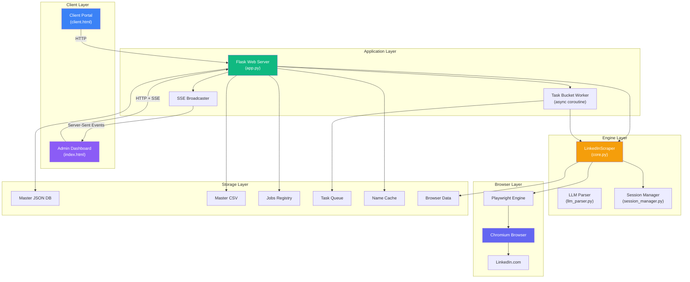

---

## Component Diagram

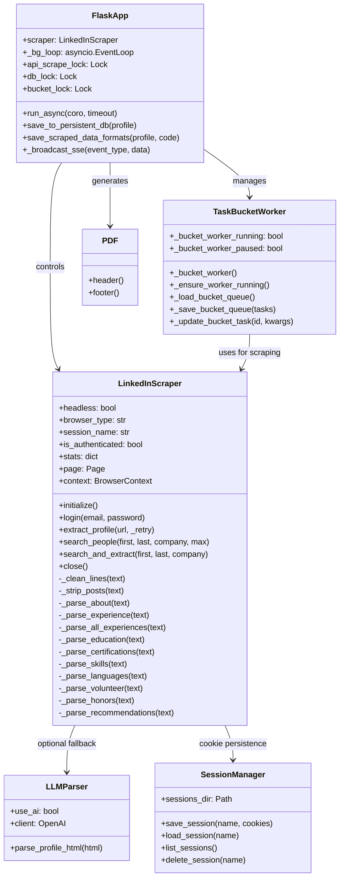

---

## Request Flow Diagrams

### Single Profile Scrape Flow

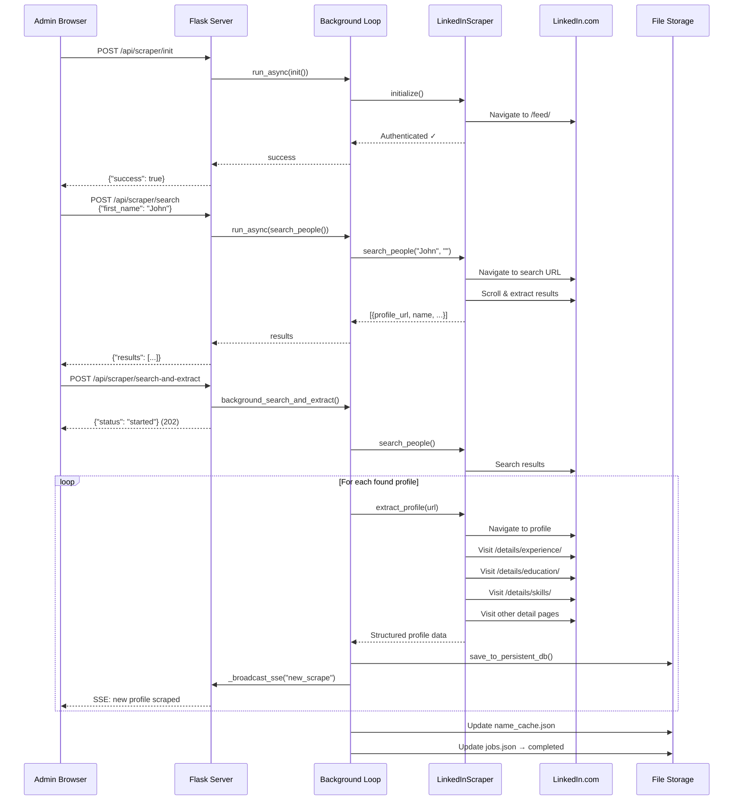

### Client Search Flow

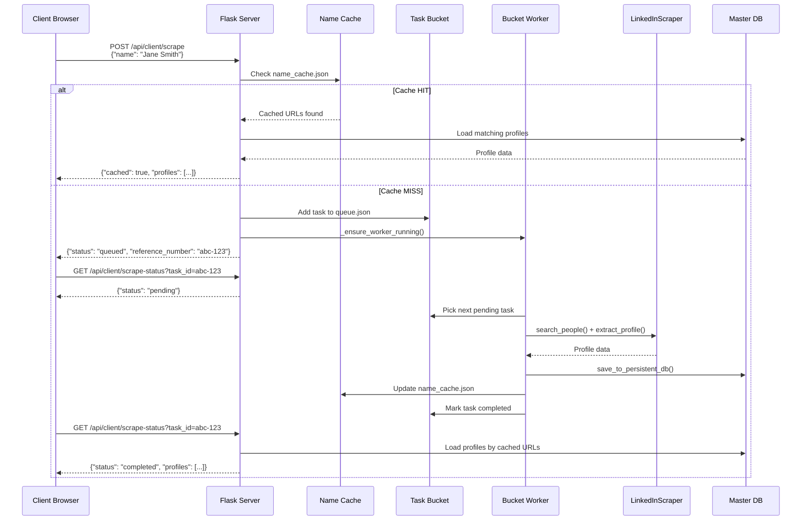

### Task Bucket Processing Flow

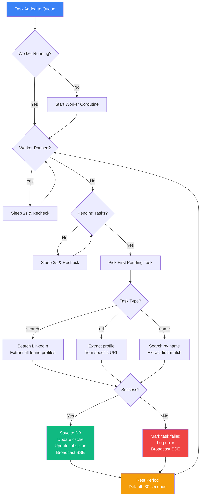

---

## Threading & Concurrency Model

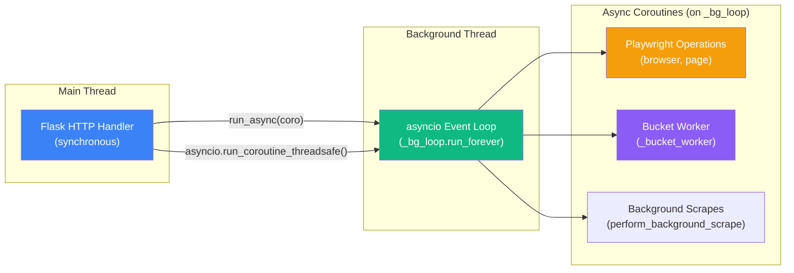

### How It Works

1. **Flask runs on the main thread** — handles all HTTP requests synchronously
2. **A dedicated asyncio event loop** (`_bg_loop`) runs in a daemon thread started at module load
3. **`run_async(coro, timeout)`** submits a coroutine to `_bg_loop` and blocks until the result is ready (for synchronous API responses)
4. **`asyncio.run_coroutine_threadsafe(coro, _bg_loop)`** fires and forgets a coroutine (for background operations that return 202 immediately)
5. **Three locks** protect shared state:

| Lock | Protects | Used By |
|------|----------|---------|
| `api_scrape_lock` | Per-job JSON/CSV files, jobs.json | save_scraped_data_formats, create_job, update_job_status |
| `db_lock` | Master database (all_scraped_profiles.json/csv), name_cache.json | save_to_persistent_db, client search endpoints |
| `bucket_lock` | Task queue (queue.json) | _load_bucket_queue, _save_bucket_queue |

---

## Data Flow Diagram

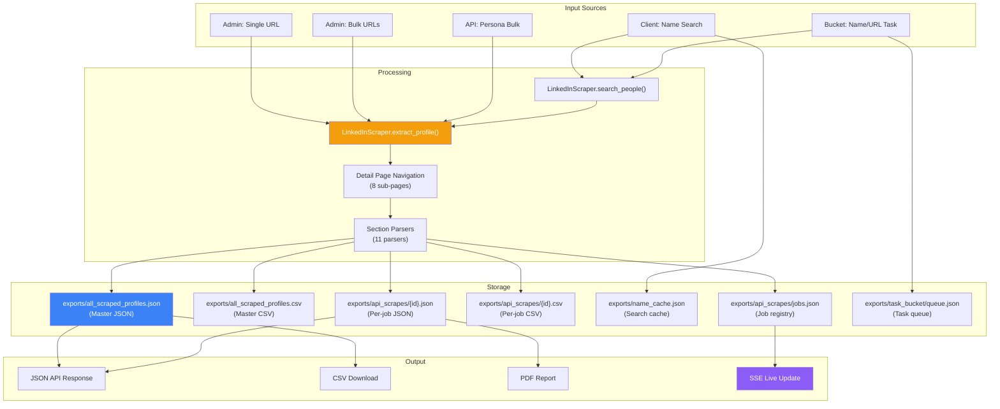

---

## File System Layout

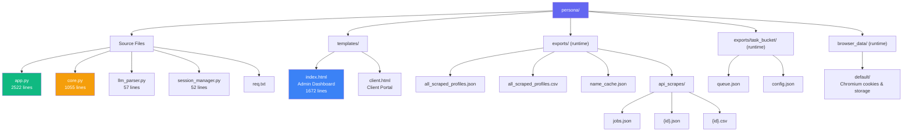

---

## SSE Event System

The admin dashboard receives real-time updates via Server-Sent Events. The server maintains a list of subscriber queues and broadcasts events to all connected clients.

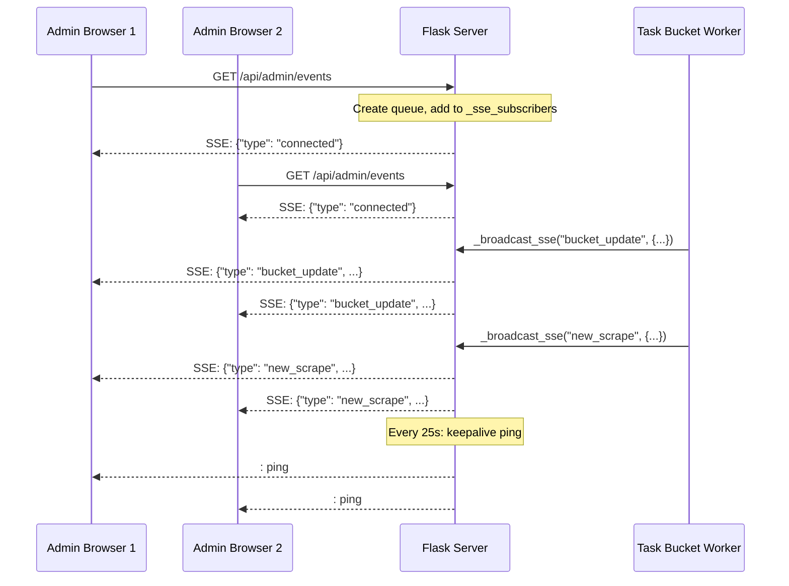

### SSE Event Types

| Event Type | Payload | Trigger |
|-----------|---------|---------|
| `connected` | `{}` | Browser connects to SSE endpoint |
| `request_started` | `{name}` | New search-and-extract request begins |
| `new_scrape` | `{name, count}` | A profile was successfully scraped |
| `bucket_tasks_added` | `{count, query}` | New tasks added to the bucket |
| `bucket_update` | `{task_id, status, query, ...}` | Task status changed |
| `bucket_rest` | `{seconds}` | Worker entering rest period |
| `bucket_paused` | `{}` | Worker paused |
| `bucket_resumed` | `{}` | Worker resumed |
| `bucket_cleared` | `{removed}` | Completed/failed tasks cleared |

---

## Module Dependency Graph

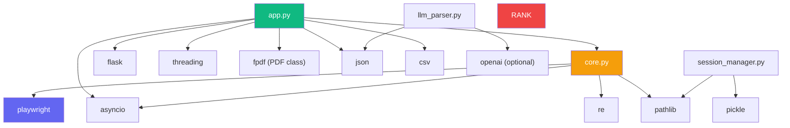

> **Note:** `llm_parser.py` and `session_manager.py` are not currently imported by `app.py` in V4 but remain available as utilities. The scraper engine (`core.py`) handles browser persistence directly via Playwright's persistent context.

#  Scraper Engine Documentation

> Deep dive into `core.py` — the LinkedIn scraper engine that powers the Persona platform.

---

## Table of Contents

- [Overview](#overview)
- [LinkedInScraper Class](#linkedinscraper-class)
- [Initialization & Authentication](#initialization--authentication)
- [Profile Extraction Pipeline](#profile-extraction-pipeline)
  - [Step 1: Navigate to Profile](#step-1-navigate-to-profile)
  - [Step 2: Initial Scroll (Lazy Loading)](#step-2-initial-scroll-lazy-loading)
  - [Step 3: Expand Hidden Sections](#step-3-expand-hidden-sections)
  - [Step 4: DOM Data Extraction](#step-4-dom-data-extraction)
  - [Step 5: Detail Sub-Page Navigation](#step-5-detail-sub-page-navigation)
  - [Step 6: Section Parsing](#step-6-section-parsing)
  - [Step 7: Result Assembly](#step-7-result-assembly)
- [UI Noise Filtering](#ui-noise-filtering)
- [Section Parsers](#section-parsers)
- [People Search](#people-search)
- [Anti-Detection Measures](#anti-detection-measures)
- [Error Handling & Retries](#error-handling--retries)

---

## Overview

`core.py` (1055 lines) contains the `LinkedInScraper` class — the heart of the Persona platform. It uses **Playwright** (an async browser automation library) to control a real Chromium browser, navigate LinkedIn pages, and extract structured profile data.

### Key Design Principles

1. **Detail Sub-Page Navigation**: Instead of parsing the main profile page (which has limited data), V4 navigates to each dedicated detail page (`/details/experience/`, `/details/education/`, etc.) for richer, more accurate extraction.

2. **UI Noise Filtering**: A comprehensive noise filter removes 50+ known LinkedIn UI elements from raw text before parsing.

3. **Persistent Browser Context**: Uses Playwright's `launch_persistent_context` to store cookies and session data across restarts.

4. **Graceful Degradation**: Every parsing step is wrapped in try/except blocks. If a section fails, the scraper continues with other sections rather than failing entirely.

---

## LinkedInScraper Class

```python
class LinkedInScraper:
    def __init__(
        self,
        headless: bool = False,        # Run browser without visible window
        browser_type: str = "chromium", # Browser engine
        session_name: str = "default"   # Subfolder for persistent profile
    )
```

### Instance Variables

| Variable | Type | Description |
|----------|------|-------------|
| `headless` | `bool` | Whether the browser runs in headless mode |
| `browser_type` | `str` | Browser engine (always `chromium`) |
| `session_name` | `str` | Name of the persistent browser data directory |
| `playwright` | `Playwright` | Playwright engine instance |
| `context` | `BrowserContext` | Persistent browser context (stores cookies) |
| `page` | `Page` | Active browser page/tab |
| `is_authenticated` | `bool` | Whether LinkedIn login is active |
| `stats` | `dict` | Runtime statistics (requests, errors, etc.) |
| `user_data_dir` | `Path` | Path to `browser_data/{session_name}/` |

---

## Initialization & Authentication

### `initialize()` Method

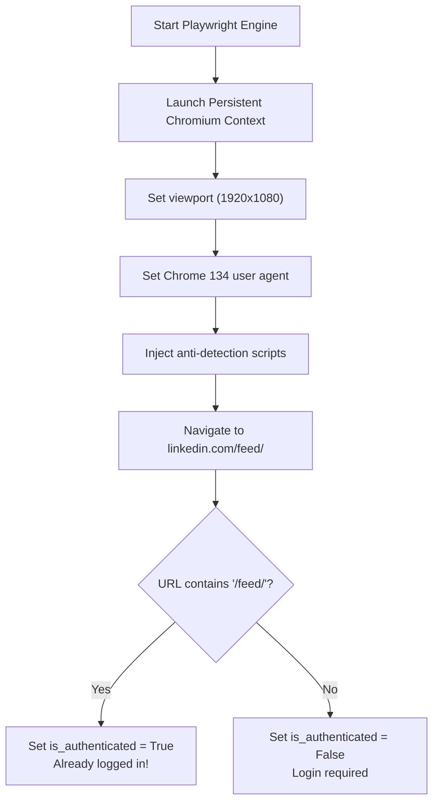

**Browser Launch Parameters:**

```python
self.context = await self.playwright.chromium.launch_persistent_context(
    str(self.user_data_dir),
    headless=self.headless,
    viewport={'width': 1920, 'height': 1080},
    user_agent='Mozilla/5.0 (Windows NT 10.0; Win64; x64) AppleWebKit/537.36 '
               '(KHTML, like Gecko) Chrome/134.0.0.0 Safari/537.36',
    locale='en-US',
    timezone_id='America/New_York',
    args=['--disable-blink-features=AutomationControlled']
)
```

### `login(email, password)` Method

1. Navigate to `https://www.linkedin.com/login`
2. Fill `#username` and `#password` fields
3. Click submit button
4. Wait 5 seconds for navigation
5. Check if URL contains `/feed/` → set `is_authenticated`

---

## Profile Extraction Pipeline

The `extract_profile(profile_url, _retry=0)` method is the most important method in the system. Here's the complete pipeline:

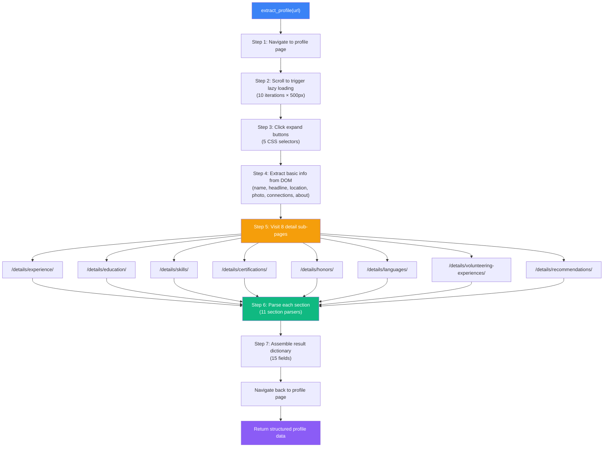

### Step 1: Navigate to Profile

```python
await self.page.goto(profile_url, wait_until='domcontentloaded', timeout=60000)
await asyncio.sleep(4)
# Wait for name element to appear
await self.page.wait_for_selector('h1', timeout=15000)
```

### Step 2: Initial Scroll (Lazy Loading)

LinkedIn uses lazy loading — sections below the viewport are not rendered until they scroll into view.

```python
for _ in range(10):
    await self.page.evaluate('window.scrollBy(0, 500)')
    await asyncio.sleep(0.6)
```

- **10 iterations** × **500px** = 5000px total scroll
- **0.6s delay** between scrolls (mimics human behavior)

### Step 3: Expand Hidden Sections

LinkedIn collapses content behind "Show all" and "See more" buttons. The scraper clicks through five CSS selectors:

| Selector | Target |
|----------|--------|
| `button[aria-label*="Show all"]` | "Show all X experience" buttons |
| `button[aria-label*="See more"]` | "See more" expand buttons |
| `button.inline-show-more-text__button` | Inline text expanders |
| `span.see-more-button button` | Legacy see-more buttons |
| `a.optional-action-on-hide-show__button` | Optional show/hide buttons |

### Step 4: DOM Data Extraction

A single `page.evaluate()` JavaScript call extracts basic info from the main profile page:

| Field | CSS Selectors Tried |
|-------|-------------------|
| `name` | `h1`, `.text-heading-xlarge`, `.pv-top-card--list li:first-child` |
| `headline` | `.text-body-medium`, `.pv-text-details__left-panel .text-body-medium` |
| `location` | `.text-body-small.inline.t-black--light`, `.pv-text-details__left-panel span.text-body-small` |
| `profile_picture` | `img.pv-top-card-profile-picture__image`, `img.presence-entity__image`, `img[src*="media.licdn.com"]` |
| `connections` | `span.t-bold` elements near "connection/follower" text |
| `about` | `#about ~ div`, section heading fallback |

**Name Fallback**: If `h1` extraction fails, the scraper extracts the name from `document.title` (e.g., "John Doe - Software Engineer | LinkedIn").

### Step 5: Detail Sub-Page Navigation

This is the **key innovation in V4**. Instead of parsing the main profile page text (which is noisy and incomplete), the scraper navigates to each dedicated detail page:

```python
detail_pages = {
    'experience':      f"{base_url}/details/experience/",
    'education':       f"{base_url}/details/education/",
    'skills':          f"{base_url}/details/skills/",
    'certifications':  f"{base_url}/details/certifications/",
    'honors':          f"{base_url}/details/honors/",
    'languages':       f"{base_url}/details/languages/",
    'volunteer':       f"{base_url}/details/volunteering-experiences/",
    'recommendations': f"{base_url}/details/recommendations/",
}
```

For each detail page:

1. Navigate to the URL (`wait_until='domcontentloaded'`)
2. Wait 2 seconds for rendering
3. Scroll 5 times (500px each) to load lazy content
4. Click "Show more" buttons to expand descriptions
5. Extract text from the **structured list container only** (not the entire page)

**Smart Text Extraction**: The scraper uses a cascade of CSS selectors to target only the profile content, avoiding sidebars and navigation:

```javascript
const selectors = [
    'main .pvs-list__container',
    'main ul.pvs-list',
    '[data-view-name="profile-component-entity"]',
    '.scaffold-layout__main .pvs-list__container',
    '.scaffold-layout__main ul',
];
```

### Step 6: Section Parsing

Each section's raw text is processed by a dedicated parser. See [Section Parsers](#section-parsers) below.

### Step 7: Result Assembly

```python
result = {
    'name': name,
    'headline': raw.get('headline', ''),
    'location': raw.get('location', ''),
    'connections': connections,
    'profile_picture': raw.get('profile_picture', ''),
    'about': about,
    'current_job': current_job,         # First experience entry
    'experience': experience,           # All experience entries
    'qualifications': qualifications,   # Education entries
    'certifications': certifications,
    'skills': skills,
    'languages': languages,
    'volunteer': volunteer,
    'honors': honors,
    'recommendations': recommendations,
    'profile_url': profile_url,
    'scraped_at': datetime.now().isoformat()
}
```

---

## UI Noise Filtering

LinkedIn pages contain extensive UI chrome (navigation, buttons, badges, sidebar content) that must be filtered out before parsing. The scraper uses two filtering mechanisms:

### Static Noise Set (`_UI_NOISE`)

A set of 50+ known UI strings that are never profile data:

```python
_UI_NOISE = {
    # Navigation
    'LinkedIn', 'Home', 'My Network', 'Jobs', 'Messaging', 'Notifications',
    # Expand buttons
    'Show all', 'Show more', 'See more', 'See less',
    # Tab labels
    'Received', 'Given', 'All', 'Top skills',
    # Sidebar
    'People also viewed', 'People you may know', 'Suggested for you',
    # Actions
    'Connect', 'Follow', 'Message', 'More', 'Report',
    # Connection badges
    '1st', '2nd', '3rd', '· 1st', '· 2nd', '· 3rd',
    ...
}
```

### Regex Noise Patterns (`_UI_NOISE_PATTERNS`)

Compiled regex patterns for dynamic UI elements:

| Pattern | Matches |
|---------|---------|
| `^\d+\s+connection` | "500+ connections" |
| `^\d+\s+follower` | "1,234 followers" |
| `^See all \d+` | "See all 12 …" |
| `^Show all \d+` | "Show all 5 …" |
| `^·\s+\d+\s+(yr\|mo\|week\|day)` | "· 2 yrs 3 mos" |
| `^linkedin\.com` | LinkedIn URLs in text |
| `^\s*\d+\s*$` | Lone digits (page numbers) |

### `_clean_lines(text)` Method

Splits text into lines, removes empty lines and all lines matching noise filters:

```python
def _clean_lines(self, text: str) -> List[str]:
    result = []
    for line in text.split('\n'):
        s = line.strip()
        if s and not _is_noise(s):
            result.append(s)
    return result
```

### `_strip_posts(text)` Method

Removes the Activity/posts section and sidebar content that appears mid-page:

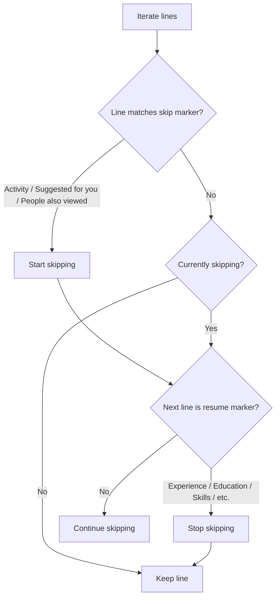

---

## Section Parsers

All section parsers follow a common pattern:

1. Clean lines (remove noise)
2. Find section header in the text
3. Read lines until the next section header
4. Group lines into structured entries

### Parser Summary

| Parser | Section | Output Structure | Grouping Logic |
|--------|---------|-----------------|---------------|
| `_parse_experience()` | Experience | `{title, company, duration, location}` | First entry only |
| `_parse_all_experiences()` | Experience | `[{title, company, duration, location}]` | Duration-based boundaries |
| `_parse_education()` | Education | `[{institution, degree, dates}]` | Duration-based boundaries |
| `_parse_certifications()` | Certifications | `[{name, issuer, date}]` | Duration-based boundaries |
| `_parse_skills()` | Skills | `[{skill, endorsements}]` | Endorsement pattern matching |
| `_parse_languages()` | Languages | `[{language, proficiency}]` | Proficiency keyword matching |
| `_parse_volunteer()` | Volunteer | `[{role, organization, duration}]` | Duration-based boundaries |
| `_parse_honors()` | Honors | `[{title, issuer, date}]` | Duration-based boundaries |
| `_parse_recommendations()` | Recommendations | `[{recommender, title, text}]` | Text length heuristics |
| `_parse_about()` | About | `str` | Section header boundaries |

### Duration Detection

The `_looks_like_duration(line)` helper function uses a regex to detect date/duration patterns:

```python
_DURATION_RE = re.compile(
    r'\b(\d{4}|Jan|Feb|Mar|...|Present|Current|Now|\d+\s*yr|\d+\s*mo|\d+\s*week)',
    re.I
)
```

This is the primary mechanism for detecting entry boundaries in multi-entry sections like Experience and Education.

### Proficiency Detection

The `_looks_like_proficiency(line)` helper checks for language proficiency keywords:

```python
_PROFICIENCY_KW = {
    'native', 'bilingual', 'full professional', 'professional working',
    'limited working', 'elementary', 'fluent', 'advanced', 'intermediate',
    'beginner', 'basic', 'conversational', 'working proficiency',
}
```

### Example: Experience Parser Flow

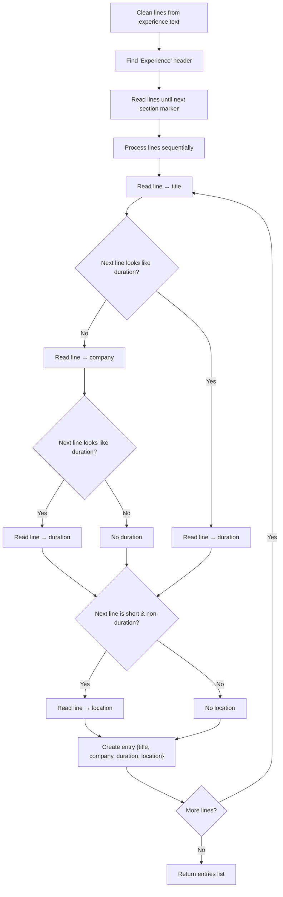

---

## People Search

### `search_people(first_name, last_name, company, max_results, force_search)`

1. **Build query**: Combine `first_name`, `last_name`, `company` into a search string
2. **Navigate**: Go to `https://www.linkedin.com/search/results/people/?keywords={encoded_query}`
3. **Scroll**: 4 iterations × 800px to load more results
4. **Extract**: Run JavaScript to parse search result cards

**JavaScript Extraction** targets two container types:

| Selector | Description |
|----------|-------------|
| `li.reusable-search__result-container` | Standard search result cards |
| `.entity-result__item` | Alternative result container |

For each card, it extracts:
- `profile_url` from `a[href*="/in/"]`
- `name` from `.entity-result__title-text`
- `profile_picture` from `img[src*="licdn.com"]` (excluding company logos and ghost images)
- `headline` from `.entity-result__primary-subtitle`

**Deduplication**: Uses a JavaScript `Set` to prevent duplicate URLs.

### `search_and_extract(first_name, last_name, company)`

Combines search + extraction:

1. Call `search_people()` to get profile URLs
2. For each result, call `extract_profile()`
3. Wait 5 seconds between each extraction
4. Return `{success, profiles_extracted, profiles}`

---

## Anti-Detection Measures

| Measure | Implementation |
|---------|---------------|
| **User Agent** | Chrome 134 on Windows 10 user agent string |
| **WebDriver Flag** | `navigator.webdriver` set to `undefined` via init script |
| **Chrome Object** | `window.chrome = { runtime: {} }` injected |
| **Automation Features** | `--disable-blink-features=AutomationControlled` flag |
| **Persistent Context** | Reuses cookies/localStorage like a real browser |
| **Human-like Scrolling** | Random delays between scroll operations |
| **Rate Limiting** | 5-second delays between profile extractions |

---

## Error Handling & Retries

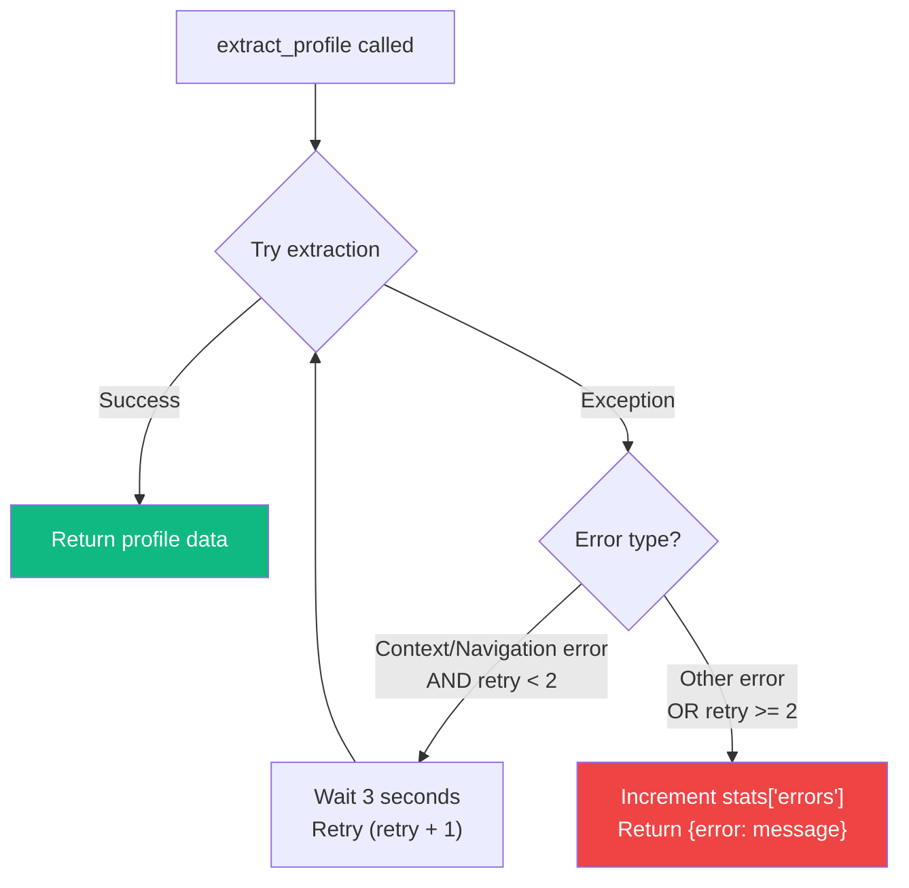

- **MAX_RETRIES**: 2 (total 3 attempts)
- **Retry conditions**: Only for context-related or navigation errors
- **Retry delay**: 3 seconds between attempts
- **Failure**: Returns `{'profile_url': url, 'error': error_message}` instead of raising

#  REST API Reference

This section provides a complete reference for all 40+ REST API endpoints available in the Persona platform.

---

## Table of Contents

- [Overview](#overview)
- [Scraper Control Endpoints](#scraper-control-endpoints)
- [Client API Endpoints](#client-api-endpoints)
- [Admin API Endpoints](#admin-api-endpoints)
- [Task Bucket API Endpoints](#task-bucket-api-endpoints)
- [Export API Endpoints](#export-api-endpoints)
- [Persona Bulk API](#persona-bulk-api)
- [SSE Events Endpoint](#sse-events-endpoint)
- [Error Handling](#error-handling)

---

## Overview

- **Base URL**: `http://localhost:5000`
- **Content Type**: All request/response bodies are `application/json` unless downloading files
- **Authentication**: No API key required (controlled by network access)
- **CORS**: Enabled for all origins via `flask-cors`

### Common Response Structure

**Success:**
```json
{
  "success": true,
  "message": "Operation completed",
  "data": { ... }
}
```

**Error:**
```json
{
  "success": false,
  "error": "Description of the error"
}
```

### HTTP Status Codes Used

| Code | Meaning |
|------|---------|
| `200` | Success |
| `201` | Created (task added to queue) |
| `202` | Accepted (task queued, processing in background) |
| `400` | Bad Request (missing required fields) |
| `401` | Unauthorized (scraper not authenticated) |
| `404` | Not Found (job/task/profile not found) |
| `500` | Internal Server Error |

---

## Scraper Control Endpoints

### `POST /api/scraper/init` — Initialize Browser

Starts the Playwright Chromium browser and creates a persistent context.

**Request:**
```json
{
  "headless": true,
  "browser_type": "chromium",
  "session_name": "default"
}
```

| Field | Type | Default | Description |
|-------|------|---------|-------------|
| `headless` | `bool` | `false` | Run browser without visible window |
| `browser_type` | `string` | `"chromium"` | Browser engine |
| `session_name` | `string` | `"default"` | Persistent data directory name |

**Response (200):**
```json
{
  "success": true,
  "message": "Browser initialized"
}
```

**Notes:**
- If a scraper is already running, it will be closed first
- The browser data is stored in `browser_data/{session_name}/`
- First call may take 5-10 seconds to launch the browser

---

### `POST /api/scraper/login` — Log In to LinkedIn

**Request:**
```json
{
  "email": "user@example.com",
  "password": "your_password"
}
```

**Response (200):**
```json
{
  "success": true,
  "message": "Login successful!"
}
```

**Response (400 — missing fields):**
```json
{
  "success": false,
  "error": "Email and password required"
}
```

**Notes:**
- Must call `/api/scraper/init` first
- After successful login, session is persisted in `browser_data/`
- Subsequent server restarts reuse the saved session automatically

---

### `GET /api/scraper/stats` — Get Scraper Statistics

**Response (200):**
```json
{
  "success": true,
  "stats": {
    "requests_made": 42,
    "profiles_scraped": 38,
    "errors": 4,
    "start_time": "2026-06-30T10:00:00",
    "runtime_seconds": 3600.5,
    "is_authenticated": true
  }
}
```

---

### `POST /api/scraper/search` — Search LinkedIn for People

**Request:**
```json
{
  "first_name": "John",
  "last_name": "Doe",
  "company": "Google",
  "max_results": 10
}
```

| Field | Type | Required | Description |
|-------|------|----------|-------------|
| `first_name` | `string` | Yes* | First name |
| `last_name` | `string` | Yes* | Last name |
| `company` | `string` | No | Company name filter |
| `max_results` | `int` | No (default: 10) | Maximum results to return |

\* At least one of `first_name` or `last_name` is required.

**Response (200):**
```json
{
  "success": true,
  "results": [
    {
      "profile_url": "https://www.linkedin.com/in/johndoe",
      "name": "John Doe",
      "profile_picture": "https://media.licdn.com/dms/image/...",
      "headline": "Software Engineer at Google"
    }
  ],
  "total": 5
}
```

---

### `POST /api/scraper/search-and-extract` — Search & Extract All Found Profiles

Performs a people search then automatically extracts the full profile for each result. Runs in the background.

**Request:**
```json
{
  "first_name": "Jane",
  "last_name": "Smith",
  "company": ""
}
```

**Response (202 — task started):**
```json
{
  "success": true,
  "status": "started",
  "message": "Scraping started in background. Please check back later."
}
```

**Response (200 — cached result):**
```json
{
  "success": true,
  "cached": true,
  "profiles": [ { "name": "Jane Smith", ... } ],
  "total": 3
}
```

**Response (202 — already in progress):**
```json
{
  "success": true,
  "status": "in_progress",
  "message": "Scraping is still running...",
  "total": 0,
  "profiles": []
}
```

---

### `POST /api/scraper/close` — Close Browser

**Response (200):**
```json
{
  "success": true,
  "message": "Closed"
}
```

---

## Client API Endpoints

### `POST /api/client/scrape` — Submit a Search Request

The primary client-facing endpoint. Routes all requests through the Task Bucket for automatic background processing.

**Request:**
```json
{
  "name": "John Doe"
}
```

**Response (200 — cached):**
```json
{
  "success": true,
  "cached": true,
  "profiles": [ { ... } ],
  "total": 3,
  "reference_number": "cached_John Doe"
}
```

**Response (202 — already queued):**
```json
{
  "success": true,
  "status": "pending",
  "reference_number": "a1b2c3d4-e5f6-...",
  "message": "Already queued. Check back soon."
}
```

**Response (202 — newly queued):**
```json
{
  "success": true,
  "status": "queued",
  "reference_number": "a1b2c3d4-e5f6-...",
  "message": "Task queued in the bucket. The worker will process it automatically."
}
```

---

### `GET /api/client/scrape-status` — Poll Task Status

**Query Parameters:** `?task_id=...` or `?name=...`

**Response (202 — pending):**
```json
{
  "success": true,
  "status": "pending",
  "message": "Queued in Task Bucket — the worker will process it automatically."
}
```

**Response (202 — in progress):**
```json
{
  "success": true,
  "status": "in_progress",
  "message": "Currently scraping LinkedIn profiles…"
}
```

**Response (200 — completed):**
```json
{
  "success": true,
  "status": "completed",
  "profiles": [
    {
      "name": "John Doe",
      "headline": "Software Engineer at Google",
      "location": "San Francisco, CA",
      ...
    }
  ],
  "total": 3
}
```

**Response (200 — failed):**
```json
{
  "success": false,
  "status": "failed",
  "error": "No profile found for: John Doe"
}
```

---

### `GET/POST /api/client/retrieve` — Retrieve Results by Return Code

**Query/Body:** `return_code`

**Response (200 — completed):**
```json
{
  "success": true,
  "status": "completed",
  "profile": {
    "name": "John Doe",
    "headline": "...",
    ...
  },
  "csv_url": "/api/client/download/csv?return_code=abc123"
}
```

---

### `GET/POST /api/client/lookup-by-reference` — Lookup by Reference Number

**Query/Body:** `reference_number` (also accepts `#reference_number`)

**Response (200 — completed):**
```json
{
  "success": true,
  "status": "completed",
  "reference_number": "a1b2c3d4-...",
  "person_name": "John Doe",
  "scraped_at": "2026-06-30T10:15:00",
  "is_bulk": false,
  "profiles": [ { ... } ],
  "total": 1
}
```

**Response (202 — in progress):**
```json
{
  "success": false,
  "status": "in_progress",
  "reference_number": "a1b2c3d4-...",
  "person_name": "John Doe",
  "requested_at": "2026-06-30T10:10:00",
  "message": "This profile is still being scraped. Please try again in a few seconds."
}
```

---

### `GET /api/client/download/csv` — Download CSV File

**Query:** `?return_code=abc123`

**Response:** File download (`text/csv`)

---

### `GET /api/client/download/json` — Download JSON File

**Query:** `?return_code=abc123`

**Response:** File download (`application/json`)

---

### `GET /api/client/download/pdf` — Download PDF Report

**Query:** `?return_code=abc123`

**Response:** File download (`application/pdf`)

The PDF includes:
- LinkedIn blue header banner
- Profile photo (downloaded and embedded)
- Name, headline, location, URL, connections
- All sections: About, Experience, Education, Skills, Certifications, Languages, Volunteer, Honors, Recommendations

---

## Admin API Endpoints

### `GET /api/admin/approvals` — List All Scrape Requests

Returns a combined list from both the Task Bucket queue and jobs.json, sorted by newest first.

**Response (200):**
```json
{
  "success": true,
  "approvals": [
    {
      "request_id": "a1b2c3d4-...",
      "reference_number": "a1b2c3d4-...",
      "person_name": "John Doe",
      "profile_url": "https://www.linkedin.com/in/johndoe",
      "status": "completed",
      "requested_at": "2026-06-30T10:00:00",
      "scraped_at": "2026-06-30T10:02:30",
      "error": null
    }
  ]
}
```

---

### `POST /api/admin/approve` — Retry/Re-scrape a Job

**Request:**
```json
{
  "request_id": "a1b2c3d4-..."
}
```

**Response (200):**
```json
{
  "success": true,
  "message": "Re-scrape triggered for request a1b2c3d4-..."
}
```

---

### `POST /api/admin/scrape-requested-name` — Manually Scrape a Name

Synchronous scrape — blocks until complete.

**Request:**
```json
{
  "person_name": "John Doe",
  "request_id": "abc123"
}
```

**Response (200):**
```json
{
  "success": true,
  "profile": { ... }
}
```

---

### `GET /api/admin/db-profiles` — Get All Profiles

**Response (200):**
```json
{
  "success": true,
  "profiles": [ { ... }, { ... }, ... ]
}
```

---

### `GET /api/admin/download-db/json` — Download Master JSON Database

**Response:** File download of `all_scraped_profiles.json`

---

### `GET /api/admin/download-db/csv` — Download Master CSV Database

**Response:** File download of `all_scraped_profiles.csv`

---

### `POST /api/admin/destroy-db` — Delete Entire Database

 **Destructive operation** — deletes all scraped data files.

**Response (200):**
```json
{
  "success": true
}
```

---

### `GET /api/admin/events` — SSE Event Stream

Opens a Server-Sent Events connection for real-time admin updates.

**Response:** `text/event-stream`

```
data: {"type":"connected"}

data: {"type":"bucket_update","task_id":"abc","status":"in_progress","query":"John Doe"}

data: {"type":"new_scrape","name":"John Doe","count":1}

: ping
```

---

## Task Bucket API Endpoints

### `POST /api/bucket/add` — Add Tasks to Queue

**Request:**
```json
{
  "queries": ["John Doe", "https://linkedin.com/in/janedoe", "Jane Smith"],
  "type": "name"
}
```

Or a single query:
```json
{
  "query": "John Doe"
}
```

| Field | Type | Description |
|-------|------|-------------|
| `queries` | `string[]` | List of names or URLs to queue |
| `query` | `string` | Single query (alternative to `queries`) |
| `type` | `string` | `"name"` or `"url"` (auto-detected for URLs) |

**Response (201):**
```json
{
  "success": true,
  "added": 3,
  "tasks": [
    {
      "id": "a1b2c3d4-...",
      "query": "John Doe",
      "type": "name",
      "status": "pending",
      "added_at": "2026-06-30T10:00:00",
      ...
    }
  ]
}
```

---

### `POST /api/bucket/add-search` — Add Structured Search Task

**Request:**
```json
{
  "first_name": "Jane",
  "last_name": "Smith",
  "company": "Google",
  "max_results": 5
}
```

**Response (201):**
```json
{
  "success": true,
  "task": {
    "id": "a1b2c3d4-...",
    "query": "Jane Smith @ Google",
    "type": "search",
    "search_params": {
      "first_name": "Jane",
      "last_name": "Smith",
      "company": "Google",
      "max_results": 5
    },
    "status": "pending",
    ...
  }
}
```

---

### `GET /api/bucket/status` — Get Queue Status

**Response (200):**
```json
{
  "success": true,
  "worker_running": true,
  "worker_paused": false,
  "rest_seconds": 30,
  "summary": {
    "pending": 3,
    "in_progress": 1,
    "completed": 12,
    "failed": 2,
    "total": 18
  },
  "tasks": [
    {
      "id": "a1b2c3d4-...",
      "query": "John Doe",
      "type": "name",
      "status": "completed",
      "added_at": "2026-06-30T10:00:00",
      "started_at": "2026-06-30T10:00:05",
      "completed_at": "2026-06-30T10:01:30",
      "result_name": "John Doe",
      "result_url": "https://www.linkedin.com/in/johndoe",
      "profiles_found": 1,
      "error": null
    }
  ]
}
```

---

### `POST /api/bucket/pause` — Pause Worker

**Response (200):**
```json
{
  "success": true,
  "paused": true
}
```

---

### `POST /api/bucket/resume` — Resume Worker

**Response (200):**
```json
{
  "success": true,
  "paused": false
}
```

---

### `POST /api/bucket/config` — Update Worker Configuration

**Request:**
```json
{
  "rest_seconds": 45
}
```

**Response (200):**
```json
{
  "success": true,
  "config": {
    "rest_seconds": 45
  }
}
```

---

### `POST /api/bucket/remove` — Remove Pending Task

**Request:**
```json
{
  "task_id": "a1b2c3d4-..."
}
```

**Response (200):**
```json
{
  "success": true
}
```

---

### `POST /api/bucket/clear` — Clear Completed/Failed Tasks

**Request:**
```json
{
  "all": false
}
```

| Field | Type | Description |
|-------|------|-------------|
| `all` | `bool` | If `true`, clears ALL tasks. If `false` (default), only clears completed and failed tasks. |

**Response (200):**
```json
{
  "success": true,
  "removed": 14,
  "remaining": 4
}
```

---

## Export API Endpoints

### `POST /api/scraper/export` — Export Data

**Request:**
```json
{
  "data": {
    "profiles": [ { ... }, { ... } ]
  },
  "format": "json"
}
```

| Field | Values | Description |
|-------|--------|-------------|
| `format` | `"json"`, `"csv"` | Output format |

**Response:** File download

---

### `POST /api/export-text-pdf` — Export Raw Text as PDF

**Request:**
```json
{
  "text": "Full profile text content..."
}
```

**Response:** PDF file download

---

### `POST /api/export-profile-pdf` — Export Single Profile as PDF

**Request:**
```json
{
  "profile": {
    "name": "John Doe",
    "headline": "...",
    ...
  }
}
```

**Response:** PDF file download

---

### `POST /api/export-bulk-pdf` — Export Multiple Profiles as PDF

**Request:**
```json
{
  "profiles": [
    { "name": "John Doe", ... },
    { "name": "Jane Smith", ... }
  ]
}
```

**Response:** PDF file download (one page per profile)

---

## Persona Bulk API

### `POST /api/persona/bulk-scrape` — Submit Bulk Scrape

**Request:**
```json
{
  "profile_urls": [
    "https://www.linkedin.com/in/user1",
    "https://www.linkedin.com/in/user2"
  ],
  "return_code": "custom_batch_001"
}
```

**Response (202):**
```json
{
  "success": true,
  "message": "Bulk scrape request queued successfully in background.",
  "return_code": "custom_batch_001",
  "status": "in_progress"
}
```

---

### `GET/POST /api/persona/bulk-retrieve` — Retrieve Bulk Results

**Query/Body:** `return_code`

> **Note:** A 1-minute delay policy is enforced after scrape completion. If you query within 60 seconds of completion, you'll receive a `waiting_delay` status.

**Response (200 — waiting delay):**
```json
{
  "success": false,
  "status": "waiting_delay",
  "message": "Bulk scrape completed, but data cannot be retrieved yet. Under the 1-minute delay policy, you must wait another 45 seconds.",
  "remaining_seconds": 45
}
```

**Response (200 — ready):**
```json
{
  "success": true,
  "status": "completed",
  "profiles": [ { ... }, { ... } ],
  "csv_url": "/api/client/download/csv?return_code=custom_batch_001",
  "pdf_url": "/api/client/download/pdf?return_code=custom_batch_001"
}
```

---

## Error Handling

### Common Error Responses

**Scraper not initialized:**
```json
{
  "success": false,
  "error": "Not initialized"
}
```
→ Call `POST /api/scraper/init` first.

**Not authenticated:**
```json
{
  "success": false,
  "error": "Not authenticated"
}
```
→ Call `POST /api/scraper/login` first.

**Missing required fields:**
```json
{
  "success": false,
  "error": "name is required"
}
```
→ Check the endpoint's required fields.

**Job not found:**
```json
{
  "success": false,
  "error": "No scrape request found for the provided return_code"
}
```
→ Verify the return code or reference number.

**Scrape failed:**
```json
{
  "success": false,
  "status": "failed",
  "error": "No profile found for: John Doe"
}
```
→ The scraper couldn't find or extract the requested profile. Try a different search query or retry.

#  Data Schema Documentation

This section details the data models, file formats, and database schemas used throughout the Persona platform.

---

## Table of Contents

- [Profile Data Model](#profile-data-model)
- [Job Registry Schema](#job-registry-schema)
- [Task Bucket Schema](#task-bucket-schema)
- [Name Cache Schema](#name-cache-schema)
- [CSV File Formats](#csv-file-formats)
- [PDF Report Format](#pdf-report-format)
- [Entity Relationship Diagram](#entity-relationship-diagram)

---

## Profile Data Model

Every scraped profile is stored as a JSON object with the following fields:

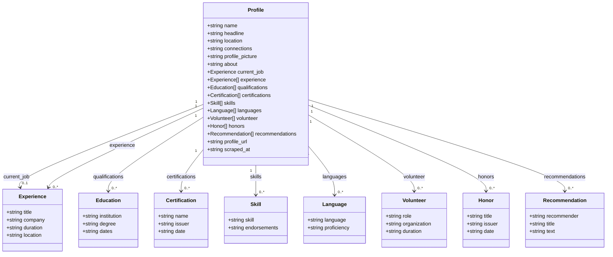

### Complete JSON Example

```json
{
  "name": "Bawantha Beliwaththa",
  "headline": "BSc (Hons) Data Science Undergrad | Developer",
  "location": "Kegalle, Sabaragamuwa, Sri Lanka",
  "connections": "500+ connections",
  "profile_picture": "https://media.licdn.com/dms/image/...",
  "about": "BSc (Hons) Data Science undergraduate student at the University of Hertfordshire. A technology enthusiast interested in Data Science, Machine Learning, Web Development, and Cybersecurity.",
  "current_job": {
    "title": "Project Head (St. Mary's College Website)",
    "company": "St. Mary's College, Kegalle",
    "duration": "2023 - Present",
    "location": "Kegalle, Sri Lanka"
  },
  "experience": [
    {
      "title": "Project Head (St. Mary's College Website)",
      "company": "St. Mary's College, Kegalle",
      "duration": "2023 - Present",
      "location": "Kegalle, Sri Lanka"
    },
    {
      "title": "IT Club President & Prefect",
      "company": "St. Mary's College, Kegalle",
      "duration": "2021 - 2022",
      "location": "Kegalle, Sri Lanka"
    }
  ],
  "qualifications": [
    {
      "institution": "University of Hertfordshire",
      "degree": "BSc (Hons) in Data Science",
      "dates": "2024 – 2028"
    },
    {
      "institution": "St. Mary's College, Kegalle",
      "degree": "GCE Advanced Level",
      "dates": "2019 – 2022"
    }
  ],
  "certifications": [
    {
      "name": "Python for Data Science",
      "issuer": "Coursera",
      "date": "Issued Dec 2023"
    }
  ],
  "skills": [
    { "skill": "Python", "endorsements": "47 endorsements" },
    { "skill": "Data Science", "endorsements": "35 endorsements" },
    { "skill": "Web Development", "endorsements": "" },
    { "skill": "Cybersecurity", "endorsements": "" }
  ],
  "languages": [
    { "language": "English", "proficiency": "Professional working proficiency" },
    { "language": "Sinhala", "proficiency": "Native or bilingual proficiency" }
  ],
  "volunteer": [
    {
      "role": "Volunteer Developer",
      "organization": "SMC Kegalle Devs Team",
      "duration": "2022 – Present"
    }
  ],
  "honors": [
    {
      "title": "IT Club President Selection",
      "issuer": "St. Mary's College, Kegalle",
      "date": "2021"
    }
  ],
  "recommendations": [
    {
      "recommender": "Jane Doe",
      "title": "Senior Engineer at Google",
      "text": "I had the pleasure of working with..."
    }
  ],
  "profile_url": "https://www.linkedin.com/in/beliwaththa",
  "scraped_at": "2026-06-30T10:15:00.000000"
}
```

### Field Reference

| Field | Type | Description | Source |
|-------|------|-------------|--------|
| `name` | `string` | Full name | `<h1>` on main page, fallback: page title |
| `headline` | `string` | Professional headline | `.text-body-medium` |
| `location` | `string` | Geographic location | `.text-body-small.inline.t-black--light` |
| `connections` | `string` | Connection/follower count | `span.t-bold` near connection text |
| `profile_picture` | `string` | Avatar image URL | `img.pv-top-card-profile-picture__image` |
| `about` | `string` | About section text | `#about ~ div`, fallback: text parser |
| `current_job` | `Experience` | Most recent job | First entry from experience parser |
| `experience` | `Experience[]` | All work experience entries | `/details/experience/` sub-page |
| `qualifications` | `Education[]` | Education entries | `/details/education/` sub-page |
| `certifications` | `Certification[]` | License/certification entries | `/details/certifications/` sub-page |
| `skills` | `Skill[]` | Skills with endorsements | `/details/skills/` sub-page |
| `languages` | `Language[]` | Languages with proficiency | `/details/languages/` sub-page |
| `volunteer` | `Volunteer[]` | Volunteer experience | `/details/volunteering-experiences/` sub-page |
| `honors` | `Honor[]` | Awards and honors | `/details/honors/` sub-page |
| `recommendations` | `Recommendation[]` | Received recommendations | `/details/recommendations/` sub-page |
| `profile_url` | `string` | LinkedIn profile URL | Input parameter |
| `scraped_at` | `string` (ISO 8601) | Timestamp of extraction | `datetime.now().isoformat()` |

---

## Job Registry Schema

**File:** `exports/api_scrapes/jobs.json`

Tracks the status of every scrape job (single or bulk) across the system.

```json
{
  "return_code_abc123": {
    "profile_url": "https://www.linkedin.com/in/johndoe",
    "person_name": "John Doe",
    "status": "completed",
    "requested_at": "2026-06-30T10:00:00",
    "scraped_at": "2026-06-30T10:02:30",
    "error": null
  },
  "BULK_1719720000_a1b2c3d4": {
    "profile_url": "https://www.linkedin.com/in/user1",
    "profile_urls": [
      "https://www.linkedin.com/in/user1",
      "https://www.linkedin.com/in/user2"
    ],
    "is_bulk": true,
    "person_name": "",
    "status": "in_progress",
    "requested_at": "2026-06-30T10:05:00",
    "scraped_at": null,
    "error": null
  }
}
```

### Job Status Lifecycle

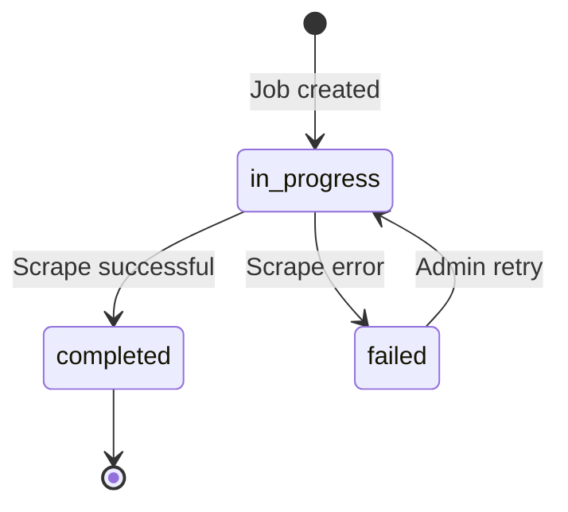

| Status | Description |
|--------|-------------|
| `in_progress` | Scrape is currently running |
| `completed` | Scrape finished successfully |
| `failed` | Scrape encountered an error |

---

## Task Bucket Schema

### Queue File

**File:** `exports/task_bucket/queue.json`

```json
[
  {
    "id": "a1b2c3d4-e5f6-7890-abcd-ef1234567890",
    "query": "Jane Smith @ Google",
    "type": "search",
    "search_params": {
      "first_name": "Jane",
      "last_name": "Smith",
      "company": "Google",
      "max_results": 5
    },
    "status": "pending",
    "added_at": "2026-06-30T10:00:00",
    "started_at": null,
    "completed_at": null,
    "result_name": "",
    "result_url": "",
    "profiles_found": 0,
    "error": null,
    "_client_name": "Jane Smith"
  }
]
```

### Task Types

| Type | Description | Query Format |
|------|-------------|--------------|
| `search` | Structured search with first/last name and company | `"Jane Smith @ Google"` |
| `name` | Simple name search (first match) | `"John Doe"` |
| `url` | Direct URL scrape | `"https://linkedin.com/in/user"` |

### Task Status Lifecycle

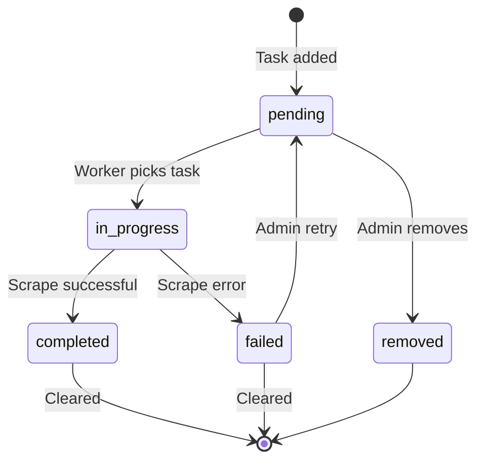

### Config File

**File:** `exports/task_bucket/config.json`

```json
{
  "rest_seconds": 30
}
```

---

## Name Cache Schema

**File:** `exports/name_cache.json`

Maps search names to lists of profile URLs for instant lookups on repeated searches.

```json
{
  "John Doe": [
    "https://www.linkedin.com/in/johndoe"
  ],
  "Jane Smith": [
    "https://www.linkedin.com/in/janesmith",
    "https://www.linkedin.com/in/jsmith"
  ]
}
```

---

## CSV File Formats

### Master CSV (`all_scraped_profiles.csv`)

| Column | Content |
|--------|---------|
| `name` | Profile name |
| `headline` | Professional headline |
| `location` | Geographic location |
| `profile_picture` | Avatar URL |
| `about` | About text |
| `current_job` | JSON string of Experience object |
| `experience` | JSON string of Experience array |
| `qualifications` | JSON string of Education array |
| `certifications` | JSON string of Certification array |
| `profile_url` | LinkedIn URL |
| `scraped_at` | ISO 8601 timestamp |

### Per-Job CSV (`{return_code}.csv`)

Same columns as master CSV plus:

| Column | Content |
|--------|---------|
| `return_code` | Job identifier |

### Export CSV (via `/api/scraper/export`)

| Column | Content |
|--------|---------|
| `Name` | Profile name |
| `Profile Picture` | Avatar URL |
| `About` | About text (max 2000 chars) |
| `Job Title` | Current job title |
| `Company` | Current company |
| `Qualifications` | Semicolon-separated "institution - degree" |
| `Certifications` | Semicolon-separated "name - issuer" |
| `Profile URL` | LinkedIn URL |
| `Scraped At` | Timestamp |

---

## PDF Report Format

Generated via the custom `PDF` class (extends FPDF):

```mermaid
graph TD
    subgraph "PDF Page Layout"
        H["Header: LinkedIn Blue Banner<br/>'LINKEDIN PROFILE REPORT'<br/>(0, 0) → (210, 35)"]
        
        PI["Profile Info Block (y=40)<br/>Name (Arial Bold 16)<br/>Headline (Arial 10)<br/>Location | URL | Connections"]
        
        PP["Profile Photo<br/>40x40px embedded image<br/>(if downloadable)"]
        
        S1["ABOUT Section<br/>Blue header bar + body text"]
        S2["EXPERIENCE Section<br/>Title at Company (Bold)<br/>Duration | Location (Italic)"]
        S3["EDUCATION Section<br/>Institution - Degree (Bold)<br/>Dates (Italic)"]
        S4["SKILLS Section<br/>Comma-separated list with endorsements"]
        S5["CERTIFICATIONS Section"]
        S6["LANGUAGES Section"]
        S7["VOLUNTEER EXPERIENCE Section"]
        S8["HONORS & AWARDS Section"]
        S9["RECOMMENDATIONS Section"]
        
        F["Footer: Page number<br/>(centered, gray italic)"]
    end

    H --> PI --> PP --> S1 --> S2 --> S3 --> S4 --> S5 --> S6 --> S7 --> S8 --> S9 --> F
```

---

## Entity Relationship Diagram

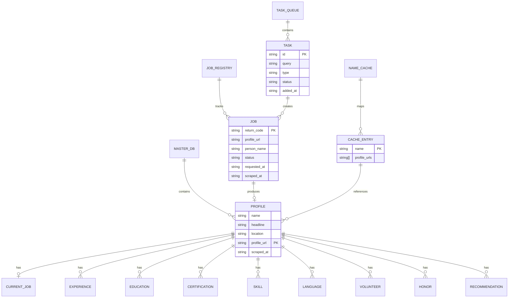

### Deduplication Logic

The master database uses `profile_url` as the unique key. When saving a profile:

1. Load `all_scraped_profiles.json`
2. Search for an existing entry with matching `profile_url`
3. If found → **update** the existing entry
4. If not found → **append** to the list
5. Rewrite the entire JSON file
6. Rewrite the entire CSV file (to stay in sync)

#  Task Bucket System

Here we outline the Task Bucket system, which serves as a persistent task queue and background worker.

---

## Table of Contents

- [Overview](#overview)
- [How It Works](#how-it-works)
- [Task Lifecycle](#task-lifecycle)
- [Worker Behavior](#worker-behavior)
- [Task Types](#task-types)
- [Configuration](#configuration)
- [SSE Event Integration](#sse-event-integration)
- [API Endpoints](#api-endpoints)
- [File Storage](#file-storage)
- [Integration with Client Portal](#integration-with-client-portal)

---

## Overview

The Task Bucket is a **persistent, file-backed task queue** that processes LinkedIn scrape requests one at a time in the background. It was designed for:

- **Unattended scraping**: Queue up many tasks, walk away, come back to results
- **Rate limiting**: Configurable rest periods between tasks prevent LinkedIn from flagging your account
- **Resilience**: Tasks survive server restarts — any pending tasks from previous runs auto-resume
- **Real-time monitoring**: SSE events broadcast every status change to connected admin browsers

```mermaid
graph LR
    subgraph "Input"
        C["Client Portal<br/>POST /api/client/scrape"]
        A["Admin Dashboard<br/>POST /api/bucket/add"]
        API["API<br/>POST /api/bucket/add-search"]
    end

    subgraph "Task Bucket"
        Q["queue.json<br/>(Persistent Queue)"]
        W["Background Worker<br/>(async coroutine)"]
        CFG["config.json<br/>(rest_seconds)"]
    end

    subgraph "Output"
        DB["Master Database"]
        JOB["jobs.json"]
        CACHE["name_cache.json"]
        SSE["SSE Events"]
    end

    C --> Q
    A --> Q
    API --> Q
    Q --> W
    CFG --> W
    W --> DB
    W --> JOB
    W --> CACHE
    W --> SSE
```

---

## How It Works

```mermaid
flowchart TD
    START["Server Starts"] --> AUTO["_ensure_worker_running()<br/>Auto-starts worker"]
    AUTO --> LOOP["Worker Loop (infinite)"]
    
    LOOP --> CHECK_PAUSE{Paused?}
    CHECK_PAUSE -->|Yes| SLEEP_PAUSE["Sleep 2s"]
    SLEEP_PAUSE --> CHECK_PAUSE
    
    CHECK_PAUSE -->|No| LOAD["Load queue.json"]
    LOAD --> PENDING{Pending tasks?}
    PENDING -->|No| SLEEP_IDLE["Sleep 3s"]
    SLEEP_IDLE --> LOOP
    
    PENDING -->|Yes| PICK["Pick first pending task"]
    PICK --> MARK_IP["Mark: in_progress<br/>Broadcast SSE"]
    MARK_IP --> INIT_CHECK{Scraper initialized?}
    
    INIT_CHECK -->|No| AUTO_INIT["Auto-initialize scraper<br/>(headless, default session)"]
    INIT_CHECK -->|Yes| AUTH_CHECK{Authenticated?}
    AUTO_INIT --> AUTH_CHECK
    
    AUTH_CHECK -->|No| FAIL["Mark: failed<br/>'Please log in via admin'"]
    AUTH_CHECK -->|Yes| PROCESS["Process task by type"]
    
    PROCESS --> RESULT{Success?}
    RESULT -->|Yes| SAVE["Save to DB + cache<br/>Mark: completed<br/>Broadcast SSE"]
    RESULT -->|No| FAIL2["Mark: failed<br/>Log error<br/>Broadcast SSE"]
    
    SAVE --> REST["Rest period<br/>(default 30s)"]
    FAIL --> REST
    FAIL2 --> REST
    REST --> LOOP

    style PICK fill:#3b82f6,color:#fff
    style SAVE fill:#10b981,color:#fff
    style FAIL fill:#ef4444,color:#fff
    style FAIL2 fill:#ef4444,color:#fff
    style REST fill:#f59e0b,color:#fff
```

---

## Task Lifecycle

```mermaid
stateDiagram-v2
    [*] --> pending : Task created
    
    pending --> in_progress : Worker picks task
    pending --> removed : Admin removes (POST /api/bucket/remove)
    
    in_progress --> completed : Scrape successful
    in_progress --> failed : Error during scrape
    
    failed --> pending : Admin retry (POST /api/admin/approve)
    
    completed --> [*] : Cleared (POST /api/bucket/clear)
    failed --> [*] : Cleared
    removed --> [*]
    
    note right of in_progress
        Only ONE task can be
        in_progress at a time
    end note
    
    note right of completed
        Results saved to:
        - Master DB
        - jobs.json
        - name_cache.json
    end note
```

---

## Worker Behavior

### Single Worker Model

Only **one worker coroutine** runs at a time. The global flag `_bucket_worker_running` prevents duplicate workers:

```python
def _ensure_worker_running():
    global _bucket_worker_running
    if not _bucket_worker_running:
        asyncio.run_coroutine_threadsafe(_bucket_worker(), _bg_loop)
```

### Auto-Start on Server Launch

At the bottom of `app.py`, `_ensure_worker_running()` is called at module load time. This means:
- Any pending tasks from a previous server session will resume automatically
- The worker starts immediately when the server boots

### Rest Period Behavior

The rest period runs in 2-second increments, checking the pause flag:

```python
while elapsed < rest:
    await asyncio.sleep(min(2, rest - elapsed))
    elapsed += 2
    if _bucket_worker_paused:
        break  # Exit rest early if paused
```

### Auto-Initialization

If the scraper is not initialized when the worker picks a task, it auto-initializes:

```python
if not scraper:
    s = LinkedInScraper(headless=True, browser_type='chromium', session_name='default')
    await s.initialize()
    scraper = s
```

This means the worker can run unattended as long as the LinkedIn session was previously saved.

---

## Task Types

### `search` — Structured People Search

Most commonly used. Searches LinkedIn by name/company, then extracts all found profiles.

```json
{
  "type": "search",
  "query": "Jane Smith @ Google",
  "search_params": {
    "first_name": "Jane",
    "last_name": "Smith",
    "company": "Google",
    "max_results": 5
  }
}
```

**Worker behavior:**
1. Call `scraper.search_people(fn, ln, co, max_results=mx)`
2. For each search result, call `scraper.extract_profile(url)`
3. Save each profile to master DB
4. Update name cache with `client_name → [scraped_urls]`
5. Save first profile under task_id for download compatibility
6. Log to jobs.json for backward compatibility

### `url` — Direct URL Scrape

Extracts a specific LinkedIn profile by URL.

```json
{
  "type": "url",
  "query": "https://www.linkedin.com/in/johndoe"
}
```

**Worker behavior:**
1. Call `scraper.extract_profile(url)`
2. Save profile to master DB
3. Save per-job files
4. Log to jobs.json

### `name` — Simple Name Search

Searches by name string, extracts only the first match.

```json
{
  "type": "name",
  "query": "John Doe"
}
```

**Worker behavior:**
1. Call `scraper.search_people(query, '', max_results=1, force_search=True)`
2. Extract the first result's profile
3. Save to master DB + per-job files

> **Auto-detection:** URLs starting with `http` are automatically treated as `url` type regardless of the specified type.

---

## Configuration

### Config File

**Location:** `exports/task_bucket/config.json`

```json
{
  "rest_seconds": 30
}
```

### Update via API

```bash
curl -X POST http://localhost:5000/api/bucket/config \
  -H "Content-Type: application/json" \
  -d '{"rest_seconds": 60}'
```

### Recommended Rest Period Values

| Scenario | Recommended Value | Rationale |
|----------|------------------|-----------|
| Light usage (< 20 profiles/day) | 15–30 seconds | Minimal rate limiting risk |
| Moderate usage (20–100 profiles/day) | 30–60 seconds | Safe for sustained scraping |
| Heavy usage (100+ profiles/day) | 60–120 seconds | Reduces rate limiting risk |
| Overnight batch | 30–45 seconds | Balance speed vs. safety |

---

## SSE Event Integration

The Task Bucket broadcasts SSE events at every status change, enabling real-time admin dashboard updates without polling.

### Events Broadcast by the Worker

| When | Event Type | Payload |
|------|-----------|---------|
| Task starts processing | `bucket_update` | `{task_id, status: "in_progress", query}` |
| Profile successfully scraped | `new_scrape` | `{name, count: 1}` |
| Task completed | `bucket_update` | `{task_id, status: "completed", query, result_name, profiles_found}` |
| Task failed | `bucket_update` | `{task_id, status: "failed", query, error}` |
| Entering rest period | `bucket_rest` | `{seconds}` |

### Events Broadcast by API Endpoints

| When | Event Type | Payload |
|------|-----------|---------|
| Tasks added to queue | `bucket_tasks_added` | `{count, query}` |
| Worker paused | `bucket_paused` | `{}` |
| Worker resumed | `bucket_resumed` | `{}` |
| Queue cleared | `bucket_cleared` | `{removed}` |
| Task retried | `bucket_update` | `{task_id, status: "pending", query}` |
| Task removed | `bucket_update` | `{task_id, status: "removed"}` |

---

## API Endpoints

| Method | Endpoint | Description |
|--------|----------|-------------|
| `POST` | `/api/bucket/add` | Add name/URL tasks |
| `POST` | `/api/bucket/add-search` | Add structured search task |
| `GET` | `/api/bucket/status` | Get full queue + summary |
| `POST` | `/api/bucket/pause` | Pause worker |
| `POST` | `/api/bucket/resume` | Resume worker |
| `POST` | `/api/bucket/config` | Update rest_seconds |
| `POST` | `/api/bucket/remove` | Remove pending task |
| `POST` | `/api/bucket/clear` | Clear completed/failed |

> See [API Reference](./api-reference.md#task-bucket-api-endpoints) for full request/response details.

---

## File Storage

```
exports/task_bucket/
├── queue.json    # Array of task objects
└── config.json   # Worker configuration
```

### Thread Safety

All file operations use `bucket_lock` (a `threading.Lock`):

```python
bucket_lock = threading.Lock()

def _load_bucket_queue():
    with bucket_lock:
        # Read queue.json

def _save_bucket_queue(tasks):
    with bucket_lock:
        # Write queue.json
```

---

## Integration with Client Portal

The Client Portal (`POST /api/client/scrape`) automatically routes all search requests through the Task Bucket:

```mermaid
sequenceDiagram
    participant Client as Client Browser
    participant API as Flask API
    participant Cache as Name Cache
    participant Bucket as Task Bucket

    Client->>API: POST /api/client/scrape {"name": "John"}
    API->>Cache: Check name_cache.json
    
    alt Cached
        Cache-->>API: URLs found
        API-->>Client: Instant results (200)
    else Not cached
        API->>Bucket: Check if already queued
        alt Already in queue
            Bucket-->>API: Existing task found
            API-->>Client: "Already queued" (202)
        else New request
            API->>Bucket: Add search task
            API-->>Client: reference_number (202)
        end
    end
    
    Note over Client: Client polls /api/client/scrape-status
```

This means the client never waits for a scrape — it always gets an immediate response with either cached results or a reference number to poll.

#  Admin Dashboard Guide

This section is a comprehensive guide to the admin dashboard, acting as the main control center for the Persona platform.

---

## Table of Contents

- [Overview](#overview)
- [Accessing the Dashboard](#accessing-the-dashboard)
- [Dashboard Sections](#dashboard-sections)
  - [Scraper Controls](#scraper-controls)
  - [Single Profile Extraction](#single-profile-extraction)
  - [Bulk Scraping](#bulk-scraping)
  - [Task Bucket Panel](#task-bucket-panel)
  - [Job Monitor](#job-monitor)
  - [Database Management](#database-management)
  - [Export Center](#export-center)
- [SSE Live Updates](#sse-live-updates)
- [Toast Notifications](#toast-notifications)
- [Keyboard Shortcuts & Tips](#keyboard-shortcuts--tips)

---

## Overview

The admin dashboard (`templates/index.html`, 1672 lines) is a full-featured single-page application (SPA) built with vanilla HTML, CSS, and JavaScript. It provides complete control over the Persona scraper platform.

```mermaid
graph TD
    subgraph "Admin Dashboard Sections"
        SC["Scraper Controls<br/>Init · Login · Status"]
        SP["Single Scrape<br/>Paste URL → Extract"]
        BS["Bulk Scrape<br/>Multiple URLs"]
        TB["Task Bucket<br/>Queue · Worker Controls"]
        JM["Job Monitor<br/>Real-time Status"]
        DB["Database<br/>Browse · Search · Download"]
        EX["Export Center<br/>JSON · CSV · PDF"]
    end

    SSE["SSE Connection<br/>(Real-time Updates)"]
    SSE --> SC
    SSE --> JM
    SSE --> TB

    style SSE fill:#8b5cf6,color:#fff
```

---

## Accessing the Dashboard

**URL:** `http://localhost:5000/admin`

The admin page is served by the Flask route:

```python
@app.route('/admin')
def admin_page():
    return render_template('index.html')
```

---

## Dashboard Sections

### Scraper Controls

The first section on the dashboard — controls the browser lifecycle.

| Button | Action | API Call |
|--------|--------|---------|
| **Initialize** | Launches Chromium browser | `POST /api/scraper/init` |
| **Login** | Opens login form → sends credentials | `POST /api/scraper/login` |
| **Stats** | Shows runtime statistics | `GET /api/scraper/stats` |
| **Close** | Closes the browser | `POST /api/scraper/close` |

**Initialize Options:**

| Option | Description |
|--------|-------------|
| Headless mode | Run browser without visible window (faster, less resource usage) |
| Session name | Name for the persistent browser data directory |

**Login Flow:**

```mermaid
sequenceDiagram
    participant Admin as Admin Dashboard
    participant Flask as Flask Server
    participant Browser as Chromium Browser

    Admin->>Flask: POST /api/scraper/login<br/>{email, password}
    Flask->>Browser: Fill login form & submit
    Browser->>Browser: Wait for redirect
    alt Login Success
        Browser-->>Flask: URL contains /feed/
        Flask-->>Admin: {"success": true}
        Note over Admin: Show "Authenticated ✓" badge
    else Login Failed
        Browser-->>Flask: URL doesn't contain /feed/
        Flask-->>Admin: {"success": false}
        Note over Admin: Show error toast
    end
```

---

### Single Profile Extraction

Paste a LinkedIn profile URL and extract structured data instantly.

**Input:** LinkedIn URL (e.g., `https://www.linkedin.com/in/username`)

**Process:**
1. User pastes URL in the input field
2. Clicks "Extract" button
3. Dashboard shows loading spinner
4. Scraper navigates to profile and extracts all sections
5. Result displayed as a formatted profile card

**Output:** Full profile card with:
- Name, headline, location
- Profile picture
- About section
- Current job
- All experience entries
- Education
- Skills with endorsements
- Certifications
- Languages
- Volunteer experience
- Honors & awards
- Recommendations

---

### Bulk Scraping

Extract multiple profiles in sequence with automatic rate limiting.

**Input:** Multiple LinkedIn URLs (one per line in a textarea)

**Process:**
1. User pastes multiple URLs
2. Clicks "Start Bulk Scrape"
3. Each profile is extracted sequentially with a 4-second delay
4. Progress is shown in real-time via SSE
5. Results are saved to the database automatically

---

### Task Bucket Panel

The Task Bucket panel provides queue management directly from the dashboard.

| Control | Description |
|---------|-------------|
| **Add Tasks** | Enter names or URLs to queue |
| **Queue Table** | Shows all tasks with status badges |
| **Pause Worker** | Stops the worker after current task |
| **Resume Worker** | Continues processing |
| **Clear Queue** | Removes completed/failed tasks |
| **Rest Period** | Configure seconds between tasks |

**Status Badges:**

| Status | Badge Color | Description |
|--------|-------------|-------------|
| Pending | Gray | Waiting in queue |
| In Progress | Blue (animated) | Currently being processed |
| Completed | Green | Successfully scraped |
| Failed | Red | Error occurred |

---

### Job Monitor

Real-time monitoring of all scrape jobs, powered by SSE.

| Column | Description |
|--------|-------------|
| Reference # | Unique job identifier |
| Person Name | Name being searched |
| Status | Current status badge |
| Requested At | When the job was submitted |
| Scraped At | When scraping completed |
| Actions | View results · Retry · Download |

**SSE Updates:** The job table auto-refreshes when these events arrive:
- `bucket_update` — task status changed
- `new_scrape` — profile scraped
- `request_started` — new search started

---

### Database Management

Browse, search, and manage all scraped profiles.

| Feature | Description |
|---------|-------------|
| **Profile List** | Scrollable list of all profiles in the master database |
| **Search** | Filter profiles by name, headline, or location |
| **Profile Cards** | Click any profile to see full details in a modal |
| **Download DB** | Download the entire database as JSON or CSV |
| **Destroy DB** |  Delete all data (with confirmation dialog) |

---

### Export Center

Export data in multiple formats.

| Format | Description |
|--------|-------------|
| **JSON** | Full structured data |
| **CSV** | Spreadsheet-compatible format |
| **PDF (Single)** | Professionally formatted single-profile report |
| **PDF (Bulk)** | Multi-page report with one profile per page |

---

## SSE Live Updates

The admin dashboard connects to the SSE endpoint on page load:

```javascript
const eventSource = new EventSource('/api/admin/events');

eventSource.onmessage = function(event) {
    const data = JSON.parse(event.data);
    // Handle event based on data.type
};
```

### What Updates in Real-Time

| Event | Dashboard Update |
|-------|-----------------|
| `new_scrape` | Profile card appears in results |
| `bucket_update` | Task status badge changes color |
| `bucket_tasks_added` | Queue counter increments |
| `bucket_rest` | Rest period countdown shown |
| `bucket_paused` | Worker status shows "Paused" |
| `bucket_resumed` | Worker status shows "Running" |
| `request_started` | Job appears in monitor |

---

## Toast Notifications

The dashboard uses a custom toast notification system:

| Type | Color | Use Case |
|------|-------|----------|
| Success | Green | Scrape completed, task added |
| Error | Red | API errors, connection failures |
| Info | Blue | Status updates, cache hits |
| Warning | Amber | Rate limiting, delays |

---

## Keyboard Shortcuts & Tips

- **Paste URL → Enter**: Quick extract a single profile
- **Tab navigation**: Move between input fields
- **Scroll to load**: Profile cards lazy-load as you scroll
- **Click profile card**: Opens detailed modal view
- **Right-click → Copy**: Copy profile URLs from results

#  Client Portal Guide

This guide covers the client-facing profile portal, designed to provide a clean and intuitive experience for end-users.

---

## Table of Contents

- [Overview](#overview)
- [Accessing the Portal](#accessing-the-portal)
- [Features](#features)
  - [Name Search](#name-search)
  - [Profile Cards](#profile-cards)
  - [Detail Modal](#detail-modal)
  - [Reference Number Lookup](#reference-number-lookup)
  - [Export & Download](#export--download)
- [User Flow Diagrams](#user-flow-diagrams)
  - [First-Time Search Flow](#first-time-search-flow)
  - [Cached Search Flow](#cached-search-flow)
  - [Reference Lookup Flow](#reference-lookup-flow)
- [How Caching Works](#how-caching-works)
- [Status Messages](#status-messages)

---

## Overview

The Client Portal is a clean, read-only interface designed for end-users who need to search and view LinkedIn profiles without needing access to the admin dashboard.

**Key differences from the Admin Dashboard:**
- No scraper controls (can't init/close browser)
- No database management
- No task queue controls
- Simplified search-only interface
- Reference number based tracking

---

## Accessing the Portal

**URL:** `http://localhost:5000` (root URL)

The client page is served by the Flask route:

```python
@app.route('/')
def client_page():
    return render_template('client.html')
```

---

## Features

### Name Search

The primary feature — search for a person by name.

```mermaid
flowchart LR
    A["Enter Name"] --> B["Click Search"]
    B --> C{Cached?}
    C -->|Yes| D["Instant Results<br/>(< 1 second)"]
    C -->|No| E["Queued to Task Bucket<br/>(Reference # issued)"]
    E --> F["Poll Status<br/>(auto-refresh)"]
    F --> G["Results Displayed"]
```

**Input:** Person's name (e.g., "John Doe")

**Behavior:**
1. If the name was previously searched and cached → **instant results**
2. If not cached → task is queued to the Task Bucket, reference number is returned
3. Client polls `/api/client/scrape-status` until results are ready
4. Results are displayed as profile cards

---

### Profile Cards

Search results are displayed as visual profile cards:

| Element | Content |
|---------|---------|
| **Avatar** | Profile picture (or placeholder) |
| **Name** | Full name in bold |
| **Headline** | Professional headline |
| **Location** | Geographic location with icon |
| **View Button** | Opens detailed modal |

---

### Detail Modal

Clicking "View" on any profile card opens a full-screen modal with:

| Section | Content |
|---------|---------|
| **Header** | Large photo, name, headline, location |
| **About** | Full "About" text |
| **Current Position** | Current job title, company, duration |
| **Experience** | All work experience entries |
| **Education** | All education entries |
| **Skills** | Skills list with endorsement counts |
| **Certifications** | Certification names, issuers, dates |
| **Languages** | Languages with proficiency levels |
| **Volunteer** | Volunteer roles and organizations |
| **Honors & Awards** | Award titles, issuers, dates |
| **Recommendations** | Recommender names, titles, and text |

---

### Reference Number Lookup

Every scrape request is assigned a reference number. Users can retrieve results later using this reference.

**Input:** Reference number (e.g., `a1b2c3d4-e5f6-7890-abcd-ef1234567890`)

**Behavior:**
1. Client sends reference number to `/api/client/lookup-by-reference`
2. If completed → displays results
3. If in progress → shows "still scraping" message
4. If not found → shows error

---

### Export & Download

From the detail modal, users can:
- **Download JSON** — full structured profile data
- **Download PDF** — professionally formatted profile report

---

## User Flow Diagrams

### First-Time Search Flow

```mermaid
sequenceDiagram
    participant User as Client User
    participant Portal as Client Portal
    participant API as Flask API
    participant Cache as Name Cache
    participant Bucket as Task Bucket
    participant Worker as Bucket Worker

    User->>Portal: Enter "Jane Smith" → Click Search
    Portal->>API: POST /api/client/scrape {"name": "Jane Smith"}
    API->>Cache: Check name_cache.json
    Cache-->>API: Not found
    API->>Bucket: Add search task
    API-->>Portal: {"status": "queued", "reference_number": "abc-123"}
    
    Portal->>Portal: Show "Queued" message + reference #

    loop Poll every 3 seconds
        Portal->>API: GET /api/client/scrape-status?task_id=abc-123
        API-->>Portal: {"status": "pending"}
        Portal->>Portal: Show "Waiting in queue..."
    end

    Note over Worker: Worker picks task and scrapes

    Portal->>API: GET /api/client/scrape-status?task_id=abc-123
    API-->>Portal: {"status": "completed", "profiles": [...]}
    
    Portal->>Portal: Display profile cards
    
    User->>Portal: Click "View" on a card
    Portal->>Portal: Show detail modal
```

### Cached Search Flow

```mermaid
sequenceDiagram
    participant User as Client User
    participant Portal as Client Portal
    participant API as Flask API
    participant Cache as Name Cache
    participant DB as Master DB

    User->>Portal: Enter "Jane Smith" → Click Search
    Portal->>API: POST /api/client/scrape {"name": "Jane Smith"}
    API->>Cache: Check name_cache.json
    Cache-->>API: Found URLs
    API->>DB: Load profiles by URLs
    DB-->>API: Profile data
    API-->>Portal: {"cached": true, "profiles": [...], "total": 2}
    
    Portal->>Portal: Instantly display profile cards
    
    Note over Portal: Response time: < 500ms
```

### Reference Lookup Flow

```mermaid
sequenceDiagram
    participant User as Client User
    participant Portal as Client Portal
    participant API as Flask API
    participant Bucket as Task Bucket
    participant Jobs as Jobs Registry

    User->>Portal: Enter reference # → Click Lookup
    Portal->>API: GET /api/client/lookup-by-reference?reference_number=abc-123
    
    API->>Bucket: Search queue.json for task_id=abc-123
    
    alt Found in Task Bucket
        alt Status: completed
            API->>API: Load profiles from DB/cache
            API-->>Portal: {"status": "completed", "profiles": [...]}
        else Status: pending/in_progress
            API-->>Portal: {"status": "in_progress", "message": "Still scraping..."}
        end
    else Not in Bucket
        API->>Jobs: Search jobs.json
        alt Found in Jobs
            API->>API: Load per-job file
            API-->>Portal: {"status": "completed", "profiles": [...]}
        else Not Found
            API-->>Portal: {"success": false, "error": "Reference not found"}
        end
    end
```

---

## How Caching Works

```mermaid
graph TD
    subgraph "Write Path (during scrape)"
        S["Scrape completes"] --> W1["Save profile to master DB"]
        S --> W2["Update name_cache.json<br/>name → [profile_urls]"]
    end

    subgraph "Read Path (client search)"
        R["Client searches 'John Doe'"] --> C{Cache hit?}
        C -->|Yes| L["Load profiles by cached URLs<br/>from master DB"]
        L --> RS["Return instantly"]
        C -->|No| Q["Queue to Task Bucket"]
    end

    style RS fill:#10b981,color:#fff
    style Q fill:#f59e0b,color:#fff
```

### Cache File Format

**File:** `exports/name_cache.json`

```json
{
  "Jane Smith": [
    "https://www.linkedin.com/in/janesmith",
    "https://www.linkedin.com/in/jsmith-google"
  ],
  "John Doe": [
    "https://www.linkedin.com/in/johndoe"
  ]
}
```

---

## Status Messages

| Status | Message Shown | User Action |
|--------|--------------|-------------|
| `cached` | Results displayed instantly | Browse profiles |
| `queued` | "Task queued. Reference: ABC-123" | Wait or note reference # |
| `pending` | "Waiting in queue…" | Wait (auto-polls) |
| `in_progress` | "Currently scraping…" | Wait (auto-polls) |
| `completed` | Profile cards displayed | Browse/export |
| `failed` | "No profile found for: ..." | Try different name |
| `error` | "Connection error" | Check server status |

#  Deployment Guide

> Installation, configuration, and production deployment instructions for the Persona platform.

---

## Table of Contents

- [Prerequisites](#prerequisites)
- [Installation](#installation)
  - [Step-by-Step Setup](#step-by-step-setup)
  - [Playwright Browser Installation](#playwright-browser-installation)
- [Configuration](#configuration)
  - [Environment Variables](#environment-variables)
  - [Server Configuration](#server-configuration)
  - [Task Bucket Configuration](#task-bucket-configuration)
- [Running the Server](#running-the-server)
  - [Development Mode](#development-mode)
  - [Production Considerations](#production-considerations)
- [First-Time Login](#first-time-login)
- [Directory Permissions](#directory-permissions)
- [Dependency Reference](#dependency-reference)
- [Upgrading](#upgrading)
- [Uninstalling](#uninstalling)

---

## Prerequisites

| Requirement | Minimum | Recommended |
|-------------|---------|-------------|
| **Python** | 3.9+ | 3.11+ |
| **RAM** | 2 GB | 4+ GB (Chromium uses ~500MB+) |
| **Disk Space** | 500 MB | 2+ GB (browser data + scraped profiles) |
| **OS** | Windows 10, macOS 12, Ubuntu 20.04 | Windows 11, macOS 14, Ubuntu 22.04 |
| **Network** | Internet access | Stable broadband |
| **LinkedIn** | Active account | Premium account (optional) |

---

## Installation

### Step-by-Step Setup

```mermaid
flowchart TD
    A["1. Clone Repository"] --> B["2. Create Virtual Env<br/>(recommended)"]
    B --> C["3. Install Python Deps<br/>(pip install -r req.txt)"]
    C --> D["4. Install Playwright<br/>(playwright install chromium)"]
    D --> E["5. Configure .env<br/>(optional)"]
    E --> F["6. Start Server<br/>(python app.py)"]
    F --> G["7. Initialize Scraper<br/>(via Admin Dashboard)"]
    G --> H["8. Login to LinkedIn<br/>(one-time)"]
    H --> I["Ready to scrape! "]

    style I fill:#10b981,color:#fff
```

#### 1. Clone the Repository

```bash
git clone https://github.com/your-username/persona.git
cd persona
```

#### 2. Create Virtual Environment (Recommended)

**Windows:**
```bash
python -m venv .venv
.venv\Scripts\activate
```

**macOS/Linux:**
```bash
python3 -m venv .venv
source .venv/bin/activate
```

#### 3. Install Python Dependencies

```bash
pip install -r req.txt
```

#### 4. Install Playwright Browsers

```bash
playwright install chromium
```

This downloads a Chromium browser binary (~150MB). It's stored in Playwright's cache directory, not in the project folder.

#### 5. (Optional) Configure Environment

```bash
# Create .env file for optional features
echo "OPENAI_API_KEY=sk-..." > .env
```

#### 6. Start the Server

```bash
python app.py
```

Output:
```
Persona - LinkedIn Profile Scraper and Ranker
http://localhost:5000
```

---

### Playwright Browser Installation

Playwright downloads browser binaries to its cache. If you need to install on a system without internet:

```bash
# Download browsers on a connected machine
playwright install --with-deps chromium

# Or install all browsers
playwright install
```

**Supported browsers:**
- `chromium` (default, recommended)
- `firefox`
- `webkit`

> **Note:** Persona only officially supports Chromium. The `browser_type` parameter exists for future compatibility.

---

## Configuration

### Environment Variables

| Variable | Required | Default | Description |
|----------|----------|---------|-------------|
| `OPENAI_API_KEY` | No | None | OpenAI API key for optional AI parser |

Create a `.env` file in the project root:

```env
OPENAI_API_KEY=sk-proj-abc123...
```

---

### Server Configuration

The Flask server is configured at the bottom of `app.py`:

```python
app.run(debug=True, host='0.0.0.0', port=5000, threaded=True)
```

| Parameter | Default | Description |
|-----------|---------|-------------|
| `debug` | `True` | Enable Flask debug mode (auto-reload, detailed errors) |
| `host` | `0.0.0.0` | Listen on all interfaces (accessible from network) |
| `port` | `5000` | HTTP port number |
| `threaded` | `True` | Handle requests in threads (required for SSE) |

**To change the port:**

Edit the last line in `app.py`:
```python
app.run(debug=True, host='0.0.0.0', port=8080, threaded=True)
```

---

### Task Bucket Configuration

Configure via API:

```bash
# Set rest period to 60 seconds
curl -X POST http://localhost:5000/api/bucket/config \
  -H "Content-Type: application/json" \
  -d '{"rest_seconds": 60}'
```

Or edit the config file directly:

**File:** `exports/task_bucket/config.json`

```json
{
  "rest_seconds": 30
}
```

---

## Running the Server

### Development Mode

```bash
python app.py
```

- Debug mode enabled (auto-reload on code changes)
- Accessible at `http://localhost:5000`
- Admin dashboard at `http://localhost:5000/admin`

### Production Considerations

>  **Important:** This application is designed for personal/internal use. It is NOT designed for public deployment.

**If deploying for internal team use:**

1. **Disable debug mode:**
   ```python
   app.run(debug=False, host='0.0.0.0', port=5000, threaded=True)
   ```

2. **Use a WSGI server** (e.g., Gunicorn with eventlet for SSE support):
   ```bash
   pip install gunicorn eventlet
   gunicorn -w 1 --threads 4 -b 0.0.0.0:5000 app:app
   ```
   > **Note:** Only 1 worker is supported because the scraper uses a single shared browser instance.

3. **Use HTTPS** via a reverse proxy (Nginx, Caddy):
   ```nginx
   server {
       listen 443 ssl;
       server_name persona.local;
       
       ssl_certificate /path/to/cert.pem;
       ssl_certificate_key /path/to/key.pem;
       
       location / {
           proxy_pass http://127.0.0.1:5000;
           proxy_set_header Host $host;
           proxy_set_header X-Real-IP $remote_addr;
       }
       
       # SSE requires special handling
       location /api/admin/events {
           proxy_pass http://127.0.0.1:5000;
           proxy_set_header Connection '';
           proxy_http_version 1.1;
           chunked_transfer_encoding off;
           proxy_buffering off;
           proxy_cache off;
       }
   }
   ```

4. **Firewall**: Restrict access to trusted IPs only.

---

## First-Time Login

The LinkedIn login needs to be done once. After that, the session is persisted.

```mermaid
sequenceDiagram
    participant You as Admin User
    participant Dash as Admin Dashboard
    participant Flask as Flask Server
    participant Chrome as Chromium Browser

    You->>Dash: Open http://localhost:5000/admin
    You->>Dash: Click "Initialize Scraper"<br/>(headless: false to see browser)
    Dash->>Flask: POST /api/scraper/init
    Flask->>Chrome: Launch browser (visible)
    Chrome-->>Flask: Ready
    Flask-->>Dash: Success

    You->>Dash: Enter email/password → Click Login
    Dash->>Flask: POST /api/scraper/login
    Flask->>Chrome: Fill login form & submit
    
    alt LinkedIn asks for verification
        Note over Chrome: Verification code / CAPTCHA
        Note over You: Enter code in the visible browser
        Chrome->>Chrome: Complete verification
    end
    
    Chrome-->>Flask: Login successful
    Flask-->>Dash: {"success": true}
    
    Note over Chrome: Session saved to browser_data/default/
    Note over You: Future restarts reuse this session
```

> **Tip:** Set `headless: false` on first login so you can see the browser and handle any verification steps (CAPTCHA, 2FA, etc.)

---

## Directory Permissions

The server needs write access to:

| Directory | Purpose | Created Automatically |
|-----------|---------|----------------------|
| `exports/` | Profile database, job files | Yes |
| `exports/api_scrapes/` | Per-job result files | Yes |
| `exports/task_bucket/` | Task queue and config | Yes |
| `browser_data/` | Chromium persistent data | Yes |
| `sessions/` | Cookie session backups | Yes |

All directories are created automatically on first use. If running as a service, ensure the service user has write permissions to the project directory.

---

## Dependency Reference

**File:** `req.txt`

| Package | Version | Purpose |
|---------|---------|---------|
| `flask` | Latest | Web server and routing |
| `flask_cors` | Latest | Cross-origin resource sharing |
| `playwright` | Latest | Browser automation (Chromium) |
| `requests` | Latest | HTTP client (image downloads) |
| `beautifulsoup4` | Latest | HTML parsing (legacy, minimal use) |
| `pydantic` | Latest | Data validation (legacy, minimal use) |
| `openai` | Latest | AI parser (optional) |
| `python-dotenv` | Latest | .env file loading |
| `aiohttp` | Latest | Async HTTP client |
| `tenacity` | Latest | Retry decorators |
| `fpdf` | Latest | PDF generation |

### Install All Dependencies

```bash
pip install -r req.txt
```

### Install Only Required Dependencies (Minimal)

```bash
pip install flask flask_cors playwright fpdf requests python-dotenv
```

---

## Upgrading

When upgrading to a new version:

1. **Backup your data:**
   ```bash
   cp -r exports/ exports_backup/
   cp -r browser_data/ browser_data_backup/
   ```

2. **Pull the latest code:**
   ```bash
   git pull origin main
   ```

3. **Update dependencies:**
   ```bash
   pip install -r req.txt --upgrade
   ```

4. **Update Playwright:**
   ```bash
   playwright install chromium
   ```

5. **Restart the server:**
   ```bash
   python app.py
   ```

Your scraped data, browser sessions, and task queue will be preserved across upgrades.

---

## Uninstalling

1. **Stop the server** (Ctrl+C)

2. **Remove data directories** (if you want to delete all scraped data):
   ```bash
   rm -rf exports/
   rm -rf browser_data/
   rm -rf sessions/
   ```

3. **Deactivate virtual environment:**
   ```bash
   deactivate
   ```

4. **Remove the project:**
   ```bash
   cd ..
   rm -rf persona/
   ```

5. **Remove Playwright browsers:**
   ```bash
   playwright uninstall --all
   ```

#  Troubleshooting Guide

> Common issues, debugging tips, and FAQ for the Persona platform.

---

## Table of Contents

- [Quick Diagnostics](#quick-diagnostics)
- [Browser & Authentication Issues](#browser--authentication-issues)
- [Scraping Issues](#scraping-issues)
- [Task Bucket Issues](#task-bucket-issues)
- [Export Issues](#export-issues)
- [Performance Issues](#performance-issues)
- [Data Issues](#data-issues)
- [Network & Connection Issues](#network--connection-issues)
- [Debugging Tools](#debugging-tools)
- [FAQ](#faq)

---

## Quick Diagnostics

Run through this checklist when something goes wrong:

```mermaid
flowchart TD
    A["Something went wrong"] --> B{Server running?}
    B -->|No| B1["Start: python app.py"]
    B -->|Yes| C{Scraper initialized?}
    C -->|No| C1["Admin → Initialize Scraper"]
    C -->|Yes| D{Authenticated?}
    D -->|No| D1["Admin → Login to LinkedIn"]
    D -->|Yes| E{Scraping works?}
    E -->|No| E1["Check: LinkedIn CAPTCHA?<br/>Rate limited?<br/>DOM selectors changed?"]
    E -->|Yes| F{Data saving?}
    F -->|No| F1["Check: exports/ writable?<br/>Disk space?"]
    F -->|Yes| G["Check specific error below"]
```

---

## Browser & Authentication Issues

###  "Not initialized" Error

**Problem:** API calls return `{"success": false, "error": "Not initialized"}`

**Fix:**
1. Open admin dashboard: `http://localhost:5000/admin`
2. Click **Initialize Scraper**
3. Wait for success message

---

###  "Not authenticated" Error

**Problem:** Scrape calls fail with `{"success": false, "error": "Not authenticated"}`

**Fix:**
1. Initialize scraper with `headless: false` (so you can see the browser)
2. Click **Login** with your LinkedIn credentials
3. If LinkedIn asks for 2FA or CAPTCHA → complete it in the visible browser window
4. After successful login, the session persists across restarts

---

###  Browser Fails to Launch

**Problem:** Initialization hangs or crashes

**Possible causes & fixes:**

| Cause | Fix |
|-------|-----|
| Playwright not installed | Run `playwright install chromium` |
| Missing system dependencies | Run `playwright install-deps chromium` (Linux) |
| Another Chromium instance using the same profile | Close other instances or use a different `session_name` |
| Corrupted browser data | Delete `browser_data/default/` and re-initialize |
| Insufficient permissions | Run as administrator or check directory permissions |

---

###  Login Succeeds But Session Not Persisted

**Problem:** You log in successfully, but after restarting the server, you need to log in again.

**Fix:**
- Ensure `browser_data/{session_name}/` exists and is writable
- Don't change the `session_name` between restarts
- Check that the server shuts down cleanly (not force-killed mid-scrape)

---

###  LinkedIn Verification/CAPTCHA

**Problem:** LinkedIn shows a security check during login

**Fix:**
1. Set `headless: false` when initializing the scraper
2. Complete the verification manually in the browser window
3. After verification, the session is saved and future logins won't require it

---

## Scraping Issues

###  Profile Returns Empty Data

**Problem:** Scrape succeeds but most fields are empty.

**Possible causes:**

| Cause | Fix |
|-------|-----|
| LinkedIn changed their HTML structure | Update CSS selectors in `core.py` |
| Profile is restricted (not connected) | Only connected/public data is visible |
| Page didn't fully load | Increase wait times in `extract_profile()` |
| Account rate-limited | Wait 24 hours, increase rest periods |

**Debug:** Check `search_debug.html` in the project root — it contains the last search page HTML.

---

###  "Context" or "Navigation" Errors

**Problem:** Errors like `Target context or browser has been closed`

**Fix:**
- The scraper auto-retries up to 2 times for these errors
- If persistent, close and reinitialize the scraper
- May indicate the browser crashed — check system resources

---

###  Missing Sections (Skills, Education, etc.)

**Problem:** Some profile sections are present on LinkedIn but missing in scraped data.

**Possible causes:**

| Cause | Fix |
|-------|-----|
| LinkedIn A/B testing different layouts | The scraper targets multiple CSS selectors — may need new ones |
| Section requires scrolling | Increase scroll iterations in `extract_profile()` |
| Private profile sections | Some users hide sections from non-connections |
| Profile doesn't have that section | Expected behavior — not all profiles have all sections |

---

###  Name Extraction Fails

**Problem:** Profile scraped successfully but name is empty or wrong.

**Fix chain (built into the scraper):**
1. Try `<h1>` element
2. Try `.text-heading-xlarge`
3. Try `.pv-top-card--list li:first-child`
4. Fallback: Extract from `document.title` (e.g., "John Doe - Engineer | LinkedIn")

If all fail, check the profile page HTML for the new name selector.

---

## Task Bucket Issues

###  Worker Not Processing Tasks

**Problem:** Tasks stuck in "pending" status.

**Check:**
1. Is the worker running? → `GET /api/bucket/status` → check `worker_running`
2. Is the worker paused? → check `worker_paused`
3. Is the scraper initialized & authenticated?

**Fix:**
```bash
# Resume the worker
curl -X POST http://localhost:5000/api/bucket/resume

# Check status
curl http://localhost:5000/api/bucket/status
```

---

###  Tasks Failing Immediately

**Problem:** Tasks change from "pending" to "failed" immediately.

**Check the error field:**

| Error | Fix |
|-------|-----|
| "Please log in via the admin dashboard" | Initialize scraper and login first |
| "No profile found" | Name search returned no LinkedIn results |
| "Context or browser has been closed" | Reinitialize the scraper |
| "TimeoutError" | LinkedIn is slow — increase timeouts or add more rest |

---

###  Queue File Corruption

**Problem:** `exports/task_bucket/queue.json` has invalid JSON.

**Fix:**
1. Stop the server
2. Fix or replace the file:
   ```bash
   echo "[]" > exports/task_bucket/queue.json
   ```
3. Restart the server

---

## Export Issues

###  PDF Generation Fails

**Problem:** PDF download returns an error.

**Possible causes:**

| Cause | Fix |
|-------|-----|
| `fpdf` not installed | `pip install fpdf` |
| Profile image download fails | The PDF will still generate without the image |
| Special characters in name/headline | The `make_pdf_safe()` function handles encoding — if it fails, file a bug |

---

###  CSV Has Missing Columns

**Problem:** Exported CSV is missing some data.

**Fix:** Nested data (experience, education, etc.) is stored as JSON strings in CSV cells. Open in a JSON-aware tool or parse with code:

```python
import csv, json

with open('exports/all_scraped_profiles.csv') as f:
    reader = csv.DictReader(f)
    for row in reader:
        experience = json.loads(row.get('experience', '[]'))
```

---

## Performance Issues

###  High Memory Usage

**Problem:** Server consumes a lot of RAM.

**Causes:**
- Chromium browser: ~300-500MB
- Large master database loaded in memory
- Multiple SSE subscribers

**Fixes:**
- Use `headless: true` (slightly less memory)
- Periodically clear completed tasks from the bucket
- Limit the number of profiles in the master database

---

###  Slow Scraping

**Problem:** Profile extraction takes too long.

**Expected times:**

| Operation | Expected Time |
|-----------|--------------|
| Single profile (full extraction) | 30–60 seconds |
| Search (finding profiles) | 5–10 seconds |
| Search + extract (per profile) | 35–70 seconds |

**If slower:**
- Check internet connection speed
- LinkedIn may be throttling — increase rest periods
- System resources may be low — close other applications

---

## Data Issues

###  Duplicate Profiles in Database

**Problem:** The same person appears multiple times.

**How deduplication works:** Profiles are matched by `profile_url`. If a profile with the same URL exists, it's updated (not duplicated).

**If duplicates exist:** It means the profiles were scraped from different URLs (e.g., with/without trailing slash, different URL parameters). This is expected behavior.

---

###  Database File is Very Large

**Problem:** `all_scraped_profiles.json` is too large.

**Fix:**
- The entire file is rewritten on every save — this is O(n)
- For very large databases (10,000+ profiles), consider archiving old data
- Export and delete via admin dashboard

---

## Network & Connection Issues

###  SSE Connection Drops

**Problem:** Admin dashboard stops receiving live updates.

**Fix:** The SSE connection automatically sends keepalive pings every 25 seconds. If the connection drops:
1. Refresh the admin dashboard page
2. Check if the server is still running
3. Check network/proxy settings (some proxies buffer SSE)

---

###  CORS Errors

**Problem:** Browser console shows CORS errors.

**Fix:** The server includes `flask-cors` which allows all origins. If you're behind a reverse proxy, ensure it passes CORS headers through.

---

## Debugging Tools

### Check Server Logs

The server prints detailed logs to the console:

```
Initializing browser...
User is already logged in
Extracting: https://www.linkedin.com/in/johndoe
Success: Extracted: John Doe | Found: about, job, 5 exp, 2 edu, 10 skills
```

### Check Search Debug HTML

After every search, the raw HTML is saved to `search_debug.html` in the project root. Open it in a browser to see exactly what LinkedIn showed.

### Check Queue State

```bash
# View current task queue
cat exports/task_bucket/queue.json | python -m json.tool

# View jobs registry
cat exports/api_scrapes/jobs.json | python -m json.tool

# View name cache
cat exports/name_cache.json | python -m json.tool
```

### API Health Check

```bash
# Check if server is running
curl http://localhost:5000/api/scraper/stats

# Check bucket status
curl http://localhost:5000/api/bucket/status

# Check profile count
curl http://localhost:5000/api/admin/db-profiles | python -c "import sys,json; d=json.load(sys.stdin); print(f'{len(d.get(\"profiles\",[]))} profiles')"
```

---

## FAQ

### Q: Is this legal?

**A:** Scraping LinkedIn may violate their Terms of Service. The *hiQ Labs v. LinkedIn* case (2022) ruled that scraping public data is generally legal, but LinkedIn actively blocks automated access. Use at your own risk and for educational purposes only.

### Q: Can I use this without a LinkedIn account?

**A:** No. LinkedIn requires authentication to view full profile data. Anonymous access only shows minimal information.

### Q: Can I run multiple scraper instances?

**A:** No. The system uses a single shared `LinkedInScraper` instance. Running multiple instances with the same LinkedIn account would likely trigger rate limiting.

### Q: How many profiles can I scrape per day?

**A:** There's no hard limit, but LinkedIn may temporarily restrict accounts that make too many requests. Recommended: 50–100 profiles/day with 30-60 second rest periods.

### Q: Will my LinkedIn account get banned?

**A:** LinkedIn may restrict your account temporarily if they detect automated behavior. Using persistent browser contexts and realistic delays reduces this risk. Never use your primary professional account.

### Q: Does this work with LinkedIn Premium?

**A:** Yes. Premium accounts can see more data (InMail contacts, full names beyond 3rd degree, etc.), which means the scraper will extract more information.

### Q: Can I scrape company pages?

**A:** Not currently. The scraper is designed for individual profile pages. Company page support would require additional parsers.

### Q: Can I change the ranking to not filter by Sri Lanka?

**A:** Yes. See the [Ranking Model — Extension Points](./ranking-model.md#extension-points) section for instructions on removing the geo-filter.

#  Profile Ranking Model

This section describes the weighted scoring model, initially developed to rank LinkedIn profiles, which we are planning to integrate fully in future updates.

---

### Table of Contents

- [Overview](#overview)
- [Scoring Architecture](#scoring-architecture)
- [Profile Strength Scoring (0–100)](#profile-strength-scoring-0100)
- [Field-Aligned Follower Score (0–50)](#field-aligned-follower-score-050)
- [Field Category Detection](#field-category-detection)
- [Tier System](#tier-system)
- [Sri Lankan Geo-Filter](#sri-lankan-geo-filter)
- [Scoring Formula](#scoring-formula)
- [API Usage](#api-usage)
- [Extension Points](#extension-points)

---

### Overview

The ranking model (`ranker.py`, 363 lines) scores LinkedIn profiles on a **0–150 point scale** using two dimensions:

1. **Profile Strength** (0–100 pts): How complete and rich is the profile?
2. **Field-Aligned Follower Score** (0–50 pts): How well-connected is the person in their field?

> **Note:** Currently, the ranker only scores profiles geo-located in Sri Lanka. Non-Sri Lankan profiles are filtered out.

---

### Scoring Architecture

```mermaid
graph TD
    P["Input: LinkedIn Profile"] --> PS["Profile Strength<br/>(0–100 pts)"]
    P --> FS["Field-Aligned Follower Score<br/>(0–50 pts)"]
    
    PS --> |"12 components"| PSC["Headline (12) + About (14) +<br/>Experience (23) + Education (8) +<br/>Skills (10) + Certifications (8) +<br/>Featured (5) + Connections (6) +<br/>Photo (4) + Recommendations (5) +<br/>Volunteer (3) + Languages (2)"]
    
    FS --> |"2 factors"| FSC["Connection Count (60%) +<br/>Field Keyword Density (40%)"]
    
    PSC --> TOTAL["Total Score = PS + FS<br/>(0–150 pts)"]
    FSC --> TOTAL
    
    TOTAL --> TIER["Tier Assignment<br/>Elite / Expert / Strong / Moderate / Beginner"]

    style P fill:#3b82f6,color:#fff
    style TOTAL fill:#10b981,color:#fff
    style TIER fill:#8b5cf6,color:#fff
```

---

### Profile Strength Scoring (0–100)

Each component awards points based on the presence and richness of profile data:

#### Component Breakdown

```mermaid
pie title Profile Strength Components (100 pts max)
    "Experience Count" : 15
    "About" : 14
    "Headline" : 12
    "Skills" : 10
    "Experience Quality" : 8
    "Education" : 8
    "Certifications" : 8
    "Connections" : 6
    "Featured" : 5
    "Recommendations" : 5
    "Profile Photo" : 4
    "Volunteer" : 3
    "Languages" : 2
```

#### Detailed Scoring Rules

| Component | Max Points | Scoring Logic | Formula |
|-----------|-----------|---------------|---------|
| **Headline** | 12 | 8 pts for having any headline + up to 4 pts for length | `8 + min(len/120 × 4, 4)` |
| **About** | 14 | 8 pts for having any about + up to 6 pts for length | `8 + min(len/800 × 6, 6)` |
| **Experience Count** | 15 | 3 points per experience entry | `min(count × 3, 15)` |
| **Experience Quality** | 8 | 2 pts per entry with rich description (>80 chars), 1 pt for short desc, 0.5 for duration | `min(sum, 8)` |
| **Education** | 8 | 4 points per education entry | `min(count × 4, 8)` |
| **Skills** | 10 | 1 point per skill | `min(count, 10)` |
| **Certifications** | 8 | 2 points per certification | `min(count × 2, 8)` |
| **Featured** | 5 | Binary: 5 pts if featured content exists, 0 if not | `5 if featured else 0` |
| **Connections** | 6 | Proportional to 500 connections | `min(conn/500 × 6, 6)` |
| **Profile Photo** | 4 | Baseline bonus (always awarded) | `4` |
| **Recommendations** | 5 | 2.5 points per recommendation | `min(count × 2.5, 5)` |
| **Volunteer** | 3 | Binary: 3 pts if any volunteer experience | `3 if volunteer else 0` |
| **Languages** | 2 | 1 point per language | `min(count, 2)` |

#### Example Scoring

| Profile Attribute | Value | Points |
|------------------|-------|--------|
| Headline | "Senior Software Engineer at Google" (35 chars) | 8 + 1.17 = **9.17** |
| About | 400-char description | 8 + 3.0 = **11.0** |
| 5 experience entries | 3 with descriptions | 15 + 7.5 = **15** (capped) + **7.5** |
| 2 education entries | — | **8** |
| 10 skills | — | **10** |
| 3 certifications | — | **6** |
| No featured content | — | **0** |
| 500+ connections | — | **6** |
| Profile photo | — | **4** |
| 2 recommendations | — | **5** |
| Volunteer experience | — | **3** |
| 2 languages | — | **2** |
| | **Profile Strength** | **87.67** |

---

### Field-Aligned Follower Score (0–50)

This dimension estimates how well-connected the person is within their professional field.

#### Formula

```
field_score = 50 × (0.6 × connection_ratio + 0.4 × field_keyword_ratio)
```

Where:
- `connection_ratio = min(connections / 1000, 1.0)` — normalized connection count
- `field_keyword_ratio = matching_keywords / total_keywords` — density of field-specific keywords in headline, about, and skills

#### Example

For a Software Engineer with 500 connections:

```
connection_ratio = 500 / 1000 = 0.5
field_keyword_ratio = 8 / 30 = 0.267 (8 out of 30 Software & IT keywords found)

field_score = 50 × (0.6 × 0.5 + 0.4 × 0.267)
           = 50 × (0.3 + 0.107)
           = 50 × 0.407
           = 20.33 pts
```

---

### Field Category Detection

The system classifies profiles into **11 industry categories** based on keyword matching across headline, about, skills, and experience:

```mermaid
mindmap
  root((Field Categories))
    Software & IT
      software, developer, engineer
      devops, cloud, frontend
      python, java, react
      aws, azure, kubernetes
    Data & Analytics
      data science, analyst
      tableau, power bi, sql
      big data, spark, hadoop
    Finance & Banking
      finance, banking, audit
      investment, insurance
      accounting, treasury
    Marketing & Sales
      digital marketing, SEO
      social media, brand
      sales, business development
    Healthcare & Medicine
      doctor, nurse, medical
      pharma, surgeon
      hospital, clinical
    Education & Research
      teacher, professor
      research, scientist
      PhD, academic
    Engineering & Manufacturing
      civil, mechanical, electrical
      manufacturing, logistics
      supply chain, procurement
    Design & Creative
      designer, graphic, UX/UI
      product design, creative
      animator, photography
    Legal & Compliance
      lawyer, attorney, legal
      counsel, compliance
    Management & Leadership
      CEO, CTO, Director
      founder, executive
      VP, president
    HR & People
      human resource, recruiter
      talent, training
      people operations
```

#### Detection Algorithm

```python
def detect_field_category(profile):
    text = concat(headline, about, skills, experience_titles)
    
    scores = {}
    for category, keywords in FIELD_CATEGORIES.items():
        hits = count(keyword in text for keyword in keywords)
        if hits > 0:
            scores[category] = hits
    
    return max(scores) or "General"
```

The category with the most keyword hits wins. If no keywords match, the profile is classified as "General".

---

### Tier System

Profiles are assigned a display tier based on their total score:

```mermaid
graph LR
    subgraph "Score Ranges"
        E["120+ pts"] --> ET[" Elite"]
        X["100–119 pts"] --> XT[" Expert"]
        S["80–99 pts"] --> ST[" Strong"]
        M["60–79 pts"] --> MT[" Moderate"]
        B["< 60 pts"] --> BT[" Beginner"]
    end

    style ET fill:#7c3aed,color:#fff
    style XT fill:#059669,color:#fff
    style ST fill:#0a66c2,color:#fff
    style MT fill:#d97706,color:#fff
    style BT fill:#6b7280,color:#fff
```

| Score Range | Label | Color | Icon |
|-------------|-------|-------|------|
| 120+ | **Elite** | `#7c3aed` (Purple) | `fa-crown` |
| 100–119 | **Expert** | `#059669` (Green) | `fa-star` |
| 80–99 | **Strong** | `#0a66c2` (Blue) | `fa-thumbs-up` |
| 60–79 | **Moderate** | `#d97706` (Amber) | `fa-chart-line` |
| < 60 | **Beginner** | `#6b7280` (Gray) | `fa-seedling` |

---

### Sri Lankan Geo-Filter

The ranker filters profiles by geographic location in Sri Lanka using a keyword-based approach:

#### Keywords Checked

```python
SL_KEYWORDS = [
    "sri lanka", "srilanka", "colombo", "kandy", "galle", "negombo",
    "jaffna", "trincomalee", "batticaloa", "ratnapura", "kurunegala",
    "anuradhapura", "polonnaruwa", "badulla", "matara", "hambantota",
    "nuwara eliya", "kegalle", "kalutara", "gampaha", "puttalam",
    "mannar", "vavuniya", "mullaitivu", "kilinochchi", "ampara",
    "moneragala", "matale", "lk",
]
```

#### Fields Searched

The filter checks three fields: `location`, `headline`, and `about`. If any Sri Lankan keyword is found in any of these fields, the profile passes the filter.

```python
def is_sri_lankan(profile):
    haystack = f"{location} {headline} {about}".lower()
    return any(kw in haystack for kw in SL_KEYWORDS)
```

---

### Scoring Formula

#### Complete Formula

```
Total Score = min(Profile Strength, 100) + Field Follower Score

Profile Strength = Σ(all component scores)

Field Follower Score = 50 × (0.6 × min(connections/1000, 1.0) + 0.4 × field_hit_ratio)
```

#### Score Distribution (Theoretical)

```mermaid
xychart-beta
    title "Score Component Distribution"
    x-axis ["Headline", "About", "Exp Count", "Exp Quality", "Education", "Skills", "Certs", "Featured", "Connections", "Photo", "Recs", "Volunteer", "Languages", "Field Score"]
    y-axis "Max Points" 0 --> 50
    bar [12, 14, 15, 8, 8, 10, 8, 5, 6, 4, 5, 3, 2, 50]
```

---

### API Usage

#### Rank Profiles

```bash
curl -X POST http://localhost:5000/api/rank \
  -H "Content-Type: application/json" \
  -d '{
    "profiles": [
      {
        "name": "John Doe",
        "headline": "Software Engineer at Google",
        "location": "Colombo, Sri Lanka",
        "about": "Experienced developer...",
        "connections": "500+",
        "experiences": [{"title": "SWE", "company": "Google"}],
        "education": [{"institution": "UoM", "degree": "BSc CS"}],
        "skills": ["Python", "Java", "AWS"],
        "certifications": [{"name": "AWS Solutions Architect"}],
        "recommendations": [{"recommender": "Jane", "text": "Great dev"}],
        "volunteer": [{"role": "Mentor"}],
        "languages": [{"language": "English"}, {"language": "Sinhala"}]
      }
    ]
  }'
```

#### Response Structure

```json
{
  "ranked": [
    {
      "rank": 1,
      "profile": { ... },
      "scoring": {
        "total_score": 127.5,
        "profile_strength": 89.0,
        "field_follower_score": 38.5,
        "field_category": "Software & IT",
        "is_sri_lankan": true,
        "connections_count": 500,
        "breakdown": { ... }
      },
      "tier": {
        "label": "Elite",
        "color": "#7c3aed",
        "icon": "fa-crown"
      }
    }
  ]
}
```

---

### Extension Points

The ranking model can be extended by modifying `ranker.py`:

#### Adding New Field Categories

Add a new entry to `FIELD_CATEGORIES`:

```python
FIELD_CATEGORIES["Blockchain & Web3"] = [
    "blockchain", "crypto", "web3", "defi", "smart contract",
    "solidity", "ethereum", "nft", "dao",
]
```

#### Adjusting Scoring Weights

Modify the `WEIGHTS` dictionary:

```python
WEIGHTS = {
    "has_headline": 8,      # Increase/decrease per component
    "skills_count": 15,     # Give more weight to skills
    ...
}
```

#### Removing the Geo-Filter

To rank all profiles regardless of location, modify `rank_sri_lankan_profiles()`:

```python
def rank_all_profiles(profiles):
    results = []
    for profile in profiles:
        scoring = score_profile(profile)
        # Remove: if not scoring["is_sri_lankan"]: continue
        results.append({"profile": profile, "scoring": scoring})
    results.sort(key=lambda x: x["scoring"]["total_score"], reverse=True)
    for i, item in enumerate(results, 1):
        item["rank"] = i
    return results
```

