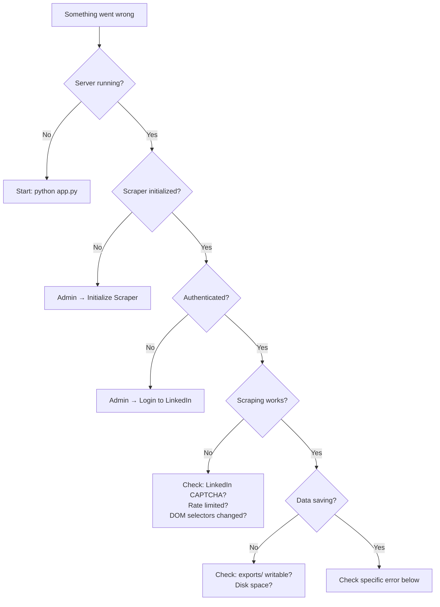

# 🔧 Troubleshooting Guide

> Common issues, debugging tips, and FAQ for the Persona platform.

---

## Table of Contents

- [Quick Diagnostics](#quick-diagnostics)
- [Browser & Authentication Issues](#browser--authentication-issues)
- [Scraping Issues](#scraping-issues)
- [Task Bucket Issues](#task-bucket-issues)
- [Export Issues](#export-issues)
- [Performance Issues](#performance-issues)
- [Data Issues](#data-issues)
- [Network & Connection Issues](#network--connection-issues)
- [Debugging Tools](#debugging-tools)
- [FAQ](#faq)

---

## Quick Diagnostics

Run through this checklist when something goes wrong:



---

## Browser & Authentication Issues

### ❌ "Not initialized" Error

**Problem:** API calls return `{"success": false, "error": "Not initialized"}`

**Fix:**
1. Open admin dashboard: `http://localhost:5000/admin`
2. Click **Initialize Scraper**
3. Wait for success message

---

### ❌ "Not authenticated" Error

**Problem:** Scrape calls fail with `{"success": false, "error": "Not authenticated"}`

**Fix:**
1. Initialize scraper with `headless: false` (so you can see the browser)
2. Click **Login** with your LinkedIn credentials
3. If LinkedIn asks for 2FA or CAPTCHA → complete it in the visible browser window
4. After successful login, the session persists across restarts

---

### ❌ Browser Fails to Launch

**Problem:** Initialization hangs or crashes

**Possible causes & fixes:**

| Cause | Fix |
|-------|-----|
| Playwright not installed | Run `playwright install chromium` |
| Missing system dependencies | Run `playwright install-deps chromium` (Linux) |
| Another Chromium instance using the same profile | Close other instances or use a different `session_name` |
| Corrupted browser data | Delete `browser_data/default/` and re-initialize |
| Insufficient permissions | Run as administrator or check directory permissions |

---

### ❌ Login Succeeds But Session Not Persisted

**Problem:** You log in successfully, but after restarting the server, you need to log in again.

**Fix:**
- Ensure `browser_data/{session_name}/` exists and is writable
- Don't change the `session_name` between restarts
- Check that the server shuts down cleanly (not force-killed mid-scrape)

---

### ❌ LinkedIn Verification/CAPTCHA

**Problem:** LinkedIn shows a security check during login

**Fix:**
1. Set `headless: false` when initializing the scraper
2. Complete the verification manually in the browser window
3. After verification, the session is saved and future logins won't require it

---

## Scraping Issues

### ❌ Profile Returns Empty Data

**Problem:** Scrape succeeds but most fields are empty.

**Possible causes:**

| Cause | Fix |
|-------|-----|
| LinkedIn changed their HTML structure | Update CSS selectors in `core.py` |
| Profile is restricted (not connected) | Only connected/public data is visible |
| Page didn't fully load | Increase wait times in `extract_profile()` |
| Account rate-limited | Wait 24 hours, increase rest periods |

**Debug:** Check `search_debug.html` in the project root — it contains the last search page HTML.

---

### ❌ "Context" or "Navigation" Errors

**Problem:** Errors like `Target context or browser has been closed`

**Fix:**
- The scraper auto-retries up to 2 times for these errors
- If persistent, close and reinitialize the scraper
- May indicate the browser crashed — check system resources

---

### ❌ Missing Sections (Skills, Education, etc.)

**Problem:** Some profile sections are present on LinkedIn but missing in scraped data.

**Possible causes:**

| Cause | Fix |
|-------|-----|
| LinkedIn A/B testing different layouts | The scraper targets multiple CSS selectors — may need new ones |
| Section requires scrolling | Increase scroll iterations in `extract_profile()` |
| Private profile sections | Some users hide sections from non-connections |
| Profile doesn't have that section | Expected behavior — not all profiles have all sections |

---

### ❌ Name Extraction Fails

**Problem:** Profile scraped successfully but name is empty or wrong.

**Fix chain (built into the scraper):**
1. Try `<h1>` element
2. Try `.text-heading-xlarge`
3. Try `.pv-top-card--list li:first-child`
4. Fallback: Extract from `document.title` (e.g., "John Doe - Engineer | LinkedIn")

If all fail, check the profile page HTML for the new name selector.

---

## Task Bucket Issues

### ❌ Worker Not Processing Tasks

**Problem:** Tasks stuck in "pending" status.

**Check:**
1. Is the worker running? → `GET /api/bucket/status` → check `worker_running`
2. Is the worker paused? → check `worker_paused`
3. Is the scraper initialized & authenticated?

**Fix:**
```bash
# Resume the worker
curl -X POST http://localhost:5000/api/bucket/resume

# Check status
curl http://localhost:5000/api/bucket/status
```

---

### ❌ Tasks Failing Immediately

**Problem:** Tasks change from "pending" to "failed" immediately.

**Check the error field:**

| Error | Fix |
|-------|-----|
| "Please log in via the admin dashboard" | Initialize scraper and login first |
| "No profile found" | Name search returned no LinkedIn results |
| "Context or browser has been closed" | Reinitialize the scraper |
| "TimeoutError" | LinkedIn is slow — increase timeouts or add more rest |

---

### ❌ Queue File Corruption

**Problem:** `exports/task_bucket/queue.json` has invalid JSON.

**Fix:**
1. Stop the server
2. Fix or replace the file:
   ```bash
   echo "[]" > exports/task_bucket/queue.json
   ```
3. Restart the server

---

## Export Issues

### ❌ PDF Generation Fails

**Problem:** PDF download returns an error.

**Possible causes:**

| Cause | Fix |
|-------|-----|
| `fpdf` not installed | `pip install fpdf` |
| Profile image download fails | The PDF will still generate without the image |
| Special characters in name/headline | The `make_pdf_safe()` function handles encoding — if it fails, file a bug |

---

### ❌ CSV Has Missing Columns

**Problem:** Exported CSV is missing some data.

**Fix:** Nested data (experience, education, etc.) is stored as JSON strings in CSV cells. Open in a JSON-aware tool or parse with code:

```python
import csv, json

with open('exports/all_scraped_profiles.csv') as f:
    reader = csv.DictReader(f)
    for row in reader:
        experience = json.loads(row.get('experience', '[]'))
```

---

## Performance Issues

### ❌ High Memory Usage

**Problem:** Server consumes a lot of RAM.

**Causes:**
- Chromium browser: ~300-500MB
- Large master database loaded in memory
- Multiple SSE subscribers

**Fixes:**
- Use `headless: true` (slightly less memory)
- Periodically clear completed tasks from the bucket
- Limit the number of profiles in the master database

---

### ❌ Slow Scraping

**Problem:** Profile extraction takes too long.

**Expected times:**

| Operation | Expected Time |
|-----------|--------------|
| Single profile (full extraction) | 30–60 seconds |
| Search (finding profiles) | 5–10 seconds |
| Search + extract (per profile) | 35–70 seconds |

**If slower:**
- Check internet connection speed
- LinkedIn may be throttling — increase rest periods
- System resources may be low — close other applications

---

## Data Issues

### ❌ Duplicate Profiles in Database

**Problem:** The same person appears multiple times.

**How deduplication works:** Profiles are matched by `profile_url`. If a profile with the same URL exists, it's updated (not duplicated).

**If duplicates exist:** It means the profiles were scraped from different URLs (e.g., with/without trailing slash, different URL parameters). This is expected behavior.

---

### ❌ Database File is Very Large

**Problem:** `all_scraped_profiles.json` is too large.

**Fix:**
- The entire file is rewritten on every save — this is O(n)
- For very large databases (10,000+ profiles), consider archiving old data
- Export and delete via admin dashboard

---

## Network & Connection Issues

### ❌ SSE Connection Drops

**Problem:** Admin dashboard stops receiving live updates.

**Fix:** The SSE connection automatically sends keepalive pings every 25 seconds. If the connection drops:
1. Refresh the admin dashboard page
2. Check if the server is still running
3. Check network/proxy settings (some proxies buffer SSE)

---

### ❌ CORS Errors

**Problem:** Browser console shows CORS errors.

**Fix:** The server includes `flask-cors` which allows all origins. If you're behind a reverse proxy, ensure it passes CORS headers through.

---

## Debugging Tools

### Check Server Logs

The server prints detailed logs to the console:

```
Initializing browser...
User is already logged in
Extracting: https://www.linkedin.com/in/johndoe
Success: Extracted: John Doe | Found: about, job, 5 exp, 2 edu, 10 skills
```

### Check Search Debug HTML

After every search, the raw HTML is saved to `search_debug.html` in the project root. Open it in a browser to see exactly what LinkedIn showed.

### Check Queue State

```bash
# View current task queue
cat exports/task_bucket/queue.json | python -m json.tool

# View jobs registry
cat exports/api_scrapes/jobs.json | python -m json.tool

# View name cache
cat exports/name_cache.json | python -m json.tool
```

### API Health Check

```bash
# Check if server is running
curl http://localhost:5000/api/scraper/stats

# Check bucket status
curl http://localhost:5000/api/bucket/status

# Check profile count
curl http://localhost:5000/api/admin/db-profiles | python -c "import sys,json; d=json.load(sys.stdin); print(f'{len(d.get(\"profiles\",[]))} profiles')"
```

---

## FAQ

### Q: Is this legal?

**A:** Scraping LinkedIn may violate their Terms of Service. The *hiQ Labs v. LinkedIn* case (2022) ruled that scraping public data is generally legal, but LinkedIn actively blocks automated access. Use at your own risk and for educational purposes only.

### Q: Can I use this without a LinkedIn account?

**A:** No. LinkedIn requires authentication to view full profile data. Anonymous access only shows minimal information.

### Q: Can I run multiple scraper instances?

**A:** No. The system uses a single shared `LinkedInScraper` instance. Running multiple instances with the same LinkedIn account would likely trigger rate limiting.

### Q: How many profiles can I scrape per day?

**A:** There's no hard limit, but LinkedIn may temporarily restrict accounts that make too many requests. Recommended: 50–100 profiles/day with 30-60 second rest periods.

### Q: Will my LinkedIn account get banned?

**A:** LinkedIn may restrict your account temporarily if they detect automated behavior. Using persistent browser contexts and realistic delays reduces this risk. Never use your primary professional account.

### Q: Does this work with LinkedIn Premium?

**A:** Yes. Premium accounts can see more data (InMail contacts, full names beyond 3rd degree, etc.), which means the scraper will extract more information.

### Q: Can I scrape company pages?

**A:** Not currently. The scraper is designed for individual profile pages. Company page support would require additional parsers.

### Q: Can I change the ranking to not filter by Sri Lanka?

**A:** Yes. See the [Ranking Model — Extension Points](./ranking-model.md#extension-points) section for instructions on removing the geo-filter.
