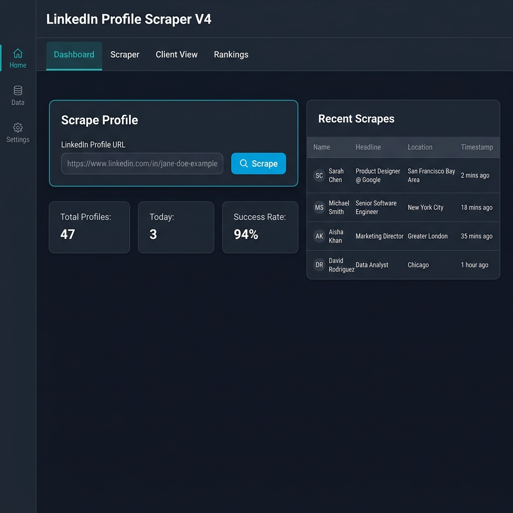
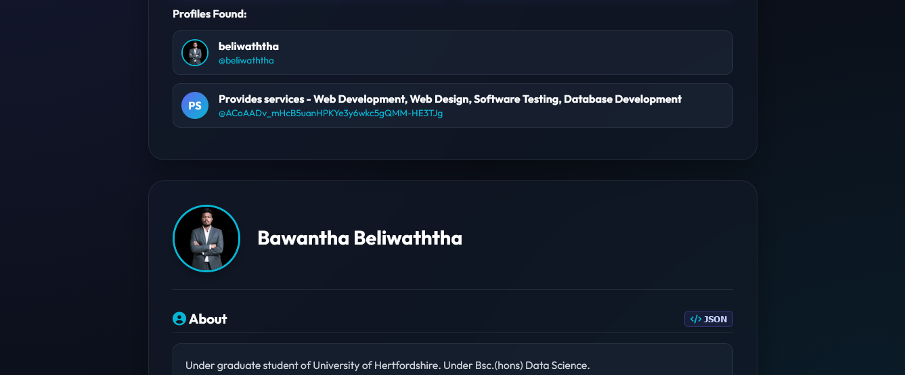
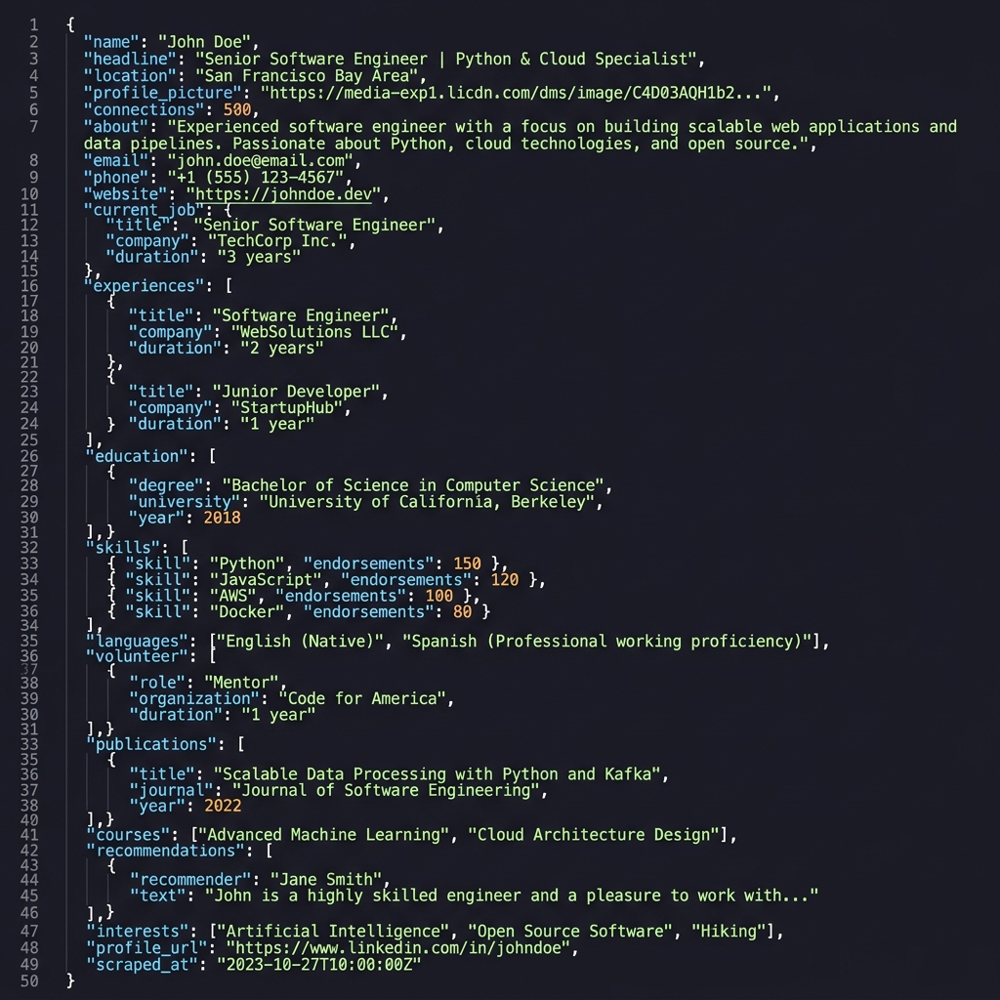

# LinkedIn Profile Scraper V3

> **A full-stack LinkedIn profile intelligence platform** — scrapes every visible section of any LinkedIn profile, stores structured data, and provides both a human-friendly web dashboard and a programmatic REST API for integration.

---

## Table of Contents

1. [Project Overview](#1-project-overview)
2. [System Architecture](#2-system-architecture)
3. [Project Structure & File Descriptions](#3-project-structure--file-descriptions)
   - [app.py — The Flask Web Server](#31-apppy--the-flask-web-server)
   - [core.py — The LinkedIn Scraper Engine](#32-corepy--the-linkedin-scraper-engine)
   - [llm_parser.py — The AI Parser](#33-llm-parserpy--the-ai-parser)
   - [session_manager.py — The Session Manager](#34-session_managerpy--the-session-manager)
   - [templates/index.html — The Admin Dashboard](#35-templatesindexhtml--the-admin-dashboard)
   - [templates/client.html — The Client View](#36-templatesclienthtml--the-client-view)
4. [Data Output Schema](#4-data-output-schema)
5. [REST API Reference](#5-rest-api-reference)
6. [Installation & Setup](#6-installation--setup)
7. [How to Use](#7-how-to-use)
8. [Screenshots](#8-screenshots)
9. [Known Limitations](#9-known-limitations)

---

## 1. Project Overview

LinkedIn Profile Scraper V4 is an automated system that:

- **Navigates** to any LinkedIn profile URL using a real Chromium browser controlled by Playwright.
- **Scrolls and expands** all hidden sections (Experience, Education, Skills, Projects, etc.) by automatically clicking every "Show all" and "See more" button.
- **Reads** the full visible text of the page and parses every LinkedIn section into structured JSON fields.
- **Attempts** to extract private contact information (email, phone, website) from the LinkedIn "Contact info" modal.
- **Saves** all scraped data to a persistent JSON database and CSV file under `exports/`.
- **Exposes** a full REST API for external systems to trigger scrapes and retrieve results.
- **Displays** results in two web interfaces: an admin-facing Dashboard and a client-facing Profile Viewer.

---

## 2. System Architecture

```
Browser (Playwright Chromium)
         │
         ▼
   core.py  ◄──────────────────────────┐
   LinkedInScraper                     │
         │  extract_profile()           │
         │  _extract_contact_info()     │
         │  _parse_skills()             │
         │  _parse_experience() ...     │
         │                              │
         ▼                              │
   Structured Profile JSON             │
         │                             │
         ├──► app.py (Flask Server) ───┘
         │       │
         │       ├── save_to_persistent_db()  → exports/all_scraped_profiles.json
         │       ├── save_scraped_data_formats() → exports/api_scrapes/{code}.json/.csv
         │       ├── POST /api/scraper/scrape  (single URL)
         │       ├── POST /api/scraper/bulk    (multiple URLs)
         │       ├── GET  /api/scraper/results (retrieve any job result)
         │       └── POST /api/scraper/export  (download JSON or CSV)
         │
         └──► templates/
                 ├── index.html   (Admin Dashboard)
                 └── client.html  (Client Profile Viewer)
```

The entire scraping pipeline is **asynchronous** using Python's `asyncio`. Flask routes that trigger scrapes use background threads (`threading.Thread`) so that the HTTP response is returned immediately with a `return_code` identifier that the client can use to poll for results.

---

## 3. Project Structure & File Descriptions

```
V4/
├── app.py                  ← Flask web server + REST API
├── core.py                 ← LinkedIn scraper engine (Playwright)
├── llm_parser.py           ← Optional AI-assisted profile parser
├── session_manager.py      ← Browser session cookie persistence
├── req.txt                 ← Python package requirements
├── templates/
│   ├── index.html          ← Admin-facing web dashboard
│   └── client.html         ← Client-facing profile viewer
├── screenshots/
│   ├── dashboard.png
│   ├── profile_view.png
│   └── json_output.png
└── README.md               ← This file
```

When you run the system for the first time, the following directories are created automatically at runtime:

```
exports/
├── all_scraped_profiles.json   ← Master JSON database (all profiles ever scraped)
├── all_scraped_profiles.csv    ← Master CSV database (same data, flat)
└── api_scrapes/
    ├── {return_code}.json      ← Per-job JSON result
    └── {return_code}.csv       ← Per-job CSV result
browser_data/
└── default/                    ← Chromium persistent profile (stores LinkedIn login)
sessions/
└── *.pkl                       ← Saved browser cookie sessions
```

---

### 3.1 `app.py` — The Flask Web Server

**File purpose:** This is the central application entry point. It starts the Flask web server, manages all HTTP routes, controls the single shared `LinkedInScraper` instance, and handles all file persistence. Every browser interaction goes through `core.py`; `app.py` is the orchestrator that wires everything together.

#### Global State

| Variable | Type | Description |
|---|---|---|
| `scraper` | `LinkedInScraper \| None` | The single shared scraper instance. Reused across requests to keep the browser open and logged in. |
| `api_scrape_lock` | `threading.Lock` | Prevents race conditions when multiple API requests try to write to the JSON/CSV database at the same time. |
| `db_lock` | `threading.Lock` | A secondary lock specifically guarding writes to the master persistent database files. |

#### Key Constants (File Paths)

| Constant | Path | Description |
|---|---|---|
| `EXPORTS_DIR` | `./exports/` | Root exports directory |
| `ALL_PROFILES_JSON` | `./exports/all_scraped_profiles.json` | Master JSON of every profile ever scraped |
| `ALL_PROFILES_CSV` | `./exports/all_scraped_profiles.csv` | Master CSV of same data |
| `API_SCRAPES_DIR` | `./exports/api_scrapes/` | Per-job individual JSON/CSV files |
| `MASTER_CSV_FILE` | `./exports/api_scrapes/master.csv` | Appended master CSV for API scrapes |
| `JOBS_FILE` | `./exports/jobs.json` | Tracks status of every scrape job |

#### Routes

| Method | URL | Handler | Description |
|---|---|---|---|
| `GET` | `/` | `index()` | Serves `templates/index.html` (admin dashboard) |
| `GET` | `/client` | `client_view()` | Serves `templates/client.html` (client viewer) |
| `POST` | `/api/scraper/init` | `init_scraper()` | Starts the browser and initializes the scraper. Must be called before scraping. |
| `GET` | `/api/scraper/status` | `get_status()` | Returns current scraper status: `{initialized, authenticated, stats}` |
| `POST` | `/api/scraper/login` | `login()` | Logs into LinkedIn with email/password. |
| `POST` | `/api/scraper/scrape` | `scrape_profile()` | Triggers a **single profile scrape** in the background. Returns a `return_code`. |
| `POST` | `/api/scraper/bulk` | `bulk_scrape()` | Triggers a **bulk scrape** of multiple URLs. Returns a `return_code`. |
| `GET` | `/api/scraper/results/<code>` | `get_results()` | Returns the scrape result for a given `return_code`. |
| `GET` | `/api/scraper/jobs` | `get_jobs()` | Lists all scrape jobs with their statuses. |
| `GET` | `/api/scraper/profiles` | `get_all_profiles()` | Returns the full master profiles database. |
| `POST` | `/api/scraper/export` | `export_data()` | Exports data as downloadable JSON or CSV file. |
| `POST` | `/api/scraper/close` | `close_scraper()` | Closes the browser gracefully. |

#### `save_to_persistent_db(profile)` Function

**Purpose:** Saves a scraped profile to the master `all_scraped_profiles.json` and rewrites the master `all_scraped_profiles.csv`. If the profile already exists (matched by `profile_url`), it is updated in place. If it is new, it is appended.

**How it works step by step:**
1. Acquires `db_lock` to prevent concurrent file writes.
2. Reads the existing `all_scraped_profiles.json` into a Python list.
3. Iterates through the list searching for a profile whose `profile_url` matches the new one.
4. If found: replaces that entry with the new profile data and sets `updated = True`.
5. If not found: appends the new profile to the list.
6. Writes the entire updated list back to `all_scraped_profiles.json` with `indent=2`.
7. Rewrites the entire `all_scraped_profiles.csv` from scratch using the current list (to keep JSON and CSV in sync).

#### `save_scraped_data_formats(profile, return_code)` Function

**Purpose:** Saves a per-job result file. Every scrape triggered via the API gets its own `{return_code}.json` and `{return_code}.csv` inside `exports/api_scrapes/`. The result is also appended to the shared `master.csv`.

#### `perform_background_scrape(profile_url, return_code)` Async Function

**Purpose:** The actual async function that runs in a background thread for single-profile API scrapes. It calls `scraper.extract_profile()`, updates the job status in `jobs.json`, saves the data via `save_scraped_data_formats()` and `save_to_persistent_db()`, then marks the job as `completed` or `failed`.

#### `perform_background_bulk_scrape(profile_urls, return_code)` Async Function

**Purpose:** Same as above but iterates over a list of URLs with a 4-second delay between each scrape (to avoid LinkedIn rate-limiting). Results from all URLs are aggregated into a single `{return_code}.json` containing a `profiles` array.

---

### 3.2 `core.py` — The LinkedIn Scraper Engine

**File purpose:** This is the heart of the system. It contains the `LinkedInScraper` class which uses **Playwright** (a browser automation library) to open a real Chromium browser, navigate to LinkedIn, scroll and expand every section, and extract all profile data. It is entirely `async` (built on Python's `asyncio`).

#### `LinkedInScraper` Class

```python
scraper = LinkedInScraper(
    headless=True,          # Run browser without visible window
    browser_type='chromium',# Browser engine (only chromium supported)
    session_name='default'  # Subfolder inside browser_data/ for persistent profile
)
```

The scraper uses a **persistent browser context** (Playwright's `launch_persistent_context`). This means the browser stores cookies, localStorage, and session data across restarts. Once you log in to LinkedIn via the UI, subsequent runs reuse the saved session without needing to log in again.

#### `initialize()` Method

**What it does:**
1. Starts the Playwright engine.
2. Launches a Chromium browser with the persistent data directory `browser_data/{session_name}/`.
3. Sets a realistic `user_agent` string (Chrome 134 on Windows) so LinkedIn does not flag it as a bot.
4. Injects JavaScript to hide the `navigator.webdriver` property (anti-detection).
5. Navigates to `https://www.linkedin.com/feed/` to check if already logged in.
6. If the URL contains `/feed/`, sets `is_authenticated = True`.

#### `login(email, password)` Method

**What it does:**
1. Navigates to `https://www.linkedin.com/login`.
2. Fills the `#username` and `#password` input fields.
3. Clicks the submit button.
4. Waits 5 seconds and checks if the URL contains `/feed/`.
5. Returns `True` if login succeeded.

#### `extract_profile(profile_url, _retry=0)` Method — **The Core Method**

This is the most important method in the entire system. Given a LinkedIn profile URL, it returns a complete structured dictionary of every visible data field.

**Step 1 — Navigate to the profile:**
```python
await self.page.goto(profile_url, wait_until='domcontentloaded', timeout=60000)
await asyncio.sleep(5)  # Wait for JS to render
```

**Step 2 — First scroll pass (load lazy content):**
The method scrolls down 12 times in steps of 500 pixels with 0.8-second pauses. LinkedIn uses lazy loading — sections only render when they enter the viewport. Without scrolling, most sections below the fold are invisible.

**Step 3 — Expand all hidden sections (CRITICAL):**
LinkedIn collapses most sections behind "Show all" and "See more" buttons. The scraper:

- Tries a list of known CSS selectors for expand buttons:
  - `button[aria-label*="show all"]`
  - `button.inline-show-more-text__button`
  - `.lt-line-clamp__more`
  - `button.artdeco-button--tertiary`
  - etc.
- For each selector, finds all matching elements and clicks every visible one.
- Then runs a JavaScript snippet that finds any button or span whose visible text contains "Show all", "See more", "Show more", "…more" and clicks them all.
- After clicking, waits 1 second for the expanded content to render.

**Step 4 — Second scroll pass:**
Scrolls down 6 more times (600px each) to load any content that appeared after expansion, then scrolls back to top.

**Step 5 — JavaScript data extraction:**
Runs a single `page.evaluate()` call that reads:
- `h1` element → `name`
- `.text-body-medium` → `headline`
- `.text-body-small.inline.t-black--light` → `location`
- `img.pv-top-card-profile-picture__image` → `profile_picture` URL
- `.pv-top-card--list .t-bold` → `connections` count
- `document.body.innerText` → `full_text` (the entire visible text of the page)

**Step 6 — Strip Activity/Posts:**
Calls `_strip_posts()` to remove the social media feed content (LinkedIn posts, "Suggested for you" sections) that appears mid-page and would corrupt the structured section parsing.

**Step 7 — Extract Contact Info:**
Calls `_extract_contact_info()` to attempt extracting email, phone, and website from the Contact Info modal.

**Step 8 — Parse all sections:**
Calls 11 different parsing methods on the cleaned text, each responsible for one LinkedIn section.

**Step 9 — Build result dict:**
Assembles the final dictionary with all 25 fields and returns it.

#### `_extract_contact_info()` Method

**What it does:**
LinkedIn hides email, phone, and website behind a modal that only appears when you click the "Contact info" link. This method:
1. Searches for the contact info link using CSS selectors: `a[href*="contact-info"]`, `#top-card-text-details-contact-info`.
2. If found, clicks the link and waits 2 seconds for the modal to open.
3. Runs JavaScript to scan modal sections for `a[href^="mailto:"]` (email), `span.t-14` near phone-related text (phone), and external `a[href^="http"]` links (website).
4. Closes the modal by clicking `button[aria-label="Dismiss"]`.
5. Returns `{'email': '...', 'phone': '...', 'website': '...'}`.

#### `_ALL_SECTION_MARKERS` Class Variable

A list of all known LinkedIn section headers:
```python
['About', 'Experience', 'Education', 'Licenses & certifications',
 'Skills', 'Honors & awards', 'Languages', 'Volunteer experience',
 'Projects', 'Publications', 'Courses', 'Recommendations',
 'Interests', 'Activity', 'Featured', 'Organizations',
 'Patents', 'Test scores', 'Volunteer']
```
Every parsing method uses this list as its `end_markers` so that it stops reading when it hits the next section header.

#### `_strip_posts(text)` Method

**What it does:**
Iterates line by line through the raw page text. When it encounters a line matching `['Activity', 'Suggested for you', 'People also viewed', 'People you may know']`, it sets a `skipping = True` flag and discards all subsequent lines until it encounters a resume section header (like `Experience`, `Skills`, etc.). This removes LinkedIn's social feed content that otherwise bleeds into profile data.

#### `_parse_section(text, start_markers, end_markers)` Method

**What it does:**
A generic multi-line text extractor. It scans line by line:
1. If the current line matches any item in `start_markers`, starts capturing.
2. Continues capturing lines until it encounters a line in `end_markers`.
3. Returns all captured non-empty lines joined with newlines.

Used to parse the "About" section.

#### `_parse_experience(text)` Method

**What it does:**
Parses the **first** experience entry (the current job). Finds the `Experience` header line, then captures lines until the next section marker. Returns a dictionary:
```json
{
  "title": "Group Chairman",
  "company": "Sri Lanka Telecom",
  "duration": "Nov 2024 - Present · 1 yr 8 mos",
  "location": "Sri Lanka"
}
```

#### `_parse_all_experiences(text)` Method

**What it does:**
Same as `_parse_experience` but groups all lines under the Experience section into blocks of 4 lines each (title, company, duration, location) and returns a list of experience dictionaries.

#### `_parse_education(text)` Method

**What it does:**
Finds the `Education` header, captures lines until the next section marker, and groups them into blocks of 3 lines each:
```json
{
  "institution": "University of Moratuwa",
  "degree": "Bachelor of Science in Engineering",
  "dates": "2005 – 2009"
}
```

#### `_parse_certifications(text)` Method

**What it does:**
Finds the `Licenses & certifications` header, captures lines until the next section, groups into blocks of 3:
```json
{
  "name": "AWS Certified Solutions Architect",
  "issuer": "Amazon Web Services (AWS)",
  "date": "Issued Jan 2023"
}
```

#### `_parse_skills(text)` Method

**What it does:**
Finds the `Skills` header, filters out endorsement metadata lines (lines containing "Endorsed by", "endorsements", "colleagues at"), and groups what remains:
- If the next line after a skill name starts with a digit (endorsement count like "99+" or "47 endorsements"), captures it as the `endorsements` field.
```json
{
  "skill": "Python",
  "endorsements": "47"
}
```

#### `_parse_honors(text)` Method

**What it does:**
Finds `Honors & awards`, captures lines, groups into blocks of 4:
```json
{
  "title": "Best Researcher Award",
  "issuer": "IEEE Sri Lanka",
  "date": "2022",
  "description": "Awarded for outstanding contribution..."
}
```

#### `_parse_languages(text)` Method

**What it does:**
Finds `Languages`, captures lines, and for each pair checks if the second line contains a proficiency keyword (`Native`, `Bilingual`, `Full professional`, `Professional working`, `Limited working`, `Elementary`, `proficiency`):
```json
{
  "language": "English",
  "proficiency": "Native or bilingual proficiency"
}
```

#### `_parse_projects(text)` Method

**What it does:**
Finds `Projects`, groups into blocks of 4 (title, dates, associated_with, description):
```json
{
  "title": "AI-Powered Crop Disease Detection",
  "dates": "Jan 2024 – Present",
  "associated_with": "University of Moratuwa",
  "description": "Developed a CNN model to detect..."
}
```

#### `_parse_volunteer(text)` Method

**What it does:**
Finds `Volunteer experience`, groups into blocks of 4 (role, organization, duration, cause):
```json
{
  "role": "Mentor",
  "organization": "CoderDojo Sri Lanka",
  "duration": "2019 – Present",
  "cause": "Education"
}
```

#### `_parse_publications(text)` Method

**What it does:**
Finds `Publications`, groups into blocks of 4 (title, publisher, date, description):
```json
{
  "title": "Deep Learning for Medical Imaging",
  "publisher": "IEEE Access",
  "date": "2023",
  "description": "This paper presents..."
}
```

#### `_parse_courses(text)` Method

**What it does:**
Finds `Courses`, groups into blocks of 2 (name, associated_with):
```json
{
  "name": "Machine Learning Specialization",
  "associated_with": "Stanford University Online"
}
```

#### `_parse_recommendations(text)` Method

**What it does:**
Finds `Recommendations`, skips `Received`/`Given` sub-headers, groups remaining lines into blocks of 3 (recommender, title, text):
```json
{
  "recommender": "Jane Doe",
  "title": "Senior Engineer at Google",
  "text": "I had the pleasure of working with..."
}
```

#### `_parse_interests(text)` Method

**What it does:**
Finds `Interests`, captures lines while filtering out navigation labels (`Top Voices`, `Companies`, `Groups`, `Schools`, `Newsletters`, `Follow`, `followers`). Returns a flat list of interest names:
```json
["Google", "Microsoft Sri Lanka", "IEEE", "Harvard Business Review"]
```

#### `search_people(first_name, last_name, company, max_results, force_search)` Method

**What it does:**
Performs a LinkedIn people search. Constructs a search URL like:
`https://www.linkedin.com/search/results/people/?keywords=John+Doe+Google`

Scrolls the results page and extracts profile URLs, names, profile pictures, and headlines from search result cards using JavaScript selectors targeting LinkedIn's search result containers (`.reusable-search__result-container`, `.entity-result__item`).

#### `search_and_extract(first_name, last_name, company, max_profiles)` Method

**What it does:**
Combines `search_people()` + `extract_profile()`. Searches for up to `max_profiles` results and extracts the full profile for each one. Returns `{'success': True, 'profiles_extracted': N, 'profiles': [...]}`.

#### `close()` Method

**What it does:**
Gracefully closes the Playwright browser context and stops the Playwright engine. Always call this when shutting down the application to free resources.


### 3.3 `llm_parser.py` — The AI Parser

**File purpose:** An optional AI-powered parsing layer. When enabled with an OpenAI API key, it can parse raw HTML using GPT-3.5-turbo as an alternative or fallback to the text-based parsers in `core.py`. By default it is **disabled** (`use_ai=False`).

#### `LLMParser` Class

```python
parser = LLMParser(use_ai=True, api_key="sk-...")
```

#### `__init__(use_ai, api_key)` Method

- If `use_ai=True` and a valid `api_key` is provided, instantiates an `OpenAI` client.
- If the `openai` package is not installed, logs a warning and sets `use_ai = False`.
- If initialisation fails for any reason, gracefully degrades to `use_ai = False`.

#### `parse_profile_html(html)` Method

- If `use_ai` is False or the client is not initialised, returns `None` immediately.
- Sends the first 10,000 characters of the provided HTML to `gpt-3.5-turbo` with a system prompt instructing it to return a JSON object with fields: `name`, `headline`, `location`, `about`, `experiences`, `education`, `skills`.
- Parses the response by finding the first `{` and last `}` in the response text.
- Returns the parsed dictionary or `None` if parsing fails.

---

### 3.4 `session_manager.py` — The Session Manager

**File purpose:** Handles saving and loading LinkedIn browser session cookies to/from disk as `.pkl` files. This allows you to export a logged-in session from one machine and import it on another.

#### `SessionManager` Class

```python
manager = SessionManager(sessions_dir="sessions")
```

Creates the `sessions/` directory if it does not exist.

#### `save_session(name, cookies)` Method

- Serialises the cookie list (a list of dicts in Playwright's format) to a pickle file at `sessions/{name}.pkl`.
- Also stores the creation timestamp and session name alongside the cookies.
- Returns `True` on success, `False` on failure.

#### `load_session(name)` Method

- Reads `sessions/{name}.pkl` and returns the cookie list.
- Returns `None` if the session file does not exist or cannot be loaded.

#### `list_sessions()` Method

- Scans the `sessions/` directory for all `.pkl` files.
- Returns a list of session names (file stems without `.pkl` extension).

#### `delete_session(name)` Method

- Deletes `sessions/{name}.pkl` from disk.
- Returns `True` if the file existed and was deleted, `False` otherwise.

---

### 3.5 `templates/index.html` — The Admin Dashboard

**File purpose:** A single-page web application served at `/`. This is the **admin-facing interface** for operating the scraper. Built with vanilla HTML, CSS, and JavaScript (no external framework). Uses AJAX (Fetch API) to communicate with the Flask backend.

#### Sections / Tabs

| Tab | What It Shows |
|---|---|
| **Dashboard** | Overview stats (total profiles, today's scrapes, success rate), recent scrapes table, quick scrape input |
| **Scraper** | Initialize scraper, login form, single URL scrape form, bulk URL scrape (textarea for multiple URLs), job status monitor |
| **Profiles** | Browse all profiles in the master database, search/filter by name or headline, view full profile details in a modal |
| **Export** | Download the entire database as JSON or CSV |
| **Settings** | Scraper configuration (headless mode, session name) |

#### Key JavaScript Functions

| Function | Description |
|---|---|
| `initScraper()` | Calls `POST /api/scraper/init` to start the browser |
| `scrapeProfile(url)` | Calls `POST /api/scraper/scrape` with a URL, stores the `return_code`, starts polling |
| `pollJobStatus(code)` | Calls `GET /api/scraper/results/{code}` every 3 seconds until status is `completed` or `failed` |
| `loadProfiles()` | Calls `GET /api/scraper/profiles` and renders the profiles grid |
| `exportData(format)` | Calls `POST /api/scraper/export` with format=`json` or `csv` and triggers file download |

---

### 3.6 `templates/client.html` — The Client View

**File purpose:** A clean, read-only profile viewer served at `/client`. This is the **client-facing interface** — it presents scraped profiles in a polished card layout without any scraper controls. Clients can browse profiles, view full details, filter by name/field, and export individual profiles.

#### Features

- **Profile cards** showing photo, name, headline, location, and connections count.
- **Detail modal** when you click a profile — shows every section (About, Experience, Education, Skills, Languages, Certifications, Projects, Volunteer, Publications, Recommendations, Interests).
- **Search and filter** by name, headline, or field category.
- **Sort controls** — sort by name or scrape date.
- **Export individual profile** as JSON directly from the detail modal.

---

## 4. Data Output Schema

Every scraped profile is saved as a JSON object with the following 25 fields:

```json
{
  "name": "Dr. Mothilal De Silva",
  "headline": "Group Chairman Sri Lanka Telecom - Mobitel",
  "location": "Sri Lanka",
  "profile_picture": "https://media.licdn.com/dms/image/...",
  "connections": "500+",
  "about": "Member of the High Level Advisory Council...",
  "email": "contact@example.com",
  "phone": "+94 77 123 4567",
  "website": "https://example.com",
  "current_job": {
    "title": "Group Chairman Sri Lanka Telecom - Mobitel",
    "company": "Sri Lanka Telecom",
    "duration": "Nov 2024 - Present · 1 yr 8 mos",
    "location": "Sri Lanka"
  },
  "experiences": [
    {
      "title": "Group Chairman Sri Lanka Telecom - Mobitel",
      "company": "Sri Lanka Telecom",
      "duration": "Nov 2024 - Present · 1 yr 8 mos",
      "location": "Sri Lanka"
    }
  ],
  "education": [
    {
      "institution": "University of Moratuwa",
      "degree": "BSc Engineering",
      "dates": "1985 – 1990"
    }
  ],
  "certifications": [
    {
      "name": "AWS Solutions Architect",
      "issuer": "Amazon Web Services",
      "date": "Issued Jan 2023"
    }
  ],
  "skills": [
    {
      "skill": "Leadership",
      "endorsements": "99+"
    }
  ],
  "honors": [
    {
      "title": "Best CTO Award",
      "issuer": "SLASSCOM",
      "date": "2021",
      "description": "Awarded for digital transformation leadership"
    }
  ],
  "languages": [
    {
      "language": "English",
      "proficiency": "Native or bilingual proficiency"
    }
  ],
  "projects": [
    {
      "title": "National Broadband Project",
      "dates": "2019 – 2021",
      "associated_with": "Sri Lanka Telecom",
      "description": "Led the nationwide fiber rollout..."
    }
  ],
  "volunteer": [
    {
      "role": "Mentor",
      "organization": "IEEE Sri Lanka",
      "duration": "2018 – Present",
      "cause": "Education"
    }
  ],
  "publications": [
    {
      "title": "Telecommunications in Sri Lanka",
      "publisher": "IEEE Transactions",
      "date": "2020",
      "description": "Comprehensive review of the sector..."
    }
  ],
  "courses": [
    {
      "name": "Executive Leadership Programme",
      "associated_with": "Harvard Business School Online"
    }
  ],
  "recommendations": [
    {
      "recommender": "Jane Smith",
      "title": "VP at Dialog",
      "text": "Exceptional leader with strategic vision..."
    }
  ],
  "interests": [
    "IEEE",
    "World Economic Forum",
    "Harvard Business Review"
  ],
  "profile_url": "https://www.linkedin.com/in/dr-mothilal-de-silva-387a2a",
  "scraped_at": "2026-06-09T08:14:53.081857"
}
```

---

## 5. REST API Reference

All API endpoints return JSON. The base URL is `http://localhost:5000`.

### Initialize Scraper
```
POST /api/scraper/init
Body: { "headless": true, "session_name": "default" }
Response: { "success": true, "message": "Scraper initialized" }
```

### Login to LinkedIn
```
POST /api/scraper/login
Body: { "email": "user@example.com", "password": "password123" }
Response: { "success": true }
```

### Scrape a Single Profile
```
POST /api/scraper/scrape
Body: { "url": "https://www.linkedin.com/in/username" }
Response: { "success": true, "return_code": "abc123", "status": "in_progress" }
```

### Check Job Status / Get Result
```
GET /api/scraper/results/<return_code>
Response (in progress): { "status": "in_progress" }
Response (completed): { "status": "completed", "data": { ...profile... } }
Response (failed): { "status": "failed", "error": "..." }
```

### Bulk Scrape Multiple Profiles
```
POST /api/scraper/bulk
Body: { "urls": ["https://linkedin.com/in/a", "https://linkedin.com/in/b"] }
Response: { "success": true, "return_code": "xyz789", "status": "in_progress" }
```

### Get All Stored Profiles
```
GET /api/scraper/profiles
Response: { "profiles": [...], "total": 47 }
```

### Export Data
```
POST /api/scraper/export
Body: { "data": {...}, "format": "json" }   ← format can be "json" or "csv"
Response: File download
```


---


---

## 6. Installation & Setup

### Prerequisites

- Python 3.9 or higher
- pip
- A valid LinkedIn account

### Step 1: Clone / Copy the project

```
Copy the V4/ folder to your working directory.
```

### Step 2: Install Python dependencies

```bash
pip install -r req.txt
```

### Step 3: Install Playwright browsers

```bash
playwright install chromium
```

### Step 4: (Optional) Create a `.env` file

```
OPENAI_API_KEY=sk-...    # Only needed if using the LLM parser
```

### Step 5: Run the server

```bash
python app.py
```

The server starts on `http://localhost:5000`.

### Step 6: Log in to LinkedIn

1. Open `http://localhost:5000` in your browser.
2. Go to the **Scraper** tab.
3. Click **Initialize Scraper** (choose `headless: false` if you want to see the browser window).
4. Click **Login** and enter your LinkedIn credentials.
5. After login, the session is saved to `browser_data/default/` and will persist across restarts.

---

## 7. How to Use

### Scraping a Single Profile

1. Go to the **Scraper** tab.
2. Paste a LinkedIn profile URL in the input box (e.g. `https://www.linkedin.com/in/username`).
3. Click **Scrape Profile**.
4. A job is created in the background. The UI polls every 3 seconds and shows `In Progress…` → `Completed`.
5. Once done, the full profile appears. It is also saved to `exports/all_scraped_profiles.json`.

### Scraping Multiple Profiles

1. Go to the **Scraper** tab → **Bulk Scrape** section.
2. Paste one LinkedIn URL per line in the textarea.
3. Click **Start Bulk Scrape**.
4. Each profile is scraped with a 4-second delay between requests.

### Viewing Profiles

- Go to the **Profiles** tab to browse all stored profiles.
- Use the search box to filter by name or headline.
- Click any profile card to open the full detail modal.
- For the client-friendly view, go to `http://localhost:5000/client`.


### Exporting Data

- Go to the **Export** tab.
- Click **Download JSON** or **Download CSV** to get the full database.

---

## 8. Screenshots

### Dashboard — Main Control Panel


The admin dashboard shows real-time scraper status, statistics, and provides the main scraping controls. You can initialize the scraper, enter a LinkedIn URL, and see job progress from this single screen.

---

### Profile Detail View — All LinkedIn Sections


Every scraped LinkedIn section is displayed in a structured card layout: About, Experience, Education, Skills with endorsement counts, Certifications, Languages with proficiency levels, and more.

---


---

### JSON Output — Complete Data Schema


The scraper outputs a fully structured JSON object for every profile with 25 fields covering every visible LinkedIn section — from basic info to recommendations and interests.

---

## 9. Known Limitations

| Limitation | Description |
|---|---|
| **LinkedIn Login Required** | The scraper requires you to be logged into a valid LinkedIn account. Anonymous access returns very limited data. |
| **Contact Info Visibility** | Email, phone, and website are only visible if the profile owner has shared them with connections. They will be empty strings if not shared with you. |
| **"Show More" Buttons** | Some profiles have sections deep in the page that require specific expand buttons beyond the generic ones clicked. Parsing accuracy may vary by profile layout. |
| **Rate Limiting** | LinkedIn may temporarily restrict your account if you scrape too many profiles in quick succession. The 4-second delay in bulk mode is a safety measure but not a guarantee. |
| **LinkedIn DOM Changes** | LinkedIn occasionally updates its HTML structure. If selectors break, the scraper may fall back to text-only parsing and some structured fields (like `name`, `headline`) may be empty. |
| **Section Ordering** | The text parser relies on section headers appearing in a consistent order. If LinkedIn reorders sections for a specific profile or A/B test, some sections may not parse correctly. |
| **Sections Requiring Extra Clicks** | Some profiles have very deep sections (e.g., full recommendations text, complete project descriptions) that require additional "show more" interactions not currently automated. |
